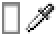
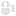
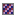
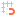
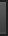
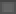
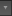
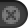
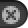
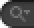

# Unity Editor Icons (6000.1.7f1)
A browsable list of 685 internal icons from the Unity Editor.

| Preview | Name | Dimensions | C# Code (for `IconContent`) |
|:---:|---|:---:|---|
|  | `AnimationRowEven` | `2x2` | `EditorGUIUtility.IconContent("AnimationRowEven")` |
|  | `AnimationRowEven@2x` | `4x4` | `EditorGUIUtility.IconContent("AnimationRowEven@2x")` |
|  | `AnimationRowEvenSelected` | `2x2` | `EditorGUIUtility.IconContent("AnimationRowEvenSelected")` |
|  | `AnimationRowEvenSelected@2x` | `4x4` | `EditorGUIUtility.IconContent("AnimationRowEvenSelected@2x")` |
|  | `AnimationRowEvenSemiSelected` | `2x2` | `EditorGUIUtility.IconContent("AnimationRowEvenSemiSelected")` |
|  | `AnimationRowEvenSemiSelected@2x` | `4x4` | `EditorGUIUtility.IconContent("AnimationRowEvenSemiSelected@2x")` |
|  | `AnimationRowOdd` | `2x2` | `EditorGUIUtility.IconContent("AnimationRowOdd")` |
|  | `AnimationRowOdd@2x` | `4x4` | `EditorGUIUtility.IconContent("AnimationRowOdd@2x")` |
|  | `AnimationRowOddSelected` | `2x2` | `EditorGUIUtility.IconContent("AnimationRowOddSelected")` |
|  | `AnimationRowOddSelected@2x` | `4x4` | `EditorGUIUtility.IconContent("AnimationRowOddSelected@2x")` |
|  | `AnimationRowOddSemiSelected` | `2x2` | `EditorGUIUtility.IconContent("AnimationRowOddSemiSelected")` |
|  | `AnimationRowOddSemiSelected@2x` | `4x4` | `EditorGUIUtility.IconContent("AnimationRowOddSemiSelected@2x")` |
|  | `AreaLight Gizmo` | `256x256` | `EditorGUIUtility.IconContent("AreaLight Gizmo")` |
|  | `ArrowNavigationLeft` | `16x16` | `EditorGUIUtility.IconContent("ArrowNavigationLeft")` |
|  | `ArrowNavigationRight` | `16x16` | `EditorGUIUtility.IconContent("ArrowNavigationRight")` |
|  | `AssetLabelIcon` | `20x15` | `EditorGUIUtility.IconContent("AssetLabelIcon")` |
|  | `AudioSource Gizmo` | `256x256` | `EditorGUIUtility.IconContent("AudioSource Gizmo")` |
|  | `bg_HeaderCollapsed@2x` | `160x32` | `EditorGUIUtility.IconContent("bg_HeaderCollapsed@2x")` |
|  | `bg_HeaderExpanded@2x` | `160x32` | `EditorGUIUtility.IconContent("bg_HeaderExpanded@2x")` |
|  | `box` | `6x6` | `EditorGUIUtility.IconContent("box")` |
|  | `box@2x` | `12x12` | `EditorGUIUtility.IconContent("box@2x")` |
|  | `BrushAttributes` | `16x16` | `EditorGUIUtility.IconContent("BrushAttributes")` |
|  | `BrushMask` | `16x16` | `EditorGUIUtility.IconContent("BrushMask")` |
|  | `btn` | `17x19` | `EditorGUIUtility.IconContent("btn")` |
|  | `btn act` | `17x19` | `EditorGUIUtility.IconContent("btn act")` |
|  | `btn act@2x` | `34x38` | `EditorGUIUtility.IconContent("btn act@2x")` |
|  | `btn focus` | `17x19` | `EditorGUIUtility.IconContent("btn focus")` |
|  | `btn left` | `8x19` | `EditorGUIUtility.IconContent("btn left")` |
|  | `btn left act` | `8x19` | `EditorGUIUtility.IconContent("btn left act")` |
|  | `btn left act@2x` | `16x38` | `EditorGUIUtility.IconContent("btn left act@2x")` |
|  | `btn left focus` | `8x19` | `EditorGUIUtility.IconContent("btn left focus")` |
|  | `btn left on` | `8x19` | `EditorGUIUtility.IconContent("btn left on")` |
|  | `btn left on focus` | `8x19` | `EditorGUIUtility.IconContent("btn left on focus")` |
|  | `btn left on@2x` | `16x38` | `EditorGUIUtility.IconContent("btn left on@2x")` |
|  | `btn left onact` | `8x19` | `EditorGUIUtility.IconContent("btn left onact")` |
|  | `btn left onact@2x` | `16x38` | `EditorGUIUtility.IconContent("btn left onact@2x")` |
|  | `btn left@2x` | `16x38` | `EditorGUIUtility.IconContent("btn left@2x")` |
|  | `btn mid` | `6x19` | `EditorGUIUtility.IconContent("btn mid")` |
|  | `btn mid act` | `6x19` | `EditorGUIUtility.IconContent("btn mid act")` |
|  | `btn mid act@2x` | `12x38` | `EditorGUIUtility.IconContent("btn mid act@2x")` |
|  | `btn mid focus` | `6x19` | `EditorGUIUtility.IconContent("btn mid focus")` |
|  | `btn mid on` | `6x19` | `EditorGUIUtility.IconContent("btn mid on")` |
|  | `btn mid on focus` | `6x19` | `EditorGUIUtility.IconContent("btn mid on focus")` |
|  | `btn mid on@2x` | `12x38` | `EditorGUIUtility.IconContent("btn mid on@2x")` |
|  | `btn mid onact` | `6x19` | `EditorGUIUtility.IconContent("btn mid onact")` |
|  | `btn mid onact@2x` | `12x38` | `EditorGUIUtility.IconContent("btn mid onact@2x")` |
|  | `btn mid@2x` | `12x38` | `EditorGUIUtility.IconContent("btn mid@2x")` |
|  | `btn on` | `17x19` | `EditorGUIUtility.IconContent("btn on")` |
|  | `btn on focus` | `17x19` | `EditorGUIUtility.IconContent("btn on focus")` |
|  | `btn on@2x` | `34x38` | `EditorGUIUtility.IconContent("btn on@2x")` |
|  | `btn onact` | `17x19` | `EditorGUIUtility.IconContent("btn onact")` |
|  | `btn onact@2x` | `34x38` | `EditorGUIUtility.IconContent("btn onact@2x")` |
|  | `btn right` | `8x19` | `EditorGUIUtility.IconContent("btn right")` |
|  | `btn right act` | `8x19` | `EditorGUIUtility.IconContent("btn right act")` |
|  | `btn right act@2x` | `16x38` | `EditorGUIUtility.IconContent("btn right act@2x")` |
|  | `btn right focus` | `8x19` | `EditorGUIUtility.IconContent("btn right focus")` |
|  | `btn right on` | `8x19` | `EditorGUIUtility.IconContent("btn right on")` |
|  | `btn right on focus` | `8x19` | `EditorGUIUtility.IconContent("btn right on focus")` |
|  | `btn right on@2x` | `16x38` | `EditorGUIUtility.IconContent("btn right on@2x")` |
|  | `btn right onact` | `8x19` | `EditorGUIUtility.IconContent("btn right onact")` |
|  | `btn right onact@2x` | `16x38` | `EditorGUIUtility.IconContent("btn right onact@2x")` |
|  | `btn right@2x` | `16x38` | `EditorGUIUtility.IconContent("btn right@2x")` |
|  | `btn@2x` | `34x38` | `EditorGUIUtility.IconContent("btn@2x")` |
|  | `buttonpulldown act` | `24x19` | `EditorGUIUtility.IconContent("buttonpulldown act")` |
|  | `buttonpulldown act@2x` | `48x38` | `EditorGUIUtility.IconContent("buttonpulldown act@2x")` |
|  | `buttonpulldown@2x` | `48x38` | `EditorGUIUtility.IconContent("buttonpulldown@2x")` |
|  | `Camera Gizmo` | `256x256` | `EditorGUIUtility.IconContent("Camera Gizmo")` |
|  | `cmd` | `17x23` | `EditorGUIUtility.IconContent("cmd")` |
|  | `cmd act` | `17x23` | `EditorGUIUtility.IconContent("cmd act")` |
|  | `cmd act@2x` | `34x46` | `EditorGUIUtility.IconContent("cmd act@2x")` |
|  | `cmd focus` | `17x23` | `EditorGUIUtility.IconContent("cmd focus")` |
|  | `cmd left` | `8x23` | `EditorGUIUtility.IconContent("cmd left")` |
|  | `cmd left act` | `8x23` | `EditorGUIUtility.IconContent("cmd left act")` |
|  | `cmd left act@2x` | `16x46` | `EditorGUIUtility.IconContent("cmd left act@2x")` |
|  | `cmd left focus` | `8x23` | `EditorGUIUtility.IconContent("cmd left focus")` |
|  | `cmd left on` | `8x23` | `EditorGUIUtility.IconContent("cmd left on")` |
|  | `cmd left on focus` | `8x23` | `EditorGUIUtility.IconContent("cmd left on focus")` |
|  | `cmd left on@2x` | `16x46` | `EditorGUIUtility.IconContent("cmd left on@2x")` |
|  | `cmd left onact` | `8x23` | `EditorGUIUtility.IconContent("cmd left onact")` |
|  | `cmd left onact@2x` | `16x46` | `EditorGUIUtility.IconContent("cmd left onact@2x")` |
|  | `cmd left@2x` | `16x46` | `EditorGUIUtility.IconContent("cmd left@2x")` |
|  | `cmd mid` | `6x23` | `EditorGUIUtility.IconContent("cmd mid")` |
|  | `cmd mid act` | `6x23` | `EditorGUIUtility.IconContent("cmd mid act")` |
|  | `cmd mid act@2x` | `12x46` | `EditorGUIUtility.IconContent("cmd mid act@2x")` |
|  | `cmd mid focus` | `6x23` | `EditorGUIUtility.IconContent("cmd mid focus")` |
|  | `cmd mid on` | `6x23` | `EditorGUIUtility.IconContent("cmd mid on")` |
|  | `cmd mid on@2x` | `12x46` | `EditorGUIUtility.IconContent("cmd mid on@2x")` |
|  | `cmd mid onact` | `6x23` | `EditorGUIUtility.IconContent("cmd mid onact")` |
|  | `cmd mid onact@2x` | `12x46` | `EditorGUIUtility.IconContent("cmd mid onact@2x")` |
|  | `cmd mid@2x` | `12x46` | `EditorGUIUtility.IconContent("cmd mid@2x")` |
|  | `cmd on` | `17x23` | `EditorGUIUtility.IconContent("cmd on")` |
|  | `cmd on focus` | `17x23` | `EditorGUIUtility.IconContent("cmd on focus")` |
|  | `cmd on@2x` | `34x46` | `EditorGUIUtility.IconContent("cmd on@2x")` |
|  | `cmd onact` | `17x23` | `EditorGUIUtility.IconContent("cmd onact")` |
|  | `cmd onact@2x` | `34x46` | `EditorGUIUtility.IconContent("cmd onact@2x")` |
|  | `cmd right` | `8x23` | `EditorGUIUtility.IconContent("cmd right")` |
|  | `cmd right act` | `8x23` | `EditorGUIUtility.IconContent("cmd right act")` |
|  | `cmd right act@2x` | `16x46` | `EditorGUIUtility.IconContent("cmd right act@2x")` |
|  | `cmd right focus` | `8x23` | `EditorGUIUtility.IconContent("cmd right focus")` |
|  | `cmd right on` | `8x23` | `EditorGUIUtility.IconContent("cmd right on")` |
|  | `cmd right on focus` | `8x23` | `EditorGUIUtility.IconContent("cmd right on focus")` |
|  | `cmd right on@2x` | `16x46` | `EditorGUIUtility.IconContent("cmd right on@2x")` |
|  | `cmd right onact` | `8x23` | `EditorGUIUtility.IconContent("cmd right onact")` |
|  | `cmd right onact@2x` | `16x46` | `EditorGUIUtility.IconContent("cmd right onact@2x")` |
|  | `cmd right@2x` | `16x46` | `EditorGUIUtility.IconContent("cmd right@2x")` |
|  | `cmd@2x` | `34x46` | `EditorGUIUtility.IconContent("cmd@2x")` |
|  | `cn entrybackodd` | `4x4` | `EditorGUIUtility.IconContent("cn entrybackodd")` |
|  | `cn entrybackodd@2x` | `8x8` | `EditorGUIUtility.IconContent("cn entrybackodd@2x")` |
|  | `cnentrybackeven` | `4x4` | `EditorGUIUtility.IconContent("cnentrybackeven")` |
|  | `cnentrybackeven@2x` | `8x8` | `EditorGUIUtility.IconContent("cnentrybackeven@2x")` |
|  | `ColorField focus` | `28x18` | `EditorGUIUtility.IconContent("ColorField focus")` |
|  | `ColorField focus@2x` | `56x36` | `EditorGUIUtility.IconContent("ColorField focus@2x")` |
|  | `ColorField@2x` | `56x36` | `EditorGUIUtility.IconContent("ColorField@2x")` |
|  | `colorpickerbox` | `8x7` | `EditorGUIUtility.IconContent("colorpickerbox")` |
|  | `colorpickerbox` | `8x7` | `EditorGUIUtility.IconContent("colorpickerbox")` |
|  | `colorpickerboxfocused` | `8x7` | `EditorGUIUtility.IconContent("colorpickerboxfocused")` |
|  | `colorpickerboxfocused` | `8x7` | `EditorGUIUtility.IconContent("colorpickerboxfocused")` |
|  | `console.erroricon` | `32x32` | `EditorGUIUtility.IconContent("console.erroricon")` |
|  | `console.erroricon.sml` | `16x16` | `EditorGUIUtility.IconContent("console.erroricon.sml")` |
|  | `console.infoicon` | `32x32` | `EditorGUIUtility.IconContent("console.infoicon")` |
|  | `console.infoicon.sml` | `16x16` | `EditorGUIUtility.IconContent("console.infoicon.sml")` |
|  | `console.warnicon` | `32x32` | `EditorGUIUtility.IconContent("console.warnicon")` |
|  | `console.warnicon.sml` | `16x16` | `EditorGUIUtility.IconContent("console.warnicon.sml")` |
|  | `CrossIcon` | `128x128` | `EditorGUIUtility.IconContent("CrossIcon")` |
|  | `d__Help` | `16x16` | `EditorGUIUtility.IconContent("d__Help")` |
|  | `d__Menu` | `16x16` | `EditorGUIUtility.IconContent("d__Menu")` |
|  | `d__Popup` | `16x16` | `EditorGUIUtility.IconContent("d__Popup")` |
|  | `d_account` | `16x16` | `EditorGUIUtility.IconContent("d_account")` |
|  | `d_AssemblyDefinitionAsset Icon` | `256x256` | `EditorGUIUtility.IconContent("d_AssemblyDefinitionAsset Icon")` |
|  | `d_AssemblyLock` | `16x16` | `EditorGUIUtility.IconContent("d_AssemblyLock")` |
|  | `d_AssetStore Icon` | `64x64` | `EditorGUIUtility.IconContent("d_AssetStore Icon")` |
|  | `d_AudioListener Icon` | `64x64` | `EditorGUIUtility.IconContent("d_AudioListener Icon")` |
|  | `d_BoxCollider Icon` | `64x64` | `EditorGUIUtility.IconContent("d_BoxCollider Icon")` |
|  | `d_BuildSettings.Android` | `32x32` | `EditorGUIUtility.IconContent("d_BuildSettings.Android")` |
|  | `d_BuildSettings.DedicatedServer` | `32x32` | `EditorGUIUtility.IconContent("d_BuildSettings.DedicatedServer")` |
|  | `d_BuildSettings.EmbeddedLinux` | `32x32` | `EditorGUIUtility.IconContent("d_BuildSettings.EmbeddedLinux")` |
|  | `d_BuildSettings.GameCoreScarlett` | `32x32` | `EditorGUIUtility.IconContent("d_BuildSettings.GameCoreScarlett")` |
|  | `d_BuildSettings.GameCoreXboxOne` | `32x32` | `EditorGUIUtility.IconContent("d_BuildSettings.GameCoreXboxOne")` |
|  | `d_BuildSettings.iPhone` | `33x33` | `EditorGUIUtility.IconContent("d_BuildSettings.iPhone")` |
|  | `d_BuildSettings.LinuxHeadlessSimulation` | `32x32` | `EditorGUIUtility.IconContent("d_BuildSettings.LinuxHeadlessSimulation")` |
|  | `d_BuildSettings.Metro` | `32x32` | `EditorGUIUtility.IconContent("d_BuildSettings.Metro")` |
|  | `d_BuildSettings.PS4` | `32x32` | `EditorGUIUtility.IconContent("d_BuildSettings.PS4")` |
|  | `d_BuildSettings.PS5` | `32x32` | `EditorGUIUtility.IconContent("d_BuildSettings.PS5")` |
|  | `d_BuildSettings.QNX` | `33x32` | `EditorGUIUtility.IconContent("d_BuildSettings.QNX")` |
|  | `d_BuildSettings.Standalone` | `32x32` | `EditorGUIUtility.IconContent("d_BuildSettings.Standalone")` |
|  | `d_BuildSettings.Standalone.Small` | `16x16` | `EditorGUIUtility.IconContent("d_BuildSettings.Standalone.Small")` |
|  | `d_BuildSettings.Switch` | `32x32` | `EditorGUIUtility.IconContent("d_BuildSettings.Switch")` |
|  | `d_BuildSettings.tvOS` | `33x33` | `EditorGUIUtility.IconContent("d_BuildSettings.tvOS")` |
|  | `d_BuildSettings.visionOS` | `32x32` | `EditorGUIUtility.IconContent("d_BuildSettings.visionOS")` |
|  | `d_BuildSettings.WebGL` | `32x32` | `EditorGUIUtility.IconContent("d_BuildSettings.WebGL")` |
|  | `d_BuildSettings.XboxOne` | `32x32` | `EditorGUIUtility.IconContent("d_BuildSettings.XboxOne")` |
|  | `d_CacheServerConnected` | `16x16` | `EditorGUIUtility.IconContent("d_CacheServerConnected")` |
|  | `d_CacheServerDisabled` | `16x16` | `EditorGUIUtility.IconContent("d_CacheServerDisabled")` |
|  | `d_CacheServerDisconnected` | `16x16` | `EditorGUIUtility.IconContent("d_CacheServerDisconnected")` |
|  | `d_Camera Icon` | `64x64` | `EditorGUIUtility.IconContent("d_Camera Icon")` |
|  | `d_CameraPreview` | `16x16` | `EditorGUIUtility.IconContent("d_CameraPreview")` |
|  | `d_clear` | `16x16` | `EditorGUIUtility.IconContent("d_clear")` |
|  | `d_clear` | `16x16` | `EditorGUIUtility.IconContent("d_clear")` |
|  | `d_CloudConnect` | `16x16` | `EditorGUIUtility.IconContent("d_CloudConnect")` |
|  | `d_color_picker` | `14x14` | `EditorGUIUtility.IconContent("d_color_picker")` |
|  | `d_color_picker` | `14x14` | `EditorGUIUtility.IconContent("d_color_picker")` |
|  | `d_console.erroricon` | `32x32` | `EditorGUIUtility.IconContent("d_console.erroricon")` |
|  | `d_console.erroricon` | `32x32` | `EditorGUIUtility.IconContent("d_console.erroricon")` |
|  | `d_console.erroricon.inactive.sml` | `16x16` | `EditorGUIUtility.IconContent("d_console.erroricon.inactive.sml")` |
|  | `d_console.erroricon.sml` | `16x16` | `EditorGUIUtility.IconContent("d_console.erroricon.sml")` |
|  | `d_console.infoicon` | `32x32` | `EditorGUIUtility.IconContent("d_console.infoicon")` |
|  | `d_console.infoicon` | `32x32` | `EditorGUIUtility.IconContent("d_console.infoicon")` |
|  | `d_console.infoicon.inactive.sml` | `16x16` | `EditorGUIUtility.IconContent("d_console.infoicon.inactive.sml")` |
|  | `d_console.infoicon.sml` | `16x16` | `EditorGUIUtility.IconContent("d_console.infoicon.sml")` |
|  | `d_console.warnicon` | `32x32` | `EditorGUIUtility.IconContent("d_console.warnicon")` |
|  | `d_console.warnicon.inactive.sml` | `16x16` | `EditorGUIUtility.IconContent("d_console.warnicon.inactive.sml")` |
|  | `d_console.warnicon.sml` | `16x16` | `EditorGUIUtility.IconContent("d_console.warnicon.sml")` |
|  | `d_CreateAddNew` | `16x16` | `EditorGUIUtility.IconContent("d_CreateAddNew")` |
|  | `d_cs Script Icon` | `256x256` | `EditorGUIUtility.IconContent("d_cs Script Icon")` |
|  | `d_CustomSorting` | `19x13` | `EditorGUIUtility.IconContent("d_CustomSorting")` |
|  | `d_DataMode.Authoring` | `16x16` | `EditorGUIUtility.IconContent("d_DataMode.Authoring")` |
|  | `d_DataMode.Authoring.Sticky` | `16x16` | `EditorGUIUtility.IconContent("d_DataMode.Authoring.Sticky")` |
|  | `d_DataMode.Mixed` | `16x16` | `EditorGUIUtility.IconContent("d_DataMode.Mixed")` |
|  | `d_DataMode.Mixed.Sticky` | `16x16` | `EditorGUIUtility.IconContent("d_DataMode.Mixed.Sticky")` |
|  | `d_DataMode.Runtime` | `16x16` | `EditorGUIUtility.IconContent("d_DataMode.Runtime")` |
|  | `d_DataMode.Runtime.Sticky` | `16x16` | `EditorGUIUtility.IconContent("d_DataMode.Runtime.Sticky")` |
|  | `d_debug` | `16x16` | `EditorGUIUtility.IconContent("d_debug")` |
|  | `d_DebuggerAttached` | `16x16` | `EditorGUIUtility.IconContent("d_DebuggerAttached")` |
|  | `d_DebuggerDisabled` | `16x16` | `EditorGUIUtility.IconContent("d_DebuggerDisabled")` |
|  | `d_DebuggerEnabled` | `16x16` | `EditorGUIUtility.IconContent("d_DebuggerEnabled")` |
|  | `d_DefaultAsset Icon` | `64x64` | `EditorGUIUtility.IconContent("d_DefaultAsset Icon")` |
|  | `d_DirectionalLight Icon` | `64x64` | `EditorGUIUtility.IconContent("d_DirectionalLight Icon")` |
|  | `d_dropdown` | `12x12` | `EditorGUIUtility.IconContent("d_dropdown")` |
|  | `d_dropdown` | `12x12` | `EditorGUIUtility.IconContent("d_dropdown")` |
|  | `d_dropdown_toggle` | `15x12` | `EditorGUIUtility.IconContent("d_dropdown_toggle")` |
|  | `d_dropdown_toggle` | `15x12` | `EditorGUIUtility.IconContent("d_dropdown_toggle")` |
|  | `d_editcollision_16` | `16x16` | `EditorGUIUtility.IconContent("d_editcollision_16")` |
|  | `d_editconstraints_16` | `16x16` | `EditorGUIUtility.IconContent("d_editconstraints_16")` |
|  | `d_Exposure` | `16x16` | `EditorGUIUtility.IconContent("d_Exposure")` |
|  | `d_Favorite` | `16x16` | `EditorGUIUtility.IconContent("d_Favorite")` |
|  | `d_Favorite Icon` | `64x64` | `EditorGUIUtility.IconContent("d_Favorite Icon")` |
|  | `d_FilterByLabel` | `16x16` | `EditorGUIUtility.IconContent("d_FilterByLabel")` |
|  | `d_FilterByType` | `16x16` | `EditorGUIUtility.IconContent("d_FilterByType")` |
|  | `d_Folder Icon` | `256x256` | `EditorGUIUtility.IconContent("d_Folder Icon")` |
|  | `d_FolderEmpty Icon` | `256x256` | `EditorGUIUtility.IconContent("d_FolderEmpty Icon")` |
|  | `d_FolderEmpty On Icon` | `32x32` | `EditorGUIUtility.IconContent("d_FolderEmpty On Icon")` |
|  | `d_FolderFavorite Icon` | `64x64` | `EditorGUIUtility.IconContent("d_FolderFavorite Icon")` |
|  | `d_FolderOpened Icon` | `256x256` | `EditorGUIUtility.IconContent("d_FolderOpened Icon")` |
|  | `d_FrameCapture` | `16x16` | `EditorGUIUtility.IconContent("d_FrameCapture")` |
|  | `d_GameObject Icon` | `256x256` | `EditorGUIUtility.IconContent("d_GameObject Icon")` |
|  | `d_GameViewAudio` | `16x16` | `EditorGUIUtility.IconContent("d_GameViewAudio")` |
|  | `d_GameViewAudio On` | `16x16` | `EditorGUIUtility.IconContent("d_GameViewAudio On")` |
|  | `d_GridAndSnap` | `16x16` | `EditorGUIUtility.IconContent("d_GridAndSnap")` |
|  | `d_GridLayoutGroup Icon` | `16x16` | `EditorGUIUtility.IconContent("d_GridLayoutGroup Icon")` |
|  | `d_icon dropdown` | `12x12` | `EditorGUIUtility.IconContent("d_icon dropdown")` |
|  | `d_IN_foldout` | `13x13` | `EditorGUIUtility.IconContent("d_IN_foldout")` |
|  | `d_IN_foldout_act` | `13x13` | `EditorGUIUtility.IconContent("d_IN_foldout_act")` |
|  | `d_IN_foldout_act_on` | `13x13` | `EditorGUIUtility.IconContent("d_IN_foldout_act_on")` |
|  | `d_IN_foldout_on` | `13x13` | `EditorGUIUtility.IconContent("d_IN_foldout_on")` |
|  | `d_Keyboard` | `16x16` | `EditorGUIUtility.IconContent("d_Keyboard")` |
|  | `d_KeyboardShortcutsDisabled` | `16x16` | `EditorGUIUtility.IconContent("d_KeyboardShortcutsDisabled")` |
|  | `d_layout` | `16x16` | `EditorGUIUtility.IconContent("d_layout")` |
|  | `d_LightingVisualization` | `16x16` | `EditorGUIUtility.IconContent("d_LightingVisualization")` |
|  | `d_LightingVisualizationColors` | `16x16` | `EditorGUIUtility.IconContent("d_LightingVisualizationColors")` |
|  | `d_Linked` | `16x16` | `EditorGUIUtility.IconContent("d_Linked")` |
|  | `d_MeshFilter Icon` | `64x64` | `EditorGUIUtility.IconContent("d_MeshFilter Icon")` |
|  | `d_MeshRenderer Icon` | `64x64` | `EditorGUIUtility.IconContent("d_MeshRenderer Icon")` |
|  | `d_more` | `16x16` | `EditorGUIUtility.IconContent("d_more")` |
|  | `d_MoreOptions` | `16x16` | `EditorGUIUtility.IconContent("d_MoreOptions")` |
|  | `d_MouseLeft` | `16x16` | `EditorGUIUtility.IconContent("d_MouseLeft")` |
|  | `d_MouseLeft-Drag` | `16x16` | `EditorGUIUtility.IconContent("d_MouseLeft-Drag")` |
|  | `d_MouseMiddle` | `16x16` | `EditorGUIUtility.IconContent("d_MouseMiddle")` |
|  | `d_MouseMiddle-Drag` | `16x16` | `EditorGUIUtility.IconContent("d_MouseMiddle-Drag")` |
|  | `d_MouseRight` | `16x16` | `EditorGUIUtility.IconContent("d_MouseRight")` |
|  | `d_MouseRight-Drag` | `16x16` | `EditorGUIUtility.IconContent("d_MouseRight-Drag")` |
|  | `d_MoveTool` | `16x16` | `EditorGUIUtility.IconContent("d_MoveTool")` |
|  | `d_ol_minus` | `16x16` | `EditorGUIUtility.IconContent("d_ol_minus")` |
|  | `d_ol_minus` | `16x16` | `EditorGUIUtility.IconContent("d_ol_minus")` |
|  | `d_ol_minus_act` | `16x16` | `EditorGUIUtility.IconContent("d_ol_minus_act")` |
|  | `d_ol_minus_act` | `16x16` | `EditorGUIUtility.IconContent("d_ol_minus_act")` |
|  | `d_ol_plus` | `16x16` | `EditorGUIUtility.IconContent("d_ol_plus")` |
|  | `d_ol_plus` | `16x16` | `EditorGUIUtility.IconContent("d_ol_plus")` |
|  | `d_ol_plus_act` | `16x16` | `EditorGUIUtility.IconContent("d_ol_plus_act")` |
|  | `d_ol_plus_act` | `16x16` | `EditorGUIUtility.IconContent("d_ol_plus_act")` |
|  | `d_OrientationGizmo` | `16x16` | `EditorGUIUtility.IconContent("d_OrientationGizmo")` |
|  | `d_PauseButton` | `16x16` | `EditorGUIUtility.IconContent("d_PauseButton")` |
|  | `d_PauseButton On` | `16x16` | `EditorGUIUtility.IconContent("d_PauseButton On")` |
|  | `d_PBrowserPackagesNotVisible` | `16x16` | `EditorGUIUtility.IconContent("d_PBrowserPackagesNotVisible")` |
|  | `d_PBrowserPackagesVisible` | `16x16` | `EditorGUIUtility.IconContent("d_PBrowserPackagesVisible")` |
|  | `d_pick` | `12x12` | `EditorGUIUtility.IconContent("d_pick")` |
|  | `d_pick` | `12x12` | `EditorGUIUtility.IconContent("d_pick")` |
|  | `d_PlayButton` | `16x16` | `EditorGUIUtility.IconContent("d_PlayButton")` |
|  | `d_Prefab Icon` | `128x128` | `EditorGUIUtility.IconContent("d_Prefab Icon")` |
|  | `d_PrefabOverlayAdded Icon` | `66x66` | `EditorGUIUtility.IconContent("d_PrefabOverlayAdded Icon")` |
|  | `d_PrefabOverlayRemoved Icon` | `66x66` | `EditorGUIUtility.IconContent("d_PrefabOverlayRemoved Icon")` |
|  | `d_Preset.Context` | `16x16` | `EditorGUIUtility.IconContent("d_Preset.Context")` |
|  | `d_PreTexA` | `16x16` | `EditorGUIUtility.IconContent("d_PreTexA")` |
|  | `d_PreTexB` | `16x16` | `EditorGUIUtility.IconContent("d_PreTexB")` |
|  | `d_PreTexG` | `16x16` | `EditorGUIUtility.IconContent("d_PreTexG")` |
|  | `d_PreTexR` | `16x16` | `EditorGUIUtility.IconContent("d_PreTexR")` |
|  | `d_PreTexRGB` | `24x16` | `EditorGUIUtility.IconContent("d_PreTexRGB")` |
|  | `d_PreTextureMipMapHigh` | `16x16` | `EditorGUIUtility.IconContent("d_PreTextureMipMapHigh")` |
|  | `d_PreTextureMipMapLow` | `16x16` | `EditorGUIUtility.IconContent("d_PreTextureMipMapLow")` |
|  | `d_ProfilerTimelineDigDownArrow` | `12x12` | `EditorGUIUtility.IconContent("d_ProfilerTimelineDigDownArrow")` |
|  | `d_ProfilerTimelineRollUpArrow` | `12x12` | `EditorGUIUtility.IconContent("d_ProfilerTimelineRollUpArrow")` |
|  | `d_Progress` | `16x16` | `EditorGUIUtility.IconContent("d_Progress")` |
|  | `d_Project` | `16x16` | `EditorGUIUtility.IconContent("d_Project")` |
|  | `d_pulldown@2x` | `24x24` | `EditorGUIUtility.IconContent("d_pulldown@2x")` |
|  | `d_rol-body` | `14x11` | `EditorGUIUtility.IconContent("d_rol-body")` |
|  | `d_rol-header` | `14x6` | `EditorGUIUtility.IconContent("d_rol-header")` |
|  | `d_rol-tab` | `10x14` | `EditorGUIUtility.IconContent("d_rol-tab")` |
|  | `d_SceneAsset Icon` | `256x256` | `EditorGUIUtility.IconContent("d_SceneAsset Icon")` |
|  | `d_SceneLayersToggle` | `16x16` | `EditorGUIUtility.IconContent("d_SceneLayersToggle")` |
|  | `d_scenepicking_notpickable` | `16x16` | `EditorGUIUtility.IconContent("d_scenepicking_notpickable")` |
|  | `d_scenepicking_notpickable_hover` | `16x16` | `EditorGUIUtility.IconContent("d_scenepicking_notpickable_hover")` |
|  | `d_scenepicking_notpickable-mixed` | `16x16` | `EditorGUIUtility.IconContent("d_scenepicking_notpickable-mixed")` |
|  | `d_scenepicking_notpickable-mixed_hover` | `16x16` | `EditorGUIUtility.IconContent("d_scenepicking_notpickable-mixed_hover")` |
|  | `d_scenepicking_pickable` | `16x16` | `EditorGUIUtility.IconContent("d_scenepicking_pickable")` |
|  | `d_scenepicking_pickable_hover` | `16x16` | `EditorGUIUtility.IconContent("d_scenepicking_pickable_hover")` |
|  | `d_scenepicking_pickable-mixed` | `16x16` | `EditorGUIUtility.IconContent("d_scenepicking_pickable-mixed")` |
|  | `d_scenepicking_pickable-mixed_hover` | `16x16` | `EditorGUIUtility.IconContent("d_scenepicking_pickable-mixed_hover")` |
|  | `d_SceneViewSnap` | `16x16` | `EditorGUIUtility.IconContent("d_SceneViewSnap")` |
|  | `d_scenevis_hidden` | `16x16` | `EditorGUIUtility.IconContent("d_scenevis_hidden")` |
|  | `d_scenevis_hidden_hover` | `16x16` | `EditorGUIUtility.IconContent("d_scenevis_hidden_hover")` |
|  | `d_scenevis_hidden-mixed` | `16x16` | `EditorGUIUtility.IconContent("d_scenevis_hidden-mixed")` |
|  | `d_scenevis_hidden-mixed_hover` | `16x16` | `EditorGUIUtility.IconContent("d_scenevis_hidden-mixed_hover")` |
|  | `d_scenevis_visible` | `16x16` | `EditorGUIUtility.IconContent("d_scenevis_visible")` |
|  | `d_scenevis_visible_hover` | `16x16` | `EditorGUIUtility.IconContent("d_scenevis_visible_hover")` |
|  | `d_scenevis_visible-mixed` | `16x16` | `EditorGUIUtility.IconContent("d_scenevis_visible-mixed")` |
|  | `d_scenevis_visible-mixed_hover` | `16x16` | `EditorGUIUtility.IconContent("d_scenevis_visible-mixed_hover")` |
|  | `d_ScriptableObject Icon` | `64x64` | `EditorGUIUtility.IconContent("d_ScriptableObject Icon")` |
|  | `d_scrolldown` | `12x12` | `EditorGUIUtility.IconContent("d_scrolldown")` |
|  | `d_scrolldown` | `12x12` | `EditorGUIUtility.IconContent("d_scrolldown")` |
|  | `d_scrolldown_uielements` | `12x16` | `EditorGUIUtility.IconContent("d_scrolldown_uielements")` |
|  | `d_scrolldown_uielements` | `12x16` | `EditorGUIUtility.IconContent("d_scrolldown_uielements")` |
|  | `d_scrollleft` | `12x12` | `EditorGUIUtility.IconContent("d_scrollleft")` |
|  | `d_scrollleft` | `12x12` | `EditorGUIUtility.IconContent("d_scrollleft")` |
|  | `d_scrollleft_uielements` | `16x12` | `EditorGUIUtility.IconContent("d_scrollleft_uielements")` |
|  | `d_scrollleft_uielements` | `16x12` | `EditorGUIUtility.IconContent("d_scrollleft_uielements")` |
|  | `d_scrollright` | `12x12` | `EditorGUIUtility.IconContent("d_scrollright")` |
|  | `d_scrollright` | `12x12` | `EditorGUIUtility.IconContent("d_scrollright")` |
|  | `d_scrollright_uielements` | `16x12` | `EditorGUIUtility.IconContent("d_scrollright_uielements")` |
|  | `d_scrollright_uielements` | `16x12` | `EditorGUIUtility.IconContent("d_scrollright_uielements")` |
|  | `d_scrollup` | `12x12` | `EditorGUIUtility.IconContent("d_scrollup")` |
|  | `d_scrollup` | `12x12` | `EditorGUIUtility.IconContent("d_scrollup")` |
|  | `d_scrollup_uielements` | `12x16` | `EditorGUIUtility.IconContent("d_scrollup_uielements")` |
|  | `d_scrollup_uielements` | `12x16` | `EditorGUIUtility.IconContent("d_scrollup_uielements")` |
|  | `d_SculptMode_On` | `16x16` | `EditorGUIUtility.IconContent("d_SculptMode_On")` |
|  | `d_Search Icon` | `64x64` | `EditorGUIUtility.IconContent("d_Search Icon")` |
|  | `d_search_icon` | `8x8` | `EditorGUIUtility.IconContent("d_search_icon")` |
|  | `d_search_icon` | `8x8` | `EditorGUIUtility.IconContent("d_search_icon")` |
|  | `d_search_menu` | `11x8` | `EditorGUIUtility.IconContent("d_search_menu")` |
|  | `d_search_menu` | `11x8` | `EditorGUIUtility.IconContent("d_search_menu")` |
|  | `d_SearchJump Icon` | `64x64` | `EditorGUIUtility.IconContent("d_SearchJump Icon")` |
|  | `d_SearchOverlay` | `16x16` | `EditorGUIUtility.IconContent("d_SearchOverlay")` |
|  | `d_SearchWindow` | `16x16` | `EditorGUIUtility.IconContent("d_SearchWindow")` |
|  | `d_SeparatorDot` | `8x8` | `EditorGUIUtility.IconContent("d_SeparatorDot")` |
|  | `d_Settings Icon` | `64x64` | `EditorGUIUtility.IconContent("d_Settings Icon")` |
|  | `d_Shaded` | `16x16` | `EditorGUIUtility.IconContent("d_Shaded")` |
|  | `d_Shortcut Icon` | `64x64` | `EditorGUIUtility.IconContent("d_Shortcut Icon")` |
|  | `d_StepButton` | `16x16` | `EditorGUIUtility.IconContent("d_StepButton")` |
|  | `d_StopButton` | `16x16` | `EditorGUIUtility.IconContent("d_StopButton")` |
|  | `d_TextAsset Icon` | `256x256` | `EditorGUIUtility.IconContent("d_TextAsset Icon")` |
|  | `d_Texture Icon` | `64x64` | `EditorGUIUtility.IconContent("d_Texture Icon")` |
|  | `d_toggle_bg` | `14x14` | `EditorGUIUtility.IconContent("d_toggle_bg")` |
|  | `d_toggle_bg` | `14x14` | `EditorGUIUtility.IconContent("d_toggle_bg")` |
|  | `d_toggle_bg_focus` | `14x14` | `EditorGUIUtility.IconContent("d_toggle_bg_focus")` |
|  | `d_toggle_bg_focus` | `14x14` | `EditorGUIUtility.IconContent("d_toggle_bg_focus")` |
|  | `d_toggle_bg_hover` | `14x14` | `EditorGUIUtility.IconContent("d_toggle_bg_hover")` |
|  | `d_toggle_bg_hover` | `14x14` | `EditorGUIUtility.IconContent("d_toggle_bg_hover")` |
|  | `d_toggle_mixed_bg` | `14x14` | `EditorGUIUtility.IconContent("d_toggle_mixed_bg")` |
|  | `d_toggle_mixed_bg` | `14x14` | `EditorGUIUtility.IconContent("d_toggle_mixed_bg")` |
|  | `d_toggle_mixed_bg_focus` | `14x14` | `EditorGUIUtility.IconContent("d_toggle_mixed_bg_focus")` |
|  | `d_toggle_mixed_bg_focus` | `14x14` | `EditorGUIUtility.IconContent("d_toggle_mixed_bg_focus")` |
|  | `d_toggle_mixed_bg_hover` | `14x14` | `EditorGUIUtility.IconContent("d_toggle_mixed_bg_hover")` |
|  | `d_toggle_mixed_bg_hover` | `14x14` | `EditorGUIUtility.IconContent("d_toggle_mixed_bg_hover")` |
|  | `d_toggle_on` | `14x14` | `EditorGUIUtility.IconContent("d_toggle_on")` |
|  | `d_toggle_on` | `14x14` | `EditorGUIUtility.IconContent("d_toggle_on")` |
|  | `d_toggle_on_focus` | `14x14` | `EditorGUIUtility.IconContent("d_toggle_on_focus")` |
|  | `d_toggle_on_focus` | `14x14` | `EditorGUIUtility.IconContent("d_toggle_on_focus")` |
|  | `d_toggle_on_hover` | `14x14` | `EditorGUIUtility.IconContent("d_toggle_on_hover")` |
|  | `d_toggle_on_hover` | `14x14` | `EditorGUIUtility.IconContent("d_toggle_on_hover")` |
|  | `d_Toolbar Minus` | `16x16` | `EditorGUIUtility.IconContent("d_Toolbar Minus")` |
|  | `d_Toolbar Plus` | `16x16` | `EditorGUIUtility.IconContent("d_Toolbar Plus")` |
|  | `d_Toolbar Plus More` | `16x16` | `EditorGUIUtility.IconContent("d_Toolbar Plus More")` |
|  | `d_ToolHandleCenter` | `16x16` | `EditorGUIUtility.IconContent("d_ToolHandleCenter")` |
|  | `d_ToolHandleGlobal` | `16x16` | `EditorGUIUtility.IconContent("d_ToolHandleGlobal")` |
|  | `d_ToolHandleLocal` | `16x16` | `EditorGUIUtility.IconContent("d_ToolHandleLocal")` |
|  | `d_ToolHandlePivot` | `16x16` | `EditorGUIUtility.IconContent("d_ToolHandlePivot")` |
|  | `d_ToolSettings` | `16x16` | `EditorGUIUtility.IconContent("d_ToolSettings")` |
|  | `d_tranp` | `2x2` | `EditorGUIUtility.IconContent("d_tranp")` |
|  | `d_Transform Icon` | `64x64` | `EditorGUIUtility.IconContent("d_Transform Icon")` |
|  | `d_UndoHistory` | `16x16` | `EditorGUIUtility.IconContent("d_UndoHistory")` |
|  | `d_UnityEditor.ConsoleWindow` | `16x16` | `EditorGUIUtility.IconContent("d_UnityEditor.ConsoleWindow")` |
|  | `d_UnityEditor.FindDependencies` | `16x16` | `EditorGUIUtility.IconContent("d_UnityEditor.FindDependencies")` |
|  | `d_UnityEditor.GameView` | `16x16` | `EditorGUIUtility.IconContent("d_UnityEditor.GameView")` |
|  | `d_UnityEditor.Graphs.AnimatorControllerTool` | `16x16` | `EditorGUIUtility.IconContent("d_UnityEditor.Graphs.AnimatorControllerTool")` |
|  | `d_UnityEditor.InspectorWindow` | `16x16` | `EditorGUIUtility.IconContent("d_UnityEditor.InspectorWindow")` |
|  | `d_UnityEditor.SceneHierarchyWindow` | `16x16` | `EditorGUIUtility.IconContent("d_UnityEditor.SceneHierarchyWindow")` |
|  | `d_UnityEditor.SceneView` | `16x16` | `EditorGUIUtility.IconContent("d_UnityEditor.SceneView")` |
|  | `d_UnityProduct` | `73x22` | `EditorGUIUtility.IconContent("d_UnityProduct")` |
|  | `d_Unlinked` | `16x16` | `EditorGUIUtility.IconContent("d_Unlinked")` |
|  | `d_ViewOptions` | `16x16` | `EditorGUIUtility.IconContent("d_ViewOptions")` |
|  | `d_WaitSpin00` | `16x16` | `EditorGUIUtility.IconContent("d_WaitSpin00")` |
|  | `d_WaitSpin01` | `16x16` | `EditorGUIUtility.IconContent("d_WaitSpin01")` |
|  | `d_WaitSpin02` | `16x16` | `EditorGUIUtility.IconContent("d_WaitSpin02")` |
|  | `d_WaitSpin03` | `16x16` | `EditorGUIUtility.IconContent("d_WaitSpin03")` |
|  | `d_WaitSpin04` | `16x16` | `EditorGUIUtility.IconContent("d_WaitSpin04")` |
|  | `d_WaitSpin05` | `16x16` | `EditorGUIUtility.IconContent("d_WaitSpin05")` |
|  | `d_WaitSpin06` | `16x16` | `EditorGUIUtility.IconContent("d_WaitSpin06")` |
|  | `d_WaitSpin07` | `16x16` | `EditorGUIUtility.IconContent("d_WaitSpin07")` |
|  | `d_WaitSpin08` | `16x16` | `EditorGUIUtility.IconContent("d_WaitSpin08")` |
|  | `d_WaitSpin09` | `16x16` | `EditorGUIUtility.IconContent("d_WaitSpin09")` |
|  | `d_WaitSpin10` | `16x16` | `EditorGUIUtility.IconContent("d_WaitSpin10")` |
|  | `d_WaitSpin11` | `16x16` | `EditorGUIUtility.IconContent("d_WaitSpin11")` |
|  | `darkviewbackground` | `28x25` | `EditorGUIUtility.IconContent("darkviewbackground")` |
|  | `darkviewbackground@2x` | `56x50` | `EditorGUIUtility.IconContent("darkviewbackground@2x")` |
|  | `DirectionalLight Gizmo` | `256x256` | `EditorGUIUtility.IconContent("DirectionalLight Gizmo")` |
|  | `DiscLight Gizmo` | `256x256` | `EditorGUIUtility.IconContent("DiscLight Gizmo")` |
|  | `dockarea back` | `10x19` | `EditorGUIUtility.IconContent("dockarea back")` |
|  | `dockarea back@2x` | `20x38` | `EditorGUIUtility.IconContent("dockarea back@2x")` |
|  | `dockarea overlay` | `10x8` | `EditorGUIUtility.IconContent("dockarea overlay")` |
|  | `dockarea overlay@2x` | `20x16` | `EditorGUIUtility.IconContent("dockarea overlay@2x")` |
|  | `dropdown_PreviewPackages` | `12x12` | `EditorGUIUtility.IconContent("dropdown_PreviewPackages")` |
|  | `dropwell nothumb` | `27x16` | `EditorGUIUtility.IconContent("dropwell nothumb")` |
|  | `dropwell nothumb focus` | `27x16` | `EditorGUIUtility.IconContent("dropwell nothumb focus")` |
|  | `dropwell nothumb@2x` | `54x32` | `EditorGUIUtility.IconContent("dropwell nothumb@2x")` |
|  | `dropwell predrop` | `27x16` | `EditorGUIUtility.IconContent("dropwell predrop")` |
|  | `dropwell predrop@2x` | `54x32` | `EditorGUIUtility.IconContent("dropwell predrop@2x")` |
|  | `ExposablePopupBg` | `17x15` | `EditorGUIUtility.IconContent("ExposablePopupBg")` |
|  | `Folder On Icon` | `256x256` | `EditorGUIUtility.IconContent("Folder On Icon")` |
|  | `gameviewbackground` | `32x32` | `EditorGUIUtility.IconContent("gameviewbackground")` |
|  | `gameviewbackground@2x` | `64x64` | `EditorGUIUtility.IconContent("gameviewbackground@2x")` |
|  | `grey_border` | `8x8` | `EditorGUIUtility.IconContent("grey_border")` |
|  | `grey_border@2x` | `16x16` | `EditorGUIUtility.IconContent("grey_border@2x")` |
|  | `helpbox` | `11x8` | `EditorGUIUtility.IconContent("helpbox")` |
|  | `helpbox` | `11x8` | `EditorGUIUtility.IconContent("helpbox")` |
|  | `iconselector sep` | `7x3` | `EditorGUIUtility.IconContent("iconselector sep")` |
|  | `iconselector sep@2x` | `14x6` | `EditorGUIUtility.IconContent("iconselector sep@2x")` |
|  | `IN BigTitle` | `4x18` | `EditorGUIUtility.IconContent("IN BigTitle")` |
|  | `IN BigTitle` | `4x18` | `EditorGUIUtility.IconContent("IN BigTitle")` |
|  | `IN BigTitle Post` | `4x18` | `EditorGUIUtility.IconContent("IN BigTitle Post")` |
|  | `IN BigTitle Post` | `4x18` | `EditorGUIUtility.IconContent("IN BigTitle Post")` |
|  | `IN foldout` | `13x13` | `EditorGUIUtility.IconContent("IN foldout")` |
|  | `IN foldout act on` | `13x13` | `EditorGUIUtility.IconContent("IN foldout act on")` |
|  | `IN foldout act on@2x` | `26x26` | `EditorGUIUtility.IconContent("IN foldout act on@2x")` |
|  | `IN foldout act@2x` | `26x26` | `EditorGUIUtility.IconContent("IN foldout act@2x")` |
|  | `IN foldout focus` | `13x13` | `EditorGUIUtility.IconContent("IN foldout focus")` |
|  | `IN foldout focus on` | `13x13` | `EditorGUIUtility.IconContent("IN foldout focus on")` |
|  | `IN foldout focus on@2x` | `26x26` | `EditorGUIUtility.IconContent("IN foldout focus on@2x")` |
|  | `IN foldout focus@2x` | `26x26` | `EditorGUIUtility.IconContent("IN foldout focus@2x")` |
|  | `IN foldout on` | `13x13` | `EditorGUIUtility.IconContent("IN foldout on")` |
|  | `IN foldout on@2x` | `26x26` | `EditorGUIUtility.IconContent("IN foldout on@2x")` |
|  | `IN foldout@2x` | `26x26` | `EditorGUIUtility.IconContent("IN foldout@2x")` |
|  | `IN LockButton` | `16x16` | `EditorGUIUtility.IconContent("IN LockButton")` |
|  | `IN LockButton act@2x` | `32x32` | `EditorGUIUtility.IconContent("IN LockButton act@2x")` |
|  | `IN LockButton on` | `16x16` | `EditorGUIUtility.IconContent("IN LockButton on")` |
|  | `IN LockButton on act` | `16x16` | `EditorGUIUtility.IconContent("IN LockButton on act")` |
|  | `IN LockButton on act@2x` | `32x32` | `EditorGUIUtility.IconContent("IN LockButton on act@2x")` |
|  | `IN LockButton on@2x` | `32x32` | `EditorGUIUtility.IconContent("IN LockButton on@2x")` |
|  | `IN LockButton@2x` | `32x32` | `EditorGUIUtility.IconContent("IN LockButton@2x")` |
|  | `IN pulldown` | `8x13` | `EditorGUIUtility.IconContent("IN pulldown")` |
|  | `IN pulldown@2x` | `16x26` | `EditorGUIUtility.IconContent("IN pulldown@2x")` |
|  | `IN Title Active` | `15x19` | `EditorGUIUtility.IconContent("IN Title Active")` |
|  | `IN Title Focused` | `15x19` | `EditorGUIUtility.IconContent("IN Title Focused")` |
|  | `IN Title Normal` | `15x19` | `EditorGUIUtility.IconContent("IN Title Normal")` |
|  | `IN Title On Active` | `15x19` | `EditorGUIUtility.IconContent("IN Title On Active")` |
|  | `IN Title On Focused` | `15x19` | `EditorGUIUtility.IconContent("IN Title On Focused")` |
|  | `IN Title On Normal` | `15x19` | `EditorGUIUtility.IconContent("IN Title On Normal")` |
|  | `Inlined TextField Focus` | `8x5` | `EditorGUIUtility.IconContent("Inlined TextField Focus")` |
|  | `Inlined TextField Focus@2x` | `16x10` | `EditorGUIUtility.IconContent("Inlined TextField Focus@2x")` |
|  | `LensFlare Gizmo` | `256x256` | `EditorGUIUtility.IconContent("LensFlare Gizmo")` |
|  | `LightProbeGroup Gizmo` | `256x256` | `EditorGUIUtility.IconContent("LightProbeGroup Gizmo")` |
|  | `LightProbeProxyVolume Gizmo` | `256x256` | `EditorGUIUtility.IconContent("LightProbeProxyVolume Gizmo")` |
|  | `Main Light Gizmo` | `256x256` | `EditorGUIUtility.IconContent("Main Light Gizmo")` |
|  | `mini btn` | `17x16` | `EditorGUIUtility.IconContent("mini btn")` |
|  | `mini btn act` | `17x16` | `EditorGUIUtility.IconContent("mini btn act")` |
|  | `mini btn act@2x` | `34x32` | `EditorGUIUtility.IconContent("mini btn act@2x")` |
|  | `mini btn focus` | `17x16` | `EditorGUIUtility.IconContent("mini btn focus")` |
|  | `mini btn left` | `8x16` | `EditorGUIUtility.IconContent("mini btn left")` |
|  | `mini btn left act` | `8x16` | `EditorGUIUtility.IconContent("mini btn left act")` |
|  | `mini btn left act@2x` | `16x32` | `EditorGUIUtility.IconContent("mini btn left act@2x")` |
|  | `mini btn left focus` | `8x16` | `EditorGUIUtility.IconContent("mini btn left focus")` |
|  | `mini btn left on` | `8x16` | `EditorGUIUtility.IconContent("mini btn left on")` |
|  | `mini btn left on focus` | `8x16` | `EditorGUIUtility.IconContent("mini btn left on focus")` |
|  | `mini btn left on@2x` | `16x32` | `EditorGUIUtility.IconContent("mini btn left on@2x")` |
|  | `mini btn left onact` | `8x16` | `EditorGUIUtility.IconContent("mini btn left onact")` |
|  | `mini btn left onact@2x` | `16x32` | `EditorGUIUtility.IconContent("mini btn left onact@2x")` |
|  | `mini btn left@2x` | `16x32` | `EditorGUIUtility.IconContent("mini btn left@2x")` |
|  | `mini btn mid` | `6x16` | `EditorGUIUtility.IconContent("mini btn mid")` |
|  | `mini btn mid act` | `6x16` | `EditorGUIUtility.IconContent("mini btn mid act")` |
|  | `mini btn mid act@2x` | `12x32` | `EditorGUIUtility.IconContent("mini btn mid act@2x")` |
|  | `mini btn mid focus` | `6x16` | `EditorGUIUtility.IconContent("mini btn mid focus")` |
|  | `mini btn mid on` | `6x16` | `EditorGUIUtility.IconContent("mini btn mid on")` |
|  | `mini btn mid on focus` | `6x16` | `EditorGUIUtility.IconContent("mini btn mid on focus")` |
|  | `mini btn mid on@2x` | `12x32` | `EditorGUIUtility.IconContent("mini btn mid on@2x")` |
|  | `mini btn mid onact` | `6x16` | `EditorGUIUtility.IconContent("mini btn mid onact")` |
|  | `mini btn mid onact@2x` | `12x32` | `EditorGUIUtility.IconContent("mini btn mid onact@2x")` |
|  | `mini btn mid@2x` | `12x32` | `EditorGUIUtility.IconContent("mini btn mid@2x")` |
|  | `mini btn on` | `17x16` | `EditorGUIUtility.IconContent("mini btn on")` |
|  | `mini btn on focus` | `17x16` | `EditorGUIUtility.IconContent("mini btn on focus")` |
|  | `mini btn on@2x` | `34x32` | `EditorGUIUtility.IconContent("mini btn on@2x")` |
|  | `mini btn onact` | `17x16` | `EditorGUIUtility.IconContent("mini btn onact")` |
|  | `mini btn onact@2x` | `34x32` | `EditorGUIUtility.IconContent("mini btn onact@2x")` |
|  | `mini btn right` | `8x16` | `EditorGUIUtility.IconContent("mini btn right")` |
|  | `mini btn right act` | `8x16` | `EditorGUIUtility.IconContent("mini btn right act")` |
|  | `mini btn right act@2x` | `16x32` | `EditorGUIUtility.IconContent("mini btn right act@2x")` |
|  | `mini btn right focus` | `8x16` | `EditorGUIUtility.IconContent("mini btn right focus")` |
|  | `mini btn right on` | `8x16` | `EditorGUIUtility.IconContent("mini btn right on")` |
|  | `mini btn right on focus` | `8x16` | `EditorGUIUtility.IconContent("mini btn right on focus")` |
|  | `mini btn right on@2x` | `16x32` | `EditorGUIUtility.IconContent("mini btn right on@2x")` |
|  | `mini btn right onact` | `8x16` | `EditorGUIUtility.IconContent("mini btn right onact")` |
|  | `mini btn right onact@2x` | `16x32` | `EditorGUIUtility.IconContent("mini btn right onact@2x")` |
|  | `mini btn right@2x` | `16x32` | `EditorGUIUtility.IconContent("mini btn right@2x")` |
|  | `mini btn@2x` | `34x32` | `EditorGUIUtility.IconContent("mini btn@2x")` |
|  | `mini popup act` | `24x16` | `EditorGUIUtility.IconContent("mini popup act")` |
|  | `mini popup act@2x` | `48x32` | `EditorGUIUtility.IconContent("mini popup act@2x")` |
|  | `mini popup focus` | `24x16` | `EditorGUIUtility.IconContent("mini popup focus")` |
|  | `mini popup focus@2x` | `46x32` | `EditorGUIUtility.IconContent("mini popup focus@2x")` |
|  | `mini popup@2x` | `48x32` | `EditorGUIUtility.IconContent("mini popup@2x")` |
|  | `mini pulldown act` | `24x16` | `EditorGUIUtility.IconContent("mini pulldown act")` |
|  | `mini pulldown act@2x` | `48x32` | `EditorGUIUtility.IconContent("mini pulldown act@2x")` |
|  | `mini pulldown focus` | `24x16` | `EditorGUIUtility.IconContent("mini pulldown focus")` |
|  | `mini pulldown focus@2x` | `48x32` | `EditorGUIUtility.IconContent("mini pulldown focus@2x")` |
|  | `mini pulldown@2x` | `48x32` | `EditorGUIUtility.IconContent("mini pulldown@2x")` |
|  | `miniScrollerVertical` | `6x32` | `EditorGUIUtility.IconContent("miniScrollerVertical")` |
|  | `ObjectPickerTab` | `12x19` | `EditorGUIUtility.IconContent("ObjectPickerTab")` |
|  | `ObjectPickerTab@2x` | `24x38` | `EditorGUIUtility.IconContent("ObjectPickerTab@2x")` |
|  | `OL box` | `19x19` | `EditorGUIUtility.IconContent("OL box")` |
|  | `OL box on` | `19x19` | `EditorGUIUtility.IconContent("OL box on")` |
|  | `OL box on@2x` | `38x38` | `EditorGUIUtility.IconContent("OL box on@2x")` |
|  | `OL box@2x` | `38x38` | `EditorGUIUtility.IconContent("OL box@2x")` |
|  | `OL Highlight` | `5x20` | `EditorGUIUtility.IconContent("OL Highlight")` |
|  | `OL Highlight` | `5x20` | `EditorGUIUtility.IconContent("OL Highlight")` |
|  | `ol minus act` | `13x13` | `EditorGUIUtility.IconContent("ol minus act")` |
|  | `ol minus act` | `13x13` | `EditorGUIUtility.IconContent("ol minus act")` |
|  | `ol plus act` | `13x13` | `EditorGUIUtility.IconContent("ol plus act")` |
|  | `ol plus act` | `13x13` | `EditorGUIUtility.IconContent("ol plus act")` |
|  | `package_installed` | `64x64` | `EditorGUIUtility.IconContent("package_installed")` |
|  | `package_update` | `32x32` | `EditorGUIUtility.IconContent("package_update")` |
|  | `pane options` | `16x16` | `EditorGUIUtility.IconContent("pane options")` |
|  | `pane options@2x` | `32x32` | `EditorGUIUtility.IconContent("pane options@2x")` |
|  | `ParticleSystem Gizmo` | `256x256` | `EditorGUIUtility.IconContent("ParticleSystem Gizmo")` |
|  | `ParticleSystemForceField Gizmo` | `256x256` | `EditorGUIUtility.IconContent("ParticleSystemForceField Gizmo")` |
|  | `PB-BottomBarBg` | `2x17` | `EditorGUIUtility.IconContent("PB-BottomBarBg")` |
|  | `PB-HeaderBgMiddle` | `2x18` | `EditorGUIUtility.IconContent("PB-HeaderBgMiddle")` |
|  | `PB-HeaderBgTop` | `2x18` | `EditorGUIUtility.IconContent("PB-HeaderBgTop")` |
|  | `PB-TopBarBg` | `2x18` | `EditorGUIUtility.IconContent("PB-TopBarBg")` |
|  | `PointLight Gizmo` | `256x256` | `EditorGUIUtility.IconContent("PointLight Gizmo")` |
|  | `PopupWindowOff` | `71x68` | `EditorGUIUtility.IconContent("PopupWindowOff")` |
|  | `PR DropHere` | `21x16` | `EditorGUIUtility.IconContent("PR DropHere")` |
|  | `PR DropHere@2x` | `42x32` | `EditorGUIUtility.IconContent("PR DropHere@2x")` |
|  | `Pre button` | `6x17` | `EditorGUIUtility.IconContent("Pre button")` |
|  | `Pre button act` | `6x17` | `EditorGUIUtility.IconContent("Pre button act")` |
|  | `Pre button act@2x` | `12x34` | `EditorGUIUtility.IconContent("Pre button act@2x")` |
|  | `Pre button on` | `6x17` | `EditorGUIUtility.IconContent("Pre button on")` |
|  | `Pre button on@2x` | `12x34` | `EditorGUIUtility.IconContent("Pre button on@2x")` |
|  | `Pre button@2x` | `12x34` | `EditorGUIUtility.IconContent("Pre button@2x")` |
|  | `Pre popup act` | `16x17` | `EditorGUIUtility.IconContent("Pre popup act")` |
|  | `Pre popup on` | `16x17` | `EditorGUIUtility.IconContent("Pre popup on")` |
|  | `Pre toolbar` | `4x17` | `EditorGUIUtility.IconContent("Pre toolbar")` |
|  | `Pre toolbar a` | `4x17` | `EditorGUIUtility.IconContent("Pre toolbar a")` |
|  | `Pre toolbar a@2x` | `8x34` | `EditorGUIUtility.IconContent("Pre toolbar a@2x")` |
|  | `Pre toolbar act overlay` | `2x2` | `EditorGUIUtility.IconContent("Pre toolbar act overlay")` |
|  | `Pre toolbar act overlay@2x` | `4x4` | `EditorGUIUtility.IconContent("Pre toolbar act overlay@2x")` |
|  | `Pre toolbar@2x` | `8x34` | `EditorGUIUtility.IconContent("Pre toolbar@2x")` |
|  | `PreviewPackageInUse` | `16x16` | `EditorGUIUtility.IconContent("PreviewPackageInUse")` |
|  | `ProfilerBadge` | `22x12` | `EditorGUIUtility.IconContent("ProfilerBadge")` |
|  | `ProfilerBadge@2x` | `44x24` | `EditorGUIUtility.IconContent("ProfilerBadge@2x")` |
|  | `ProfilerLeftPane` | `4x18` | `EditorGUIUtility.IconContent("ProfilerLeftPane")` |
|  | `ProfilerLeftPane@2x` | `8x36` | `EditorGUIUtility.IconContent("ProfilerLeftPane@2x")` |
|  | `ProfilerNoDataAvailableOverlayDark` | `3x4` | `EditorGUIUtility.IconContent("ProfilerNoDataAvailableOverlayDark")` |
|  | `ProfilerNoDataAvailableOverlayDarkOn` | `3x4` | `EditorGUIUtility.IconContent("ProfilerNoDataAvailableOverlayDarkOn")` |
|  | `ProfilerRightPaneBackground` | `3x18` | `EditorGUIUtility.IconContent("ProfilerRightPaneBackground")` |
|  | `ProfilerRightPaneBackground@2x` | `6x36` | `EditorGUIUtility.IconContent("ProfilerRightPaneBackground@2x")` |
|  | `ProfilerRightPaneBackgroundOn` | `3x18` | `EditorGUIUtility.IconContent("ProfilerRightPaneBackgroundOn")` |
|  | `ProfilerRightPaneBackgroundOn@2x` | `6x36` | `EditorGUIUtility.IconContent("ProfilerRightPaneBackgroundOn@2x")` |
|  | `progress back` | `5x5` | `EditorGUIUtility.IconContent("progress back")` |
|  | `progress back` | `5x5` | `EditorGUIUtility.IconContent("progress back")` |
|  | `progress front` | `5x5` | `EditorGUIUtility.IconContent("progress front")` |
|  | `ProilerLeftPaneOn` | `4x18` | `EditorGUIUtility.IconContent("ProilerLeftPaneOn")` |
|  | `ProilerLeftPaneOn@2x` | `8x36` | `EditorGUIUtility.IconContent("ProilerLeftPaneOn@2x")` |
|  | `ProjectBrowserGridLabel` | `22x17` | `EditorGUIUtility.IconContent("ProjectBrowserGridLabel")` |
|  | `ProjectBrowserGridLabelUnfocused` | `22x17` | `EditorGUIUtility.IconContent("ProjectBrowserGridLabelUnfocused")` |
|  | `ProjectBrowserIconAreaBg` | `6x6` | `EditorGUIUtility.IconContent("ProjectBrowserIconAreaBg")` |
|  | `ProjectBrowserTextureIconDropShadow` | `12x12` | `EditorGUIUtility.IconContent("ProjectBrowserTextureIconDropShadow")` |
|  | `ProjectBrowserTextureIconDropShadow` | `12x12` | `EditorGUIUtility.IconContent("ProjectBrowserTextureIconDropShadow")` |
|  | `Projector Gizmo` | `256x256` | `EditorGUIUtility.IconContent("Projector Gizmo")` |
|  | `pulldown act` | `24x19` | `EditorGUIUtility.IconContent("pulldown act")` |
|  | `pulldown act@2x` | `48x38` | `EditorGUIUtility.IconContent("pulldown act@2x")` |
|  | `pulldown focus` | `24x19` | `EditorGUIUtility.IconContent("pulldown focus")` |
|  | `pulldown focus@2x` | `48x38` | `EditorGUIUtility.IconContent("pulldown focus@2x")` |
|  | `pulldown@2x` | `48x38` | `EditorGUIUtility.IconContent("pulldown@2x")` |
|  | `ReflectionProbe Gizmo` | `256x256` | `EditorGUIUtility.IconContent("ReflectionProbe Gizmo")` |
|  | `RepaintDot` | `16x16` | `EditorGUIUtility.IconContent("RepaintDot")` |
|  | `ro_selected_d` | `12x20` | `EditorGUIUtility.IconContent("ro_selected_d")` |
|  | `ro_unselected_d` | `12x20` | `EditorGUIUtility.IconContent("ro_unselected_d")` |
|  | `scroll horiz` | `37x15` | `EditorGUIUtility.IconContent("scroll horiz")` |
|  | `scroll horiz left act` | `25x15` | `EditorGUIUtility.IconContent("scroll horiz left act")` |
|  | `scroll horiz left act@2x` | `50x30` | `EditorGUIUtility.IconContent("scroll horiz left act@2x")` |
|  | `scroll horiz left@2x` | `50x30` | `EditorGUIUtility.IconContent("scroll horiz left@2x")` |
|  | `scroll horiz right act` | `25x15` | `EditorGUIUtility.IconContent("scroll horiz right act")` |
|  | `scroll horiz right act@2x` | `50x30` | `EditorGUIUtility.IconContent("scroll horiz right act@2x")` |
|  | `scroll horiz right@2x` | `50x30` | `EditorGUIUtility.IconContent("scroll horiz right@2x")` |
|  | `scroll horiz thumb` | `24x15` | `EditorGUIUtility.IconContent("scroll horiz thumb")` |
|  | `scroll horiz thumb@2x` | `48x30` | `EditorGUIUtility.IconContent("scroll horiz thumb@2x")` |
|  | `scroll horiz@2x` | `74x30` | `EditorGUIUtility.IconContent("scroll horiz@2x")` |
|  | `scroll vert` | `15x37` | `EditorGUIUtility.IconContent("scroll vert")` |
|  | `scroll vert down act` | `15x25` | `EditorGUIUtility.IconContent("scroll vert down act")` |
|  | `scroll vert down act@2x` | `30x50` | `EditorGUIUtility.IconContent("scroll vert down act@2x")` |
|  | `scroll vert down@2x` | `30x50` | `EditorGUIUtility.IconContent("scroll vert down@2x")` |
|  | `scroll vert thumb` | `15x24` | `EditorGUIUtility.IconContent("scroll vert thumb")` |
|  | `scroll vert thumb@2x` | `30x48` | `EditorGUIUtility.IconContent("scroll vert thumb@2x")` |
|  | `scroll vert up act` | `15x25` | `EditorGUIUtility.IconContent("scroll vert up act")` |
|  | `scroll vert up act@2x` | `30x50` | `EditorGUIUtility.IconContent("scroll vert up act@2x")` |
|  | `scroll vert up@2x` | `30x50` | `EditorGUIUtility.IconContent("scroll vert up@2x")` |
|  | `scroll vert@2x` | `30x74` | `EditorGUIUtility.IconContent("scroll vert@2x")` |
|  | `scrubber background` | `6x31` | `EditorGUIUtility.IconContent("scrubber background")` |
|  | `scrubber button` | `10x21` | `EditorGUIUtility.IconContent("scrubber button")` |
|  | `scrubber button act` | `10x21` | `EditorGUIUtility.IconContent("scrubber button act")` |
|  | `search focused` | `18x18` | `EditorGUIUtility.IconContent("search focused")` |
|  | `search focused@2x` | `36x36` | `EditorGUIUtility.IconContent("search focused@2x")` |
|  | `search@2x` | `36x36` | `EditorGUIUtility.IconContent("search@2x")` |
|  | `searchCancelButton@2x` | `32x36` | `EditorGUIUtility.IconContent("searchCancelButton@2x")` |
|  | `searchCancelButtonActive` | `16x18` | `EditorGUIUtility.IconContent("searchCancelButtonActive")` |
|  | `searchCancelButtonActive@2x` | `32x36` | `EditorGUIUtility.IconContent("searchCancelButtonActive@2x")` |
|  | `searchCancelButtonOff` | `16x18` | `EditorGUIUtility.IconContent("searchCancelButtonOff")` |
|  | `searchCancelButtonOff@2x` | `32x36` | `EditorGUIUtility.IconContent("searchCancelButtonOff@2x")` |
|  | `SearchModeFilter` | `8x8` | `EditorGUIUtility.IconContent("SearchModeFilter")` |
|  | `selected` | `2x2` | `EditorGUIUtility.IconContent("selected")` |
|  | `selected@2x` | `4x4` | `EditorGUIUtility.IconContent("selected@2x")` |
|  | `ShurikenDropdownFocused` | `13x13` | `EditorGUIUtility.IconContent("ShurikenDropdownFocused")` |
|  | `ShurikenObjectField` | `20x13` | `EditorGUIUtility.IconContent("ShurikenObjectField")` |
|  | `ShurikenObjectFieldFocused` | `20x13` | `EditorGUIUtility.IconContent("ShurikenObjectFieldFocused")` |
|  | `ShurikenObjectFieldPreDrop` | `20x13` | `EditorGUIUtility.IconContent("ShurikenObjectFieldPreDrop")` |
|  | `ShurikenPopupFocused` | `13x13` | `EditorGUIUtility.IconContent("ShurikenPopupFocused")` |
|  | `ShurikenTextField` | `6x13` | `EditorGUIUtility.IconContent("ShurikenTextField")` |
|  | `ShurikenTextFieldFocused` | `6x13` | `EditorGUIUtility.IconContent("ShurikenTextFieldFocused")` |
|  | `ShurikenToggleFocused` | `12x12` | `EditorGUIUtility.IconContent("ShurikenToggleFocused")` |
|  | `ShurikenToggleFocusedOn` | `12x12` | `EditorGUIUtility.IconContent("ShurikenToggleFocusedOn")` |
|  | `ShurikenToggleHover` | `12x12` | `EditorGUIUtility.IconContent("ShurikenToggleHover")` |
|  | `ShurikenToggleHoverOn` | `12x12` | `EditorGUIUtility.IconContent("ShurikenToggleHoverOn")` |
|  | `ShurikenToggleMixed` | `12x12` | `EditorGUIUtility.IconContent("ShurikenToggleMixed")` |
|  | `ShurikenToggleNormal` | `12x12` | `EditorGUIUtility.IconContent("ShurikenToggleNormal")` |
|  | `ShurikenToggleNormalMixed` | `12x12` | `EditorGUIUtility.IconContent("ShurikenToggleNormalMixed")` |
|  | `ShurikenToggleNormalOn` | `12x12` | `EditorGUIUtility.IconContent("ShurikenToggleNormalOn")` |
|  | `slider horiz` | `17x5` | `EditorGUIUtility.IconContent("slider horiz")` |
|  | `slider horiz@2x` | `34x10` | `EditorGUIUtility.IconContent("slider horiz@2x")` |
|  | `slider thumb` | `12x12` | `EditorGUIUtility.IconContent("slider thumb")` |
|  | `slider thumb act` | `12x12` | `EditorGUIUtility.IconContent("slider thumb act")` |
|  | `slider thumb act@2x` | `24x24` | `EditorGUIUtility.IconContent("slider thumb act@2x")` |
|  | `slider thumb focus` | `12x12` | `EditorGUIUtility.IconContent("slider thumb focus")` |
|  | `slider thumb focus@2x` | `24x24` | `EditorGUIUtility.IconContent("slider thumb focus@2x")` |
|  | `slider thumb@2x` | `24x24` | `EditorGUIUtility.IconContent("slider thumb@2x")` |
|  | `slider vert` | `5x17` | `EditorGUIUtility.IconContent("slider vert")` |
|  | `slider vert@2x` | `10x34` | `EditorGUIUtility.IconContent("slider vert@2x")` |
|  | `SpotLight Gizmo` | `256x256` | `EditorGUIUtility.IconContent("SpotLight Gizmo")` |
|  | `tabbar on` | `12x17` | `EditorGUIUtility.IconContent("tabbar on")` |
|  | `tabbar on f` | `11x17` | `EditorGUIUtility.IconContent("tabbar on f")` |
|  | `tabbar on f@2x` | `22x34` | `EditorGUIUtility.IconContent("tabbar on f@2x")` |
|  | `tabbar on@2x` | `24x34` | `EditorGUIUtility.IconContent("tabbar on@2x")` |
|  | `TE Toolbar` | `4x18` | `EditorGUIUtility.IconContent("TE Toolbar")` |
|  | `TE toolbar button` | `14x18` | `EditorGUIUtility.IconContent("TE toolbar button")` |
|  | `TE toolbar button act` | `14x18` | `EditorGUIUtility.IconContent("TE toolbar button act")` |
|  | `TE toolbar button act@2x` | `28x36` | `EditorGUIUtility.IconContent("TE toolbar button act@2x")` |
|  | `TE toolbar button@2x` | `28x36` | `EditorGUIUtility.IconContent("TE toolbar button@2x")` |
|  | `TE toolbar dropdown act` | `13x18` | `EditorGUIUtility.IconContent("TE toolbar dropdown act")` |
|  | `TE toolbar dropdown act@2x` | `26x36` | `EditorGUIUtility.IconContent("TE toolbar dropdown act@2x")` |
|  | `TE toolbar dropdown@2x` | `26x36` | `EditorGUIUtility.IconContent("TE toolbar dropdown@2x")` |
|  | `TE Toolbar@2x` | `8x36` | `EditorGUIUtility.IconContent("TE Toolbar@2x")` |
|  | `TextField` | `8x7` | `EditorGUIUtility.IconContent("TextField")` |
|  | `TextField focused` | `8x7` | `EditorGUIUtility.IconContent("TextField focused")` |
|  | `TextField focused@2x` | `16x14` | `EditorGUIUtility.IconContent("TextField focused@2x")` |
|  | `TextField@2x` | `16x14` | `EditorGUIUtility.IconContent("TextField@2x")` |
|  | `TextfieldDropdownAct` | `12x16` | `EditorGUIUtility.IconContent("TextfieldDropdownAct")` |
|  | `TextFieldDropDownFocused` | `12x16` | `EditorGUIUtility.IconContent("TextFieldDropDownFocused")` |
|  | `TextFieldDropDownText` | `5x16` | `EditorGUIUtility.IconContent("TextFieldDropDownText")` |
|  | `toggle act@2x` | `32x30` | `EditorGUIUtility.IconContent("toggle act@2x")` |
|  | `toggle focus@2x` | `32x30` | `EditorGUIUtility.IconContent("toggle focus@2x")` |
|  | `toggle mixed act` | `16x15` | `EditorGUIUtility.IconContent("toggle mixed act")` |
|  | `toggle mixed act@2x` | `32x30` | `EditorGUIUtility.IconContent("toggle mixed act@2x")` |
|  | `toggle mixed focus@2x` | `32x30` | `EditorGUIUtility.IconContent("toggle mixed focus@2x")` |
|  | `toggle mixed@2x` | `32x30` | `EditorGUIUtility.IconContent("toggle mixed@2x")` |
|  | `toggle on act` | `16x15` | `EditorGUIUtility.IconContent("toggle on act")` |
|  | `toggle on act@2x` | `32x30` | `EditorGUIUtility.IconContent("toggle on act@2x")` |
|  | `toggle on focus@2x` | `32x30` | `EditorGUIUtility.IconContent("toggle on focus@2x")` |
|  | `toggle on@2x` | `32x30` | `EditorGUIUtility.IconContent("toggle on@2x")` |
|  | `toggle@2x` | `32x30` | `EditorGUIUtility.IconContent("toggle@2x")` |
|  | `Toolbar` | `2x18` | `EditorGUIUtility.IconContent("Toolbar")` |
|  | `toolbar back` | `4x4` | `EditorGUIUtility.IconContent("toolbar back")` |
|  | `toolbar back@2x` | `8x8` | `EditorGUIUtility.IconContent("toolbar back@2x")` |
|  | `toolbar button` | `14x18` | `EditorGUIUtility.IconContent("toolbar button")` |
|  | `toolbar button act` | `14x18` | `EditorGUIUtility.IconContent("toolbar button act")` |
|  | `toolbar button act on` | `14x18` | `EditorGUIUtility.IconContent("toolbar button act on")` |
|  | `toolbar button act on@2x` | `28x36` | `EditorGUIUtility.IconContent("toolbar button act on@2x")` |
|  | `toolbar button act@2x` | `28x36` | `EditorGUIUtility.IconContent("toolbar button act@2x")` |
|  | `toolbar button on` | `14x18` | `EditorGUIUtility.IconContent("toolbar button on")` |
|  | `toolbar button on@2x` | `28x36` | `EditorGUIUtility.IconContent("toolbar button on@2x")` |
|  | `toolbar button@2x` | `28x36` | `EditorGUIUtility.IconContent("toolbar button@2x")` |
|  | `toolbar popup act` | `13x18` | `EditorGUIUtility.IconContent("toolbar popup act")` |
|  | `toolbar popup act` | `13x18` | `EditorGUIUtility.IconContent("toolbar popup act")` |
|  | `toolbar popup@2x` | `28x36` | `EditorGUIUtility.IconContent("toolbar popup@2x")` |
|  | `toolbar pulldown` | `13x18` | `EditorGUIUtility.IconContent("toolbar pulldown")` |
|  | `toolbar pulldown act` | `13x18` | `EditorGUIUtility.IconContent("toolbar pulldown act")` |
|  | `toolbar pulldown act` | `13x18` | `EditorGUIUtility.IconContent("toolbar pulldown act")` |
|  | `toolbar pulldown@2x` | `26x36` | `EditorGUIUtility.IconContent("toolbar pulldown@2x")` |
|  | `Toolbar@2x` | `4x36` | `EditorGUIUtility.IconContent("Toolbar@2x")` |
|  | `toolbarsearch focused` | `16x14` | `EditorGUIUtility.IconContent("toolbarsearch focused")` |
|  | `toolbarsearch focused@2x` | `32x28` | `EditorGUIUtility.IconContent("toolbarsearch focused@2x")` |
|  | `toolbarsearch@2x` | `32x28` | `EditorGUIUtility.IconContent("toolbarsearch@2x")` |
|  | `toolbarsearchCancelButton@2x` | `28x28` | `EditorGUIUtility.IconContent("toolbarsearchCancelButton@2x")` |
|  | `toolbarsearchCancelButtonActive` | `14x14` | `EditorGUIUtility.IconContent("toolbarsearchCancelButtonActive")` |
|  | `toolbarsearchCancelButtonActive@2x` | `28x28` | `EditorGUIUtility.IconContent("toolbarsearchCancelButtonActive@2x")` |
|  | `toolbarsearchCancelButtonOff` | `14x14` | `EditorGUIUtility.IconContent("toolbarsearchCancelButtonOff")` |
|  | `toolbarsearchCancelButtonOff@2x` | `28x28` | `EditorGUIUtility.IconContent("toolbarsearchCancelButtonOff@2x")` |
|  | `toolbarsearchpopup focused` | `17x14` | `EditorGUIUtility.IconContent("toolbarsearchpopup focused")` |
|  | `toolbarsearchpopup focused@2x` | `34x28` | `EditorGUIUtility.IconContent("toolbarsearchpopup focused@2x")` |
|  | `toolbarsearchpopup@2x` | `34x28` | `EditorGUIUtility.IconContent("toolbarsearchpopup@2x")` |
|  | `transparent` | `2x2` | `EditorGUIUtility.IconContent("transparent")` |
|  | `transparent` | `2x2` | `EditorGUIUtility.IconContent("transparent")` |
|  | `transparent@2x` | `4x4` | `EditorGUIUtility.IconContent("transparent@2x")` |
|  | `transparent@2x` | `4x4` | `EditorGUIUtility.IconContent("transparent@2x")` |
|  | `unselected` | `2x2` | `EditorGUIUtility.IconContent("unselected")` |
|  | `unselected@2x` | `4x4` | `EditorGUIUtility.IconContent("unselected@2x")` |
|  | `VisualEffect Gizmo` | `256x256` | `EditorGUIUtility.IconContent("VisualEffect Gizmo")` |
|  | `white` | `4x4` | `EditorGUIUtility.IconContent("white")` |
|  | `window back` | `4x4` | `EditorGUIUtility.IconContent("window back")` |
|  | `window back@2x` | `8x8` | `EditorGUIUtility.IconContent("window back@2x")` |
|  | `WindowBottomResize` | `4x6` | `EditorGUIUtility.IconContent("WindowBottomResize")` |
|  | `WindZone Gizmo` | `256x256` | `EditorGUIUtility.IconContent("WindZone Gizmo")` |
