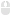

# Unity Editor Icons (6000.1.13f1)

**313 icons** available for Unity 6000.1.13f1


[](LICENSE)
[](/alaxxxx/unityeditoricons/releases/latest)

This project provides two main features:

1. **An Editor Window for Unity**: Browse, search, and copy the names of all internal editor icons directly within Unity. Perfect for creating custom editor tools with a native look and feel.

2. **A README Generator**: Automatically generates this documentation with previews of all icons, keeping the repository up-to-date with new Unity versions.

## 🚀 Installation

1. Download the latest release or clone this repository
2. Open the Icon Browser via **Tools > Icon Browser**

## 📖 Usage

```csharp
// Basic usage
GUIContent icon = EditorGUIUtility.IconContent("d_Toolbar Plus");

// In buttons
if (GUILayout.Button(icon, GUILayout.Width(30)))
    Debug.Log("Clicked!");

// In toolbars
if (GUILayout.Button(EditorGUIUtility.IconContent("d_Refresh"), EditorStyles.toolbarButton))
    RefreshData();

```

## 📊 Icon Statistics

- **Total Icons**: 313
- **Most Common Size**: 16
- **Size Range**: 2×2 to 256×256

## 🎨 All Icons (313)

| Preview | Dimensions | Name (for `EditorGUIUtility.IconContent`) |
|:---:|:---:|---|
|  | `256×256` | ```
AreaLight Gizmo
``` |
|  | `16×16` | ```
ArrowNavigationLeft
``` |
|  | `16×16` | ```
ArrowNavigationRight
``` |
|  | `20×15` | ```
AssetLabelIcon
``` |
|  | `256×256` | ```
AudioSource Gizmo
``` |
|  | `16×16` | ```
BrushMask
``` |
|  | `256×256` | ```
Camera Gizmo
``` |
|  | `32×32` | ```
console.erroricon
``` |
|  | `16×16` | ```
console.erroricon.sml
``` |
|  | `32×32` | ```
console.infoicon
``` |
|  | `16×16` | ```
console.infoicon.sml
``` |
|  | `32×32` | ```
console.warnicon
``` |
|  | `16×16` | ```
console.warnicon.sml
``` |
|  | `128×128` | ```
CrossIcon
``` |
|  | `16×16` | ```
d__Help
``` |
|  | `16×16` | ```
d__Menu
``` |
|  | `16×16` | ```
d__Popup
``` |
|  | `16×16` | ```
d_account
``` |
|  | `256×256` | ```
d_AnimationClip Icon
``` |
|  | `256×256` | ```
d_AssemblyDefinitionAsset Icon
``` |
|  | `16×16` | ```
d_AssemblyLock
``` |
|  | `64×64` | ```
d_AssetStore Icon
``` |
|  | `64×64` | ```
d_AudioClip Icon
``` |
|  | `64×64` | ```
d_AudioListener Icon
``` |
|  | `64×64` | ```
d_AudioSource Icon
``` |
|  | `16×16` | ```
d_BrushAttributes
``` |
|  | `16×16` | ```
d_CacheServerConnected
``` |
|  | `16×16` | ```
d_CacheServerDisabled
``` |
|  | `16×16` | ```
d_CacheServerDisconnected
``` |
|  | `64×64` | ```
d_Camera Icon
``` |
|  | `16×16` | ```
d_CameraPreview
``` |
|  | `16×16` | ```
d_clear
``` |
|  | `16×16` | ```
d_clear
``` |
|  | `16×16` | ```
d_CloudConnect
``` |
|  | `64×64` | ```
d_Collab.FileAdded
``` |
|  | `14×14` | ```
d_color_picker
``` |
|  | `14×14` | ```
d_color_picker
``` |
|  | `32×32` | ```
d_console.erroricon
``` |
|  | `32×32` | ```
d_console.erroricon
``` |
|  | `16×16` | ```
d_console.erroricon.inactive.sml
``` |
|  | `16×16` | ```
d_console.erroricon.sml
``` |
|  | `32×32` | ```
d_console.infoicon
``` |
|  | `32×32` | ```
d_console.infoicon
``` |
|  | `16×16` | ```
d_console.infoicon.inactive.sml
``` |
|  | `16×16` | ```
d_console.infoicon.sml
``` |
|  | `32×32` | ```
d_console.warnicon
``` |
|  | `16×16` | ```
d_console.warnicon.inactive.sml
``` |
|  | `16×16` | ```
d_console.warnicon.sml
``` |
|  | `16×16` | ```
d_CreateAddNew
``` |
|  | `256×256` | ```
d_cs Script Icon
``` |
|  | `19×13` | ```
d_CustomSorting
``` |
|  | `16×16` | ```
d_DataMode.Authoring
``` |
|  | `16×16` | ```
d_DataMode.Authoring.Sticky
``` |
|  | `16×16` | ```
d_DataMode.Mixed
``` |
|  | `16×16` | ```
d_DataMode.Mixed.Sticky
``` |
|  | `16×16` | ```
d_DataMode.Runtime
``` |
|  | `16×16` | ```
d_DataMode.Runtime.Sticky
``` |
|  | `16×16` | ```
d_debug
``` |
|  | `16×16` | ```
d_DebuggerAttached
``` |
|  | `16×16` | ```
d_DebuggerDisabled
``` |
|  | `16×16` | ```
d_DebuggerEnabled
``` |
|  | `64×64` | ```
d_DefaultAsset Icon
``` |
|  | `64×64` | ```
d_DirectionalLight Icon
``` |
|  | `12×12` | ```
d_dropdown
``` |
|  | `12×12` | ```
d_dropdown
``` |
|  | `15×12` | ```
d_dropdown_toggle
``` |
|  | `15×12` | ```
d_dropdown_toggle
``` |
|  | `16×16` | ```
d_editcollision_16
``` |
|  | `16×16` | ```
d_editconstraints_16
``` |
|  | `16×16` | ```
d_Exposure
``` |
|  | `16×16` | ```
d_Favorite
``` |
|  | `16×16` | ```
d_FilterByLabel
``` |
|  | `16×16` | ```
d_FilterByType
``` |
|  | `256×256` | ```
d_Folder Icon
``` |
|  | `256×256` | ```
d_FolderOpened Icon
``` |
|  | `16×16` | ```
d_FrameCapture
``` |
|  | `256×256` | ```
d_GameObject Icon
``` |
|  | `16×16` | ```
d_GameViewAudio
``` |
|  | `16×16` | ```
d_GameViewAudio On
``` |
|  | `16×16` | ```
d_GridAndSnap
``` |
|  | `16×16` | ```
d_GridLayoutGroup Icon
``` |
|  | `16×16` | ```
d_Help
``` |
|  | `12×12` | ```
d_icon dropdown
``` |
|  | `16×16` | ```
d_Import
``` |
|  | `13×13` | ```
d_IN_foldout
``` |
|  | `13×13` | ```
d_IN_foldout_act
``` |
|  | `13×13` | ```
d_IN_foldout_act_on
``` |
|  | `13×13` | ```
d_IN_foldout_on
``` |
|  | `256×256` | ```
d_Js Script Icon
``` |
|  | `16×16` | ```
d_Keyboard
``` |
|  | `16×16` | ```
d_KeyboardShortcutsDisabled
``` |
|  | `16×16` | ```
d_layout
``` |
|  | `64×64` | ```
d_Light Icon
``` |
|  | `16×16` | ```
d_LightingVisualization
``` |
|  | `16×16` | ```
d_LightingVisualizationColors
``` |
|  | `16×16` | ```
d_Linked
``` |
|  | `64×64` | ```
d_Material Icon
``` |
|  | `64×64` | ```
d_MeshFilter Icon
``` |
|  | `64×64` | ```
d_MeshRenderer Icon
``` |
|  | `16×16` | ```
d_more
``` |
|  | `16×16` | ```
d_MoreOptions
``` |
|  | `16×16` | ```
d_MouseLeft
``` |
|  | `16×16` | ```
d_MouseLeft-Drag
``` |
|  | `16×16` | ```
d_MouseMiddle
``` |
|  | `16×16` | ```
d_MouseMiddle-Drag
``` |
|  | `16×16` | ```
d_MouseRight
``` |
|  | `16×16` | ```
d_MouseRight-Drag
``` |
|  | `16×16` | ```
d_MoveTool
``` |
|  | `16×16` | ```
d_ol_minus
``` |
|  | `16×16` | ```
d_ol_minus
``` |
|  | `16×16` | ```
d_ol_minus_act
``` |
|  | `16×16` | ```
d_ol_minus_act
``` |
|  | `16×16` | ```
d_ol_plus
``` |
|  | `16×16` | ```
d_ol_plus
``` |
|  | `16×16` | ```
d_ol_plus_act
``` |
|  | `16×16` | ```
d_ol_plus_act
``` |
|  | `16×16` | ```
d_OrientationGizmo
``` |
|  | `64×64` | ```
d_ParticleSystem Icon
``` |
|  | `16×16` | ```
d_PBrowserPackagesNotVisible
``` |
|  | `16×16` | ```
d_PBrowserPackagesVisible
``` |
|  | `12×12` | ```
d_pick
``` |
|  | `12×12` | ```
d_pick
``` |
|  | `128×128` | ```
d_Prefab Icon
``` |
|  | `66×66` | ```
d_PrefabOverlayAdded Icon
``` |
|  | `66×66` | ```
d_PrefabOverlayRemoved Icon
``` |
|  | `16×16` | ```
d_Preset.Context
``` |
|  | `12×12` | ```
d_ProfilerTimelineDigDownArrow
``` |
|  | `12×12` | ```
d_ProfilerTimelineRollUpArrow
``` |
|  | `16×16` | ```
d_Progress
``` |
|  | `16×16` | ```
d_Project
``` |
|  | `16×16` | ```
d_RectTool
``` |
|  | `16×16` | ```
d_Refresh
``` |
|  | `64×64` | ```
d_Rigidbody Icon
``` |
|  | `16×16` | ```
d_RotateTool
``` |
|  | `16×16` | ```
d_SaveAs
``` |
|  | `16×16` | ```
d_ScaleTool
``` |
|  | `256×256` | ```
d_SceneAsset Icon
``` |
|  | `16×16` | ```
d_SceneLayersToggle
``` |
|  | `16×16` | ```
d_scenepicking_notpickable
``` |
|  | `16×16` | ```
d_scenepicking_notpickable_hover
``` |
|  | `16×16` | ```
d_scenepicking_notpickable-mixed
``` |
|  | `16×16` | ```
d_scenepicking_notpickable-mixed_hover
``` |
|  | `16×16` | ```
d_scenepicking_pickable
``` |
|  | `16×16` | ```
d_scenepicking_pickable_hover
``` |
|  | `16×16` | ```
d_scenepicking_pickable-mixed
``` |
|  | `16×16` | ```
d_scenepicking_pickable-mixed_hover
``` |
|  | `16×16` | ```
d_SceneViewSnap
``` |
|  | `16×16` | ```
d_scenevis_hidden
``` |
|  | `16×16` | ```
d_scenevis_hidden_hover
``` |
|  | `16×16` | ```
d_scenevis_hidden-mixed
``` |
|  | `16×16` | ```
d_scenevis_hidden-mixed_hover
``` |
|  | `16×16` | ```
d_scenevis_visible
``` |
|  | `16×16` | ```
d_scenevis_visible_hover
``` |
|  | `16×16` | ```
d_scenevis_visible-mixed
``` |
|  | `16×16` | ```
d_scenevis_visible-mixed_hover
``` |
|  | `64×64` | ```
d_ScriptableObject Icon
``` |
|  | `12×12` | ```
d_scrolldown
``` |
|  | `12×12` | ```
d_scrolldown
``` |
|  | `12×16` | ```
d_scrolldown_uielements
``` |
|  | `12×16` | ```
d_scrolldown_uielements
``` |
|  | `12×12` | ```
d_scrollleft
``` |
|  | `12×12` | ```
d_scrollleft
``` |
|  | `16×12` | ```
d_scrollleft_uielements
``` |
|  | `16×12` | ```
d_scrollleft_uielements
``` |
|  | `12×12` | ```
d_scrollright
``` |
|  | `12×12` | ```
d_scrollright
``` |
|  | `16×12` | ```
d_scrollright_uielements
``` |
|  | `16×12` | ```
d_scrollright_uielements
``` |
|  | `12×12` | ```
d_scrollup
``` |
|  | `12×12` | ```
d_scrollup
``` |
|  | `12×16` | ```
d_scrollup_uielements
``` |
|  | `12×16` | ```
d_scrollup_uielements
``` |
|  | `16×16` | ```
d_SculptMode_On
``` |
|  | `64×64` | ```
d_Search Icon
``` |
|  | `8×8` | ```
d_search_icon
``` |
|  | `8×8` | ```
d_search_icon
``` |
|  | `11×8` | ```
d_search_menu
``` |
|  | `11×8` | ```
d_search_menu
``` |
|  | `64×64` | ```
d_SearchJump Icon
``` |
|  | `16×16` | ```
d_SearchOverlay
``` |
|  | `16×16` | ```
d_SearchWindow
``` |
|  | `8×8` | ```
d_SeparatorDot
``` |
|  | `16×16` | ```
d_Settings
``` |
|  | `64×64` | ```
d_Settings Icon
``` |
|  | `16×16` | ```
d_Shaded
``` |
|  | `256×256` | ```
d_Shader Icon
``` |
|  | `64×64` | ```
d_Shortcut Icon
``` |
|  | `64×64` | ```
d_SphereCollider Icon
``` |
|  | `256×256` | ```
d_TextAsset Icon
``` |
|  | `64×64` | ```
d_Texture Icon
``` |
|  | `64×64` | ```
d_Texture2D Icon
``` |
|  | `14×14` | ```
d_toggle_bg
``` |
|  | `14×14` | ```
d_toggle_bg
``` |
|  | `14×14` | ```
d_toggle_mixed_bg
``` |
|  | `14×14` | ```
d_toggle_mixed_bg
``` |
|  | `14×14` | ```
d_toggle_on
``` |
|  | `14×14` | ```
d_toggle_on
``` |
|  | `14×14` | ```
d_toggle_on_focus
``` |
|  | `14×14` | ```
d_toggle_on_focus
``` |
|  | `14×14` | ```
d_toggle_on_hover
``` |
|  | `14×14` | ```
d_toggle_on_hover
``` |
|  | `16×16` | ```
d_ToolHandleCenter
``` |
|  | `16×16` | ```
d_ToolHandleGlobal
``` |
|  | `16×16` | ```
d_ToolHandleLocal
``` |
|  | `16×16` | ```
d_ToolHandlePivot
``` |
|  | `16×16` | ```
d_ToolSettings
``` |
|  | `2×2` | ```
d_tranp
``` |
|  | `64×64` | ```
d_Transform Icon
``` |
|  | `16×16` | ```
d_TreeEditor.Trash
``` |
|  | `16×16` | ```
d_UndoHistory
``` |
|  | `16×16` | ```
d_UnityEditor.ConsoleWindow
``` |
|  | `16×16` | ```
d_UnityEditor.FindDependencies
``` |
|  | `16×16` | ```
d_UnityEditor.GameView
``` |
|  | `16×14` | ```
d_UnityEditor.HierarchyWindow
``` |
|  | `16×16` | ```
d_UnityEditor.InspectorWindow
``` |
|  | `16×16` | ```
d_UnityEditor.SceneHierarchyWindow
``` |
|  | `16×16` | ```
d_UnityEditor.SceneView
``` |
|  | `73×22` | ```
d_UnityProduct
``` |
|  | `16×16` | ```
d_Unlinked
``` |
|  | `16×16` | ```
d_ViewOptions
``` |
|  | `16×16` | ```
d_WaitSpin00
``` |
|  | `16×16` | ```
d_WaitSpin01
``` |
|  | `16×16` | ```
d_WaitSpin02
``` |
|  | `16×16` | ```
d_WaitSpin03
``` |
|  | `16×16` | ```
d_WaitSpin04
``` |
|  | `16×16` | ```
d_WaitSpin05
``` |
|  | `16×16` | ```
d_WaitSpin06
``` |
|  | `16×16` | ```
d_WaitSpin07
``` |
|  | `16×16` | ```
d_WaitSpin08
``` |
|  | `16×16` | ```
d_WaitSpin09
``` |
|  | `16×16` | ```
d_WaitSpin10
``` |
|  | `16×16` | ```
d_WaitSpin11
``` |
|  | `256×256` | ```
DirectionalLight Gizmo
``` |
|  | `256×256` | ```
DiscLight Gizmo
``` |
|  | `12×12` | ```
dropdown_PreviewPackages
``` |
|  | `17×15` | ```
ExposablePopupBg
``` |
|  | `256×256` | ```
Folder On Icon
``` |
|  | `4×18` | ```
IN BigTitle
``` |
|  | `4×18` | ```
IN BigTitle
``` |
|  | `4×18` | ```
IN BigTitle Post
``` |
|  | `4×18` | ```
IN BigTitle Post
``` |
|  | `13×13` | ```
IN foldout
``` |
|  | `13×13` | ```
IN foldout act on
``` |
|  | `26×26` | ```
IN foldout act on@2x
``` |
|  | `26×26` | ```
IN foldout act@2x
``` |
|  | `13×13` | ```
IN foldout focus
``` |
|  | `13×13` | ```
IN foldout focus on
``` |
|  | `26×26` | ```
IN foldout focus on@2x
``` |
|  | `26×26` | ```
IN foldout focus@2x
``` |
|  | `13×13` | ```
IN foldout on
``` |
|  | `26×26` | ```
IN foldout on@2x
``` |
|  | `26×26` | ```
IN foldout@2x
``` |
|  | `256×256` | ```
LensFlare Gizmo
``` |
|  | `256×256` | ```
LightProbeGroup Gizmo
``` |
|  | `256×256` | ```
LightProbeProxyVolume Gizmo
``` |
|  | `256×256` | ```
Main Light Gizmo
``` |
|  | `13×13` | ```
ol minus act
``` |
|  | `13×13` | ```
ol minus act
``` |
|  | `13×13` | ```
ol plus act
``` |
|  | `13×13` | ```
ol plus act
``` |
|  | `64×64` | ```
package_installed
``` |
|  | `32×32` | ```
package_update
``` |
|  | `16×16` | ```
pane options
``` |
|  | `32×32` | ```
pane options@2x
``` |
|  | `256×256` | ```
ParticleSystem Gizmo
``` |
|  | `256×256` | ```
ParticleSystemForceField Gizmo
``` |
|  | `256×256` | ```
PointLight Gizmo
``` |
|  | `71×68` | ```
PopupWindowOff
``` |
|  | `21×16` | ```
PR DropHere
``` |
|  | `42×32` | ```
PR DropHere@2x
``` |
|  | `16×16` | ```
PreviewPackageInUse
``` |
|  | `22×12` | ```
ProfilerBadge
``` |
|  | `44×24` | ```
ProfilerBadge@2x
``` |
|  | `3×4` | ```
ProfilerNoDataAvailableOverlayDark
``` |
|  | `3×4` | ```
ProfilerNoDataAvailableOverlayDarkOn
``` |
|  | `4×18` | ```
ProilerLeftPaneOn
``` |
|  | `8×36` | ```
ProilerLeftPaneOn@2x
``` |
|  | `256×256` | ```
Projector Gizmo
``` |
|  | `256×256` | ```
ReflectionProbe Gizmo
``` |
|  | `16×16` | ```
RepaintDot
``` |
|  | `6×31` | ```
scrubber background
``` |
|  | `18×18` | ```
search focused
``` |
|  | `36×36` | ```
search focused@2x
``` |
|  | `36×36` | ```
search@2x
``` |
|  | `8×8` | ```
SearchModeFilter
``` |
|  | `13×13` | ```
ShurikenDropdownFocused
``` |
|  | `20×13` | ```
ShurikenObjectField
``` |
|  | `20×13` | ```
ShurikenObjectFieldFocused
``` |
|  | `20×13` | ```
ShurikenObjectFieldPreDrop
``` |
|  | `13×13` | ```
ShurikenPopupFocused
``` |
|  | `12×12` | ```
ShurikenToggleFocused
``` |
|  | `12×12` | ```
ShurikenToggleFocusedOn
``` |
|  | `12×12` | ```
ShurikenToggleHover
``` |
|  | `12×12` | ```
ShurikenToggleHoverOn
``` |
|  | `12×12` | ```
ShurikenToggleMixed
``` |
|  | `12×12` | ```
ShurikenToggleNormal
``` |
|  | `12×12` | ```
ShurikenToggleNormalMixed
``` |
|  | `12×12` | ```
ShurikenToggleNormalOn
``` |
|  | `256×256` | ```
SpotLight Gizmo
``` |
|  | `32×30` | ```
toggle act@2x
``` |
|  | `32×30` | ```
toggle focus@2x
``` |
|  | `16×15` | ```
toggle mixed act
``` |
|  | `32×30` | ```
toggle mixed act@2x
``` |
|  | `32×30` | ```
toggle mixed focus@2x
``` |
|  | `32×30` | ```
toggle mixed@2x
``` |
|  | `16×15` | ```
toggle on act
``` |
|  | `32×30` | ```
toggle on act@2x
``` |
|  | `32×30` | ```
toggle on focus@2x
``` |
|  | `32×30` | ```
toggle on@2x
``` |
|  | `32×30` | ```
toggle@2x
``` |
|  | `256×256` | ```
VisualEffect Gizmo
``` |
|  | `4×4` | ```
white
``` |
|  | `256×256` | ```
WindZone Gizmo
``` |

---

*Generated automatically on 2025-08-08 for Unity 6000.1.13f1*
