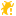

# Unity Editor Icons (6000.1.13f1)

**313 icons** available for Unity 6000.1.13f1


[](LICENSE)
[](/alaxxxx/unityeditoricons/releases/latest)

This project provides two main features:

1. **An Editor Window for Unity**: Browse, search, and copy the names of all internal editor icons directly within Unity. Perfect for creating custom editor tools with a native look and feel.

2. **A README Generator**: Automatically generates this documentation with previews of all icons, keeping the repository up-to-date with new Unity versions.

## 🚀 Installation

1. Download the latest release or clone this repository
2. Open the Icon Browser via **Tools > Icon Browser**

## 📖 Usage

```csharp
// Basic usage
GUIContent icon = EditorGUIUtility.IconContent("d_Toolbar Plus");

// In buttons
if (GUILayout.Button(icon, GUILayout.Width(30)))
    Debug.Log("Clicked!");

// In toolbars
if (GUILayout.Button(EditorGUIUtility.IconContent("d_Refresh"), EditorStyles.toolbarButton))
    RefreshData();

```

## 📊 Icon Statistics

- **Total Icons**: 313
- **Most Common Size**: 16
- **Size Range**: 2×2 to 256×256

## 🎨 All Icons (313)

*Click on any icon name to copy it to clipboard*

| Preview | Dimensions | Name (for `EditorGUIUtility.IconContent`) |
|:---:|:---:|---|
|  | `256×256` | <code class="icon-name" onclick="copyToClipboard('AreaLight Gizmo')" style="cursor: pointer; user-select: none;" title="Click to copy">AreaLight Gizmo</code> |
|  | `16×16` | <code class="icon-name" onclick="copyToClipboard('ArrowNavigationLeft')" style="cursor: pointer; user-select: none;" title="Click to copy">ArrowNavigationLeft</code> |
|  | `16×16` | <code class="icon-name" onclick="copyToClipboard('ArrowNavigationRight')" style="cursor: pointer; user-select: none;" title="Click to copy">ArrowNavigationRight</code> |
|  | `20×15` | <code class="icon-name" onclick="copyToClipboard('AssetLabelIcon')" style="cursor: pointer; user-select: none;" title="Click to copy">AssetLabelIcon</code> |
|  | `256×256` | <code class="icon-name" onclick="copyToClipboard('AudioSource Gizmo')" style="cursor: pointer; user-select: none;" title="Click to copy">AudioSource Gizmo</code> |
|  | `16×16` | <code class="icon-name" onclick="copyToClipboard('BrushMask')" style="cursor: pointer; user-select: none;" title="Click to copy">BrushMask</code> |
|  | `256×256` | <code class="icon-name" onclick="copyToClipboard('Camera Gizmo')" style="cursor: pointer; user-select: none;" title="Click to copy">Camera Gizmo</code> |
|  | `32×32` | <code class="icon-name" onclick="copyToClipboard('console.erroricon')" style="cursor: pointer; user-select: none;" title="Click to copy">console.erroricon</code> |
|  | `16×16` | <code class="icon-name" onclick="copyToClipboard('console.erroricon.sml')" style="cursor: pointer; user-select: none;" title="Click to copy">console.erroricon.sml</code> |
|  | `32×32` | <code class="icon-name" onclick="copyToClipboard('console.infoicon')" style="cursor: pointer; user-select: none;" title="Click to copy">console.infoicon</code> |
|  | `16×16` | <code class="icon-name" onclick="copyToClipboard('console.infoicon.sml')" style="cursor: pointer; user-select: none;" title="Click to copy">console.infoicon.sml</code> |
|  | `32×32` | <code class="icon-name" onclick="copyToClipboard('console.warnicon')" style="cursor: pointer; user-select: none;" title="Click to copy">console.warnicon</code> |
|  | `16×16` | <code class="icon-name" onclick="copyToClipboard('console.warnicon.sml')" style="cursor: pointer; user-select: none;" title="Click to copy">console.warnicon.sml</code> |
|  | `128×128` | <code class="icon-name" onclick="copyToClipboard('CrossIcon')" style="cursor: pointer; user-select: none;" title="Click to copy">CrossIcon</code> |
|  | `16×16` | <code class="icon-name" onclick="copyToClipboard('d__Help')" style="cursor: pointer; user-select: none;" title="Click to copy">d__Help</code> |
|  | `16×16` | <code class="icon-name" onclick="copyToClipboard('d__Menu')" style="cursor: pointer; user-select: none;" title="Click to copy">d__Menu</code> |
|  | `16×16` | <code class="icon-name" onclick="copyToClipboard('d__Popup')" style="cursor: pointer; user-select: none;" title="Click to copy">d__Popup</code> |
|  | `16×16` | <code class="icon-name" onclick="copyToClipboard('d_account')" style="cursor: pointer; user-select: none;" title="Click to copy">d_account</code> |
|  | `256×256` | <code class="icon-name" onclick="copyToClipboard('d_AnimationClip Icon')" style="cursor: pointer; user-select: none;" title="Click to copy">d_AnimationClip Icon</code> |
|  | `256×256` | <code class="icon-name" onclick="copyToClipboard('d_AssemblyDefinitionAsset Icon')" style="cursor: pointer; user-select: none;" title="Click to copy">d_AssemblyDefinitionAsset Icon</code> |
|  | `16×16` | <code class="icon-name" onclick="copyToClipboard('d_AssemblyLock')" style="cursor: pointer; user-select: none;" title="Click to copy">d_AssemblyLock</code> |
|  | `64×64` | <code class="icon-name" onclick="copyToClipboard('d_AssetStore Icon')" style="cursor: pointer; user-select: none;" title="Click to copy">d_AssetStore Icon</code> |
|  | `64×64` | <code class="icon-name" onclick="copyToClipboard('d_AudioClip Icon')" style="cursor: pointer; user-select: none;" title="Click to copy">d_AudioClip Icon</code> |
|  | `64×64` | <code class="icon-name" onclick="copyToClipboard('d_AudioListener Icon')" style="cursor: pointer; user-select: none;" title="Click to copy">d_AudioListener Icon</code> |
|  | `64×64` | <code class="icon-name" onclick="copyToClipboard('d_AudioSource Icon')" style="cursor: pointer; user-select: none;" title="Click to copy">d_AudioSource Icon</code> |
|  | `16×16` | <code class="icon-name" onclick="copyToClipboard('d_BrushAttributes')" style="cursor: pointer; user-select: none;" title="Click to copy">d_BrushAttributes</code> |
|  | `16×16` | <code class="icon-name" onclick="copyToClipboard('d_CacheServerConnected')" style="cursor: pointer; user-select: none;" title="Click to copy">d_CacheServerConnected</code> |
|  | `16×16` | <code class="icon-name" onclick="copyToClipboard('d_CacheServerDisabled')" style="cursor: pointer; user-select: none;" title="Click to copy">d_CacheServerDisabled</code> |
|  | `16×16` | <code class="icon-name" onclick="copyToClipboard('d_CacheServerDisconnected')" style="cursor: pointer; user-select: none;" title="Click to copy">d_CacheServerDisconnected</code> |
|  | `64×64` | <code class="icon-name" onclick="copyToClipboard('d_Camera Icon')" style="cursor: pointer; user-select: none;" title="Click to copy">d_Camera Icon</code> |
|  | `16×16` | <code class="icon-name" onclick="copyToClipboard('d_CameraPreview')" style="cursor: pointer; user-select: none;" title="Click to copy">d_CameraPreview</code> |
|  | `16×16` | <code class="icon-name" onclick="copyToClipboard('d_clear')" style="cursor: pointer; user-select: none;" title="Click to copy">d_clear</code> |
|  | `16×16` | <code class="icon-name" onclick="copyToClipboard('d_clear')" style="cursor: pointer; user-select: none;" title="Click to copy">d_clear</code> |
|  | `16×16` | <code class="icon-name" onclick="copyToClipboard('d_CloudConnect')" style="cursor: pointer; user-select: none;" title="Click to copy">d_CloudConnect</code> |
|  | `64×64` | <code class="icon-name" onclick="copyToClipboard('d_Collab.FileAdded')" style="cursor: pointer; user-select: none;" title="Click to copy">d_Collab.FileAdded</code> |
|  | `14×14` | <code class="icon-name" onclick="copyToClipboard('d_color_picker')" style="cursor: pointer; user-select: none;" title="Click to copy">d_color_picker</code> |
|  | `14×14` | <code class="icon-name" onclick="copyToClipboard('d_color_picker')" style="cursor: pointer; user-select: none;" title="Click to copy">d_color_picker</code> |
|  | `32×32` | <code class="icon-name" onclick="copyToClipboard('d_console.erroricon')" style="cursor: pointer; user-select: none;" title="Click to copy">d_console.erroricon</code> |
|  | `32×32` | <code class="icon-name" onclick="copyToClipboard('d_console.erroricon')" style="cursor: pointer; user-select: none;" title="Click to copy">d_console.erroricon</code> |
|  | `16×16` | <code class="icon-name" onclick="copyToClipboard('d_console.erroricon.inactive.sml')" style="cursor: pointer; user-select: none;" title="Click to copy">d_console.erroricon.inactive.sml</code> |
|  | `16×16` | <code class="icon-name" onclick="copyToClipboard('d_console.erroricon.sml')" style="cursor: pointer; user-select: none;" title="Click to copy">d_console.erroricon.sml</code> |
|  | `32×32` | <code class="icon-name" onclick="copyToClipboard('d_console.infoicon')" style="cursor: pointer; user-select: none;" title="Click to copy">d_console.infoicon</code> |
|  | `32×32` | <code class="icon-name" onclick="copyToClipboard('d_console.infoicon')" style="cursor: pointer; user-select: none;" title="Click to copy">d_console.infoicon</code> |
|  | `16×16` | <code class="icon-name" onclick="copyToClipboard('d_console.infoicon.inactive.sml')" style="cursor: pointer; user-select: none;" title="Click to copy">d_console.infoicon.inactive.sml</code> |
|  | `16×16` | <code class="icon-name" onclick="copyToClipboard('d_console.infoicon.sml')" style="cursor: pointer; user-select: none;" title="Click to copy">d_console.infoicon.sml</code> |
|  | `32×32` | <code class="icon-name" onclick="copyToClipboard('d_console.warnicon')" style="cursor: pointer; user-select: none;" title="Click to copy">d_console.warnicon</code> |
|  | `16×16` | <code class="icon-name" onclick="copyToClipboard('d_console.warnicon.inactive.sml')" style="cursor: pointer; user-select: none;" title="Click to copy">d_console.warnicon.inactive.sml</code> |
|  | `16×16` | <code class="icon-name" onclick="copyToClipboard('d_console.warnicon.sml')" style="cursor: pointer; user-select: none;" title="Click to copy">d_console.warnicon.sml</code> |
|  | `16×16` | <code class="icon-name" onclick="copyToClipboard('d_CreateAddNew')" style="cursor: pointer; user-select: none;" title="Click to copy">d_CreateAddNew</code> |
|  | `256×256` | <code class="icon-name" onclick="copyToClipboard('d_cs Script Icon')" style="cursor: pointer; user-select: none;" title="Click to copy">d_cs Script Icon</code> |
|  | `19×13` | <code class="icon-name" onclick="copyToClipboard('d_CustomSorting')" style="cursor: pointer; user-select: none;" title="Click to copy">d_CustomSorting</code> |
|  | `16×16` | <code class="icon-name" onclick="copyToClipboard('d_DataMode.Authoring')" style="cursor: pointer; user-select: none;" title="Click to copy">d_DataMode.Authoring</code> |
|  | `16×16` | <code class="icon-name" onclick="copyToClipboard('d_DataMode.Authoring.Sticky')" style="cursor: pointer; user-select: none;" title="Click to copy">d_DataMode.Authoring.Sticky</code> |
|  | `16×16` | <code class="icon-name" onclick="copyToClipboard('d_DataMode.Mixed')" style="cursor: pointer; user-select: none;" title="Click to copy">d_DataMode.Mixed</code> |
|  | `16×16` | <code class="icon-name" onclick="copyToClipboard('d_DataMode.Mixed.Sticky')" style="cursor: pointer; user-select: none;" title="Click to copy">d_DataMode.Mixed.Sticky</code> |
|  | `16×16` | <code class="icon-name" onclick="copyToClipboard('d_DataMode.Runtime')" style="cursor: pointer; user-select: none;" title="Click to copy">d_DataMode.Runtime</code> |
|  | `16×16` | <code class="icon-name" onclick="copyToClipboard('d_DataMode.Runtime.Sticky')" style="cursor: pointer; user-select: none;" title="Click to copy">d_DataMode.Runtime.Sticky</code> |
|  | `16×16` | <code class="icon-name" onclick="copyToClipboard('d_debug')" style="cursor: pointer; user-select: none;" title="Click to copy">d_debug</code> |
|  | `16×16` | <code class="icon-name" onclick="copyToClipboard('d_DebuggerAttached')" style="cursor: pointer; user-select: none;" title="Click to copy">d_DebuggerAttached</code> |
|  | `16×16` | <code class="icon-name" onclick="copyToClipboard('d_DebuggerDisabled')" style="cursor: pointer; user-select: none;" title="Click to copy">d_DebuggerDisabled</code> |
|  | `16×16` | <code class="icon-name" onclick="copyToClipboard('d_DebuggerEnabled')" style="cursor: pointer; user-select: none;" title="Click to copy">d_DebuggerEnabled</code> |
|  | `64×64` | <code class="icon-name" onclick="copyToClipboard('d_DefaultAsset Icon')" style="cursor: pointer; user-select: none;" title="Click to copy">d_DefaultAsset Icon</code> |
|  | `64×64` | <code class="icon-name" onclick="copyToClipboard('d_DirectionalLight Icon')" style="cursor: pointer; user-select: none;" title="Click to copy">d_DirectionalLight Icon</code> |
|  | `12×12` | <code class="icon-name" onclick="copyToClipboard('d_dropdown')" style="cursor: pointer; user-select: none;" title="Click to copy">d_dropdown</code> |
|  | `12×12` | <code class="icon-name" onclick="copyToClipboard('d_dropdown')" style="cursor: pointer; user-select: none;" title="Click to copy">d_dropdown</code> |
|  | `15×12` | <code class="icon-name" onclick="copyToClipboard('d_dropdown_toggle')" style="cursor: pointer; user-select: none;" title="Click to copy">d_dropdown_toggle</code> |
|  | `15×12` | <code class="icon-name" onclick="copyToClipboard('d_dropdown_toggle')" style="cursor: pointer; user-select: none;" title="Click to copy">d_dropdown_toggle</code> |
|  | `16×16` | <code class="icon-name" onclick="copyToClipboard('d_editcollision_16')" style="cursor: pointer; user-select: none;" title="Click to copy">d_editcollision_16</code> |
|  | `16×16` | <code class="icon-name" onclick="copyToClipboard('d_editconstraints_16')" style="cursor: pointer; user-select: none;" title="Click to copy">d_editconstraints_16</code> |
|  | `16×16` | <code class="icon-name" onclick="copyToClipboard('d_Exposure')" style="cursor: pointer; user-select: none;" title="Click to copy">d_Exposure</code> |
|  | `16×16` | <code class="icon-name" onclick="copyToClipboard('d_Favorite')" style="cursor: pointer; user-select: none;" title="Click to copy">d_Favorite</code> |
|  | `16×16` | <code class="icon-name" onclick="copyToClipboard('d_FilterByLabel')" style="cursor: pointer; user-select: none;" title="Click to copy">d_FilterByLabel</code> |
|  | `16×16` | <code class="icon-name" onclick="copyToClipboard('d_FilterByType')" style="cursor: pointer; user-select: none;" title="Click to copy">d_FilterByType</code> |
|  | `256×256` | <code class="icon-name" onclick="copyToClipboard('d_Folder Icon')" style="cursor: pointer; user-select: none;" title="Click to copy">d_Folder Icon</code> |
|  | `256×256` | <code class="icon-name" onclick="copyToClipboard('d_FolderOpened Icon')" style="cursor: pointer; user-select: none;" title="Click to copy">d_FolderOpened Icon</code> |
|  | `16×16` | <code class="icon-name" onclick="copyToClipboard('d_FrameCapture')" style="cursor: pointer; user-select: none;" title="Click to copy">d_FrameCapture</code> |
|  | `256×256` | <code class="icon-name" onclick="copyToClipboard('d_GameObject Icon')" style="cursor: pointer; user-select: none;" title="Click to copy">d_GameObject Icon</code> |
|  | `16×16` | <code class="icon-name" onclick="copyToClipboard('d_GameViewAudio')" style="cursor: pointer; user-select: none;" title="Click to copy">d_GameViewAudio</code> |
|  | `16×16` | <code class="icon-name" onclick="copyToClipboard('d_GameViewAudio On')" style="cursor: pointer; user-select: none;" title="Click to copy">d_GameViewAudio On</code> |
|  | `16×16` | <code class="icon-name" onclick="copyToClipboard('d_GridAndSnap')" style="cursor: pointer; user-select: none;" title="Click to copy">d_GridAndSnap</code> |
|  | `16×16` | <code class="icon-name" onclick="copyToClipboard('d_GridLayoutGroup Icon')" style="cursor: pointer; user-select: none;" title="Click to copy">d_GridLayoutGroup Icon</code> |
|  | `16×16` | <code class="icon-name" onclick="copyToClipboard('d_Help')" style="cursor: pointer; user-select: none;" title="Click to copy">d_Help</code> |
|  | `12×12` | <code class="icon-name" onclick="copyToClipboard('d_icon dropdown')" style="cursor: pointer; user-select: none;" title="Click to copy">d_icon dropdown</code> |
|  | `16×16` | <code class="icon-name" onclick="copyToClipboard('d_Import')" style="cursor: pointer; user-select: none;" title="Click to copy">d_Import</code> |
|  | `13×13` | <code class="icon-name" onclick="copyToClipboard('d_IN_foldout')" style="cursor: pointer; user-select: none;" title="Click to copy">d_IN_foldout</code> |
|  | `13×13` | <code class="icon-name" onclick="copyToClipboard('d_IN_foldout_act')" style="cursor: pointer; user-select: none;" title="Click to copy">d_IN_foldout_act</code> |
|  | `13×13` | <code class="icon-name" onclick="copyToClipboard('d_IN_foldout_act_on')" style="cursor: pointer; user-select: none;" title="Click to copy">d_IN_foldout_act_on</code> |
|  | `13×13` | <code class="icon-name" onclick="copyToClipboard('d_IN_foldout_on')" style="cursor: pointer; user-select: none;" title="Click to copy">d_IN_foldout_on</code> |
|  | `256×256` | <code class="icon-name" onclick="copyToClipboard('d_Js Script Icon')" style="cursor: pointer; user-select: none;" title="Click to copy">d_Js Script Icon</code> |
|  | `16×16` | <code class="icon-name" onclick="copyToClipboard('d_Keyboard')" style="cursor: pointer; user-select: none;" title="Click to copy">d_Keyboard</code> |
|  | `16×16` | <code class="icon-name" onclick="copyToClipboard('d_KeyboardShortcutsDisabled')" style="cursor: pointer; user-select: none;" title="Click to copy">d_KeyboardShortcutsDisabled</code> |
|  | `16×16` | <code class="icon-name" onclick="copyToClipboard('d_layout')" style="cursor: pointer; user-select: none;" title="Click to copy">d_layout</code> |
|  | `64×64` | <code class="icon-name" onclick="copyToClipboard('d_Light Icon')" style="cursor: pointer; user-select: none;" title="Click to copy">d_Light Icon</code> |
|  | `16×16` | <code class="icon-name" onclick="copyToClipboard('d_LightingVisualization')" style="cursor: pointer; user-select: none;" title="Click to copy">d_LightingVisualization</code> |
|  | `16×16` | <code class="icon-name" onclick="copyToClipboard('d_LightingVisualizationColors')" style="cursor: pointer; user-select: none;" title="Click to copy">d_LightingVisualizationColors</code> |
|  | `16×16` | <code class="icon-name" onclick="copyToClipboard('d_Linked')" style="cursor: pointer; user-select: none;" title="Click to copy">d_Linked</code> |
|  | `64×64` | <code class="icon-name" onclick="copyToClipboard('d_Material Icon')" style="cursor: pointer; user-select: none;" title="Click to copy">d_Material Icon</code> |
|  | `64×64` | <code class="icon-name" onclick="copyToClipboard('d_MeshFilter Icon')" style="cursor: pointer; user-select: none;" title="Click to copy">d_MeshFilter Icon</code> |
|  | `64×64` | <code class="icon-name" onclick="copyToClipboard('d_MeshRenderer Icon')" style="cursor: pointer; user-select: none;" title="Click to copy">d_MeshRenderer Icon</code> |
|  | `16×16` | <code class="icon-name" onclick="copyToClipboard('d_more')" style="cursor: pointer; user-select: none;" title="Click to copy">d_more</code> |
|  | `16×16` | <code class="icon-name" onclick="copyToClipboard('d_MoreOptions')" style="cursor: pointer; user-select: none;" title="Click to copy">d_MoreOptions</code> |
|  | `16×16` | <code class="icon-name" onclick="copyToClipboard('d_MouseLeft')" style="cursor: pointer; user-select: none;" title="Click to copy">d_MouseLeft</code> |
|  | `16×16` | <code class="icon-name" onclick="copyToClipboard('d_MouseLeft-Drag')" style="cursor: pointer; user-select: none;" title="Click to copy">d_MouseLeft-Drag</code> |
|  | `16×16` | <code class="icon-name" onclick="copyToClipboard('d_MouseMiddle')" style="cursor: pointer; user-select: none;" title="Click to copy">d_MouseMiddle</code> |
|  | `16×16` | <code class="icon-name" onclick="copyToClipboard('d_MouseMiddle-Drag')" style="cursor: pointer; user-select: none;" title="Click to copy">d_MouseMiddle-Drag</code> |
|  | `16×16` | <code class="icon-name" onclick="copyToClipboard('d_MouseRight')" style="cursor: pointer; user-select: none;" title="Click to copy">d_MouseRight</code> |
|  | `16×16` | <code class="icon-name" onclick="copyToClipboard('d_MouseRight-Drag')" style="cursor: pointer; user-select: none;" title="Click to copy">d_MouseRight-Drag</code> |
|  | `16×16` | <code class="icon-name" onclick="copyToClipboard('d_MoveTool')" style="cursor: pointer; user-select: none;" title="Click to copy">d_MoveTool</code> |
|  | `16×16` | <code class="icon-name" onclick="copyToClipboard('d_ol_minus')" style="cursor: pointer; user-select: none;" title="Click to copy">d_ol_minus</code> |
|  | `16×16` | <code class="icon-name" onclick="copyToClipboard('d_ol_minus')" style="cursor: pointer; user-select: none;" title="Click to copy">d_ol_minus</code> |
|  | `16×16` | <code class="icon-name" onclick="copyToClipboard('d_ol_minus_act')" style="cursor: pointer; user-select: none;" title="Click to copy">d_ol_minus_act</code> |
|  | `16×16` | <code class="icon-name" onclick="copyToClipboard('d_ol_minus_act')" style="cursor: pointer; user-select: none;" title="Click to copy">d_ol_minus_act</code> |
|  | `16×16` | <code class="icon-name" onclick="copyToClipboard('d_ol_plus')" style="cursor: pointer; user-select: none;" title="Click to copy">d_ol_plus</code> |
|  | `16×16` | <code class="icon-name" onclick="copyToClipboard('d_ol_plus')" style="cursor: pointer; user-select: none;" title="Click to copy">d_ol_plus</code> |
|  | `16×16` | <code class="icon-name" onclick="copyToClipboard('d_ol_plus_act')" style="cursor: pointer; user-select: none;" title="Click to copy">d_ol_plus_act</code> |
|  | `16×16` | <code class="icon-name" onclick="copyToClipboard('d_ol_plus_act')" style="cursor: pointer; user-select: none;" title="Click to copy">d_ol_plus_act</code> |
|  | `16×16` | <code class="icon-name" onclick="copyToClipboard('d_OrientationGizmo')" style="cursor: pointer; user-select: none;" title="Click to copy">d_OrientationGizmo</code> |
|  | `64×64` | <code class="icon-name" onclick="copyToClipboard('d_ParticleSystem Icon')" style="cursor: pointer; user-select: none;" title="Click to copy">d_ParticleSystem Icon</code> |
|  | `16×16` | <code class="icon-name" onclick="copyToClipboard('d_PBrowserPackagesNotVisible')" style="cursor: pointer; user-select: none;" title="Click to copy">d_PBrowserPackagesNotVisible</code> |
|  | `16×16` | <code class="icon-name" onclick="copyToClipboard('d_PBrowserPackagesVisible')" style="cursor: pointer; user-select: none;" title="Click to copy">d_PBrowserPackagesVisible</code> |
|  | `12×12` | <code class="icon-name" onclick="copyToClipboard('d_pick')" style="cursor: pointer; user-select: none;" title="Click to copy">d_pick</code> |
|  | `12×12` | <code class="icon-name" onclick="copyToClipboard('d_pick')" style="cursor: pointer; user-select: none;" title="Click to copy">d_pick</code> |
|  | `128×128` | <code class="icon-name" onclick="copyToClipboard('d_Prefab Icon')" style="cursor: pointer; user-select: none;" title="Click to copy">d_Prefab Icon</code> |
|  | `66×66` | <code class="icon-name" onclick="copyToClipboard('d_PrefabOverlayAdded Icon')" style="cursor: pointer; user-select: none;" title="Click to copy">d_PrefabOverlayAdded Icon</code> |
|  | `66×66` | <code class="icon-name" onclick="copyToClipboard('d_PrefabOverlayRemoved Icon')" style="cursor: pointer; user-select: none;" title="Click to copy">d_PrefabOverlayRemoved Icon</code> |
|  | `16×16` | <code class="icon-name" onclick="copyToClipboard('d_Preset.Context')" style="cursor: pointer; user-select: none;" title="Click to copy">d_Preset.Context</code> |
|  | `12×12` | <code class="icon-name" onclick="copyToClipboard('d_ProfilerTimelineDigDownArrow')" style="cursor: pointer; user-select: none;" title="Click to copy">d_ProfilerTimelineDigDownArrow</code> |
|  | `12×12` | <code class="icon-name" onclick="copyToClipboard('d_ProfilerTimelineRollUpArrow')" style="cursor: pointer; user-select: none;" title="Click to copy">d_ProfilerTimelineRollUpArrow</code> |
|  | `16×16` | <code class="icon-name" onclick="copyToClipboard('d_Progress')" style="cursor: pointer; user-select: none;" title="Click to copy">d_Progress</code> |
|  | `16×16` | <code class="icon-name" onclick="copyToClipboard('d_Project')" style="cursor: pointer; user-select: none;" title="Click to copy">d_Project</code> |
|  | `16×16` | <code class="icon-name" onclick="copyToClipboard('d_RectTool')" style="cursor: pointer; user-select: none;" title="Click to copy">d_RectTool</code> |
|  | `16×16` | <code class="icon-name" onclick="copyToClipboard('d_Refresh')" style="cursor: pointer; user-select: none;" title="Click to copy">d_Refresh</code> |
|  | `64×64` | <code class="icon-name" onclick="copyToClipboard('d_Rigidbody Icon')" style="cursor: pointer; user-select: none;" title="Click to copy">d_Rigidbody Icon</code> |
|  | `16×16` | <code class="icon-name" onclick="copyToClipboard('d_RotateTool')" style="cursor: pointer; user-select: none;" title="Click to copy">d_RotateTool</code> |
|  | `16×16` | <code class="icon-name" onclick="copyToClipboard('d_SaveAs')" style="cursor: pointer; user-select: none;" title="Click to copy">d_SaveAs</code> |
|  | `16×16` | <code class="icon-name" onclick="copyToClipboard('d_ScaleTool')" style="cursor: pointer; user-select: none;" title="Click to copy">d_ScaleTool</code> |
|  | `256×256` | <code class="icon-name" onclick="copyToClipboard('d_SceneAsset Icon')" style="cursor: pointer; user-select: none;" title="Click to copy">d_SceneAsset Icon</code> |
|  | `16×16` | <code class="icon-name" onclick="copyToClipboard('d_SceneLayersToggle')" style="cursor: pointer; user-select: none;" title="Click to copy">d_SceneLayersToggle</code> |
|  | `16×16` | <code class="icon-name" onclick="copyToClipboard('d_scenepicking_notpickable')" style="cursor: pointer; user-select: none;" title="Click to copy">d_scenepicking_notpickable</code> |
|  | `16×16` | <code class="icon-name" onclick="copyToClipboard('d_scenepicking_notpickable_hover')" style="cursor: pointer; user-select: none;" title="Click to copy">d_scenepicking_notpickable_hover</code> |
|  | `16×16` | <code class="icon-name" onclick="copyToClipboard('d_scenepicking_notpickable-mixed')" style="cursor: pointer; user-select: none;" title="Click to copy">d_scenepicking_notpickable-mixed</code> |
|  | `16×16` | <code class="icon-name" onclick="copyToClipboard('d_scenepicking_notpickable-mixed_hover')" style="cursor: pointer; user-select: none;" title="Click to copy">d_scenepicking_notpickable-mixed_hover</code> |
|  | `16×16` | <code class="icon-name" onclick="copyToClipboard('d_scenepicking_pickable')" style="cursor: pointer; user-select: none;" title="Click to copy">d_scenepicking_pickable</code> |
|  | `16×16` | <code class="icon-name" onclick="copyToClipboard('d_scenepicking_pickable_hover')" style="cursor: pointer; user-select: none;" title="Click to copy">d_scenepicking_pickable_hover</code> |
|  | `16×16` | <code class="icon-name" onclick="copyToClipboard('d_scenepicking_pickable-mixed')" style="cursor: pointer; user-select: none;" title="Click to copy">d_scenepicking_pickable-mixed</code> |
|  | `16×16` | <code class="icon-name" onclick="copyToClipboard('d_scenepicking_pickable-mixed_hover')" style="cursor: pointer; user-select: none;" title="Click to copy">d_scenepicking_pickable-mixed_hover</code> |
|  | `16×16` | <code class="icon-name" onclick="copyToClipboard('d_SceneViewSnap')" style="cursor: pointer; user-select: none;" title="Click to copy">d_SceneViewSnap</code> |
|  | `16×16` | <code class="icon-name" onclick="copyToClipboard('d_scenevis_hidden')" style="cursor: pointer; user-select: none;" title="Click to copy">d_scenevis_hidden</code> |
|  | `16×16` | <code class="icon-name" onclick="copyToClipboard('d_scenevis_hidden_hover')" style="cursor: pointer; user-select: none;" title="Click to copy">d_scenevis_hidden_hover</code> |
|  | `16×16` | <code class="icon-name" onclick="copyToClipboard('d_scenevis_hidden-mixed')" style="cursor: pointer; user-select: none;" title="Click to copy">d_scenevis_hidden-mixed</code> |
|  | `16×16` | <code class="icon-name" onclick="copyToClipboard('d_scenevis_hidden-mixed_hover')" style="cursor: pointer; user-select: none;" title="Click to copy">d_scenevis_hidden-mixed_hover</code> |
|  | `16×16` | <code class="icon-name" onclick="copyToClipboard('d_scenevis_visible')" style="cursor: pointer; user-select: none;" title="Click to copy">d_scenevis_visible</code> |
|  | `16×16` | <code class="icon-name" onclick="copyToClipboard('d_scenevis_visible_hover')" style="cursor: pointer; user-select: none;" title="Click to copy">d_scenevis_visible_hover</code> |
|  | `16×16` | <code class="icon-name" onclick="copyToClipboard('d_scenevis_visible-mixed')" style="cursor: pointer; user-select: none;" title="Click to copy">d_scenevis_visible-mixed</code> |
|  | `16×16` | <code class="icon-name" onclick="copyToClipboard('d_scenevis_visible-mixed_hover')" style="cursor: pointer; user-select: none;" title="Click to copy">d_scenevis_visible-mixed_hover</code> |
|  | `64×64` | <code class="icon-name" onclick="copyToClipboard('d_ScriptableObject Icon')" style="cursor: pointer; user-select: none;" title="Click to copy">d_ScriptableObject Icon</code> |
|  | `12×12` | <code class="icon-name" onclick="copyToClipboard('d_scrolldown')" style="cursor: pointer; user-select: none;" title="Click to copy">d_scrolldown</code> |
|  | `12×12` | <code class="icon-name" onclick="copyToClipboard('d_scrolldown')" style="cursor: pointer; user-select: none;" title="Click to copy">d_scrolldown</code> |
|  | `12×16` | <code class="icon-name" onclick="copyToClipboard('d_scrolldown_uielements')" style="cursor: pointer; user-select: none;" title="Click to copy">d_scrolldown_uielements</code> |
|  | `12×16` | <code class="icon-name" onclick="copyToClipboard('d_scrolldown_uielements')" style="cursor: pointer; user-select: none;" title="Click to copy">d_scrolldown_uielements</code> |
|  | `12×12` | <code class="icon-name" onclick="copyToClipboard('d_scrollleft')" style="cursor: pointer; user-select: none;" title="Click to copy">d_scrollleft</code> |
|  | `12×12` | <code class="icon-name" onclick="copyToClipboard('d_scrollleft')" style="cursor: pointer; user-select: none;" title="Click to copy">d_scrollleft</code> |
|  | `16×12` | <code class="icon-name" onclick="copyToClipboard('d_scrollleft_uielements')" style="cursor: pointer; user-select: none;" title="Click to copy">d_scrollleft_uielements</code> |
|  | `16×12` | <code class="icon-name" onclick="copyToClipboard('d_scrollleft_uielements')" style="cursor: pointer; user-select: none;" title="Click to copy">d_scrollleft_uielements</code> |
|  | `12×12` | <code class="icon-name" onclick="copyToClipboard('d_scrollright')" style="cursor: pointer; user-select: none;" title="Click to copy">d_scrollright</code> |
|  | `12×12` | <code class="icon-name" onclick="copyToClipboard('d_scrollright')" style="cursor: pointer; user-select: none;" title="Click to copy">d_scrollright</code> |
|  | `16×12` | <code class="icon-name" onclick="copyToClipboard('d_scrollright_uielements')" style="cursor: pointer; user-select: none;" title="Click to copy">d_scrollright_uielements</code> |
|  | `16×12` | <code class="icon-name" onclick="copyToClipboard('d_scrollright_uielements')" style="cursor: pointer; user-select: none;" title="Click to copy">d_scrollright_uielements</code> |
|  | `12×12` | <code class="icon-name" onclick="copyToClipboard('d_scrollup')" style="cursor: pointer; user-select: none;" title="Click to copy">d_scrollup</code> |
|  | `12×12` | <code class="icon-name" onclick="copyToClipboard('d_scrollup')" style="cursor: pointer; user-select: none;" title="Click to copy">d_scrollup</code> |
|  | `12×16` | <code class="icon-name" onclick="copyToClipboard('d_scrollup_uielements')" style="cursor: pointer; user-select: none;" title="Click to copy">d_scrollup_uielements</code> |
|  | `12×16` | <code class="icon-name" onclick="copyToClipboard('d_scrollup_uielements')" style="cursor: pointer; user-select: none;" title="Click to copy">d_scrollup_uielements</code> |
|  | `16×16` | <code class="icon-name" onclick="copyToClipboard('d_SculptMode_On')" style="cursor: pointer; user-select: none;" title="Click to copy">d_SculptMode_On</code> |
|  | `64×64` | <code class="icon-name" onclick="copyToClipboard('d_Search Icon')" style="cursor: pointer; user-select: none;" title="Click to copy">d_Search Icon</code> |
|  | `8×8` | <code class="icon-name" onclick="copyToClipboard('d_search_icon')" style="cursor: pointer; user-select: none;" title="Click to copy">d_search_icon</code> |
|  | `8×8` | <code class="icon-name" onclick="copyToClipboard('d_search_icon')" style="cursor: pointer; user-select: none;" title="Click to copy">d_search_icon</code> |
|  | `11×8` | <code class="icon-name" onclick="copyToClipboard('d_search_menu')" style="cursor: pointer; user-select: none;" title="Click to copy">d_search_menu</code> |
|  | `11×8` | <code class="icon-name" onclick="copyToClipboard('d_search_menu')" style="cursor: pointer; user-select: none;" title="Click to copy">d_search_menu</code> |
|  | `64×64` | <code class="icon-name" onclick="copyToClipboard('d_SearchJump Icon')" style="cursor: pointer; user-select: none;" title="Click to copy">d_SearchJump Icon</code> |
|  | `16×16` | <code class="icon-name" onclick="copyToClipboard('d_SearchOverlay')" style="cursor: pointer; user-select: none;" title="Click to copy">d_SearchOverlay</code> |
|  | `16×16` | <code class="icon-name" onclick="copyToClipboard('d_SearchWindow')" style="cursor: pointer; user-select: none;" title="Click to copy">d_SearchWindow</code> |
|  | `8×8` | <code class="icon-name" onclick="copyToClipboard('d_SeparatorDot')" style="cursor: pointer; user-select: none;" title="Click to copy">d_SeparatorDot</code> |
|  | `16×16` | <code class="icon-name" onclick="copyToClipboard('d_Settings')" style="cursor: pointer; user-select: none;" title="Click to copy">d_Settings</code> |
|  | `64×64` | <code class="icon-name" onclick="copyToClipboard('d_Settings Icon')" style="cursor: pointer; user-select: none;" title="Click to copy">d_Settings Icon</code> |
|  | `16×16` | <code class="icon-name" onclick="copyToClipboard('d_Shaded')" style="cursor: pointer; user-select: none;" title="Click to copy">d_Shaded</code> |
|  | `256×256` | <code class="icon-name" onclick="copyToClipboard('d_Shader Icon')" style="cursor: pointer; user-select: none;" title="Click to copy">d_Shader Icon</code> |
|  | `64×64` | <code class="icon-name" onclick="copyToClipboard('d_Shortcut Icon')" style="cursor: pointer; user-select: none;" title="Click to copy">d_Shortcut Icon</code> |
|  | `64×64` | <code class="icon-name" onclick="copyToClipboard('d_SphereCollider Icon')" style="cursor: pointer; user-select: none;" title="Click to copy">d_SphereCollider Icon</code> |
|  | `256×256` | <code class="icon-name" onclick="copyToClipboard('d_TextAsset Icon')" style="cursor: pointer; user-select: none;" title="Click to copy">d_TextAsset Icon</code> |
|  | `64×64` | <code class="icon-name" onclick="copyToClipboard('d_Texture Icon')" style="cursor: pointer; user-select: none;" title="Click to copy">d_Texture Icon</code> |
|  | `64×64` | <code class="icon-name" onclick="copyToClipboard('d_Texture2D Icon')" style="cursor: pointer; user-select: none;" title="Click to copy">d_Texture2D Icon</code> |
|  | `14×14` | <code class="icon-name" onclick="copyToClipboard('d_toggle_bg')" style="cursor: pointer; user-select: none;" title="Click to copy">d_toggle_bg</code> |
|  | `14×14` | <code class="icon-name" onclick="copyToClipboard('d_toggle_bg')" style="cursor: pointer; user-select: none;" title="Click to copy">d_toggle_bg</code> |
|  | `14×14` | <code class="icon-name" onclick="copyToClipboard('d_toggle_mixed_bg')" style="cursor: pointer; user-select: none;" title="Click to copy">d_toggle_mixed_bg</code> |
|  | `14×14` | <code class="icon-name" onclick="copyToClipboard('d_toggle_mixed_bg')" style="cursor: pointer; user-select: none;" title="Click to copy">d_toggle_mixed_bg</code> |
|  | `14×14` | <code class="icon-name" onclick="copyToClipboard('d_toggle_on')" style="cursor: pointer; user-select: none;" title="Click to copy">d_toggle_on</code> |
|  | `14×14` | <code class="icon-name" onclick="copyToClipboard('d_toggle_on')" style="cursor: pointer; user-select: none;" title="Click to copy">d_toggle_on</code> |
|  | `14×14` | <code class="icon-name" onclick="copyToClipboard('d_toggle_on_focus')" style="cursor: pointer; user-select: none;" title="Click to copy">d_toggle_on_focus</code> |
|  | `14×14` | <code class="icon-name" onclick="copyToClipboard('d_toggle_on_focus')" style="cursor: pointer; user-select: none;" title="Click to copy">d_toggle_on_focus</code> |
|  | `14×14` | <code class="icon-name" onclick="copyToClipboard('d_toggle_on_hover')" style="cursor: pointer; user-select: none;" title="Click to copy">d_toggle_on_hover</code> |
|  | `14×14` | <code class="icon-name" onclick="copyToClipboard('d_toggle_on_hover')" style="cursor: pointer; user-select: none;" title="Click to copy">d_toggle_on_hover</code> |
|  | `16×16` | <code class="icon-name" onclick="copyToClipboard('d_ToolHandleCenter')" style="cursor: pointer; user-select: none;" title="Click to copy">d_ToolHandleCenter</code> |
|  | `16×16` | <code class="icon-name" onclick="copyToClipboard('d_ToolHandleGlobal')" style="cursor: pointer; user-select: none;" title="Click to copy">d_ToolHandleGlobal</code> |
|  | `16×16` | <code class="icon-name" onclick="copyToClipboard('d_ToolHandleLocal')" style="cursor: pointer; user-select: none;" title="Click to copy">d_ToolHandleLocal</code> |
|  | `16×16` | <code class="icon-name" onclick="copyToClipboard('d_ToolHandlePivot')" style="cursor: pointer; user-select: none;" title="Click to copy">d_ToolHandlePivot</code> |
|  | `16×16` | <code class="icon-name" onclick="copyToClipboard('d_ToolSettings')" style="cursor: pointer; user-select: none;" title="Click to copy">d_ToolSettings</code> |
|  | `2×2` | <code class="icon-name" onclick="copyToClipboard('d_tranp')" style="cursor: pointer; user-select: none;" title="Click to copy">d_tranp</code> |
|  | `64×64` | <code class="icon-name" onclick="copyToClipboard('d_Transform Icon')" style="cursor: pointer; user-select: none;" title="Click to copy">d_Transform Icon</code> |
|  | `16×16` | <code class="icon-name" onclick="copyToClipboard('d_TreeEditor.Trash')" style="cursor: pointer; user-select: none;" title="Click to copy">d_TreeEditor.Trash</code> |
|  | `16×16` | <code class="icon-name" onclick="copyToClipboard('d_UndoHistory')" style="cursor: pointer; user-select: none;" title="Click to copy">d_UndoHistory</code> |
|  | `16×16` | <code class="icon-name" onclick="copyToClipboard('d_UnityEditor.ConsoleWindow')" style="cursor: pointer; user-select: none;" title="Click to copy">d_UnityEditor.ConsoleWindow</code> |
|  | `16×16` | <code class="icon-name" onclick="copyToClipboard('d_UnityEditor.FindDependencies')" style="cursor: pointer; user-select: none;" title="Click to copy">d_UnityEditor.FindDependencies</code> |
|  | `16×16` | <code class="icon-name" onclick="copyToClipboard('d_UnityEditor.GameView')" style="cursor: pointer; user-select: none;" title="Click to copy">d_UnityEditor.GameView</code> |
|  | `16×14` | <code class="icon-name" onclick="copyToClipboard('d_UnityEditor.HierarchyWindow')" style="cursor: pointer; user-select: none;" title="Click to copy">d_UnityEditor.HierarchyWindow</code> |
|  | `16×16` | <code class="icon-name" onclick="copyToClipboard('d_UnityEditor.InspectorWindow')" style="cursor: pointer; user-select: none;" title="Click to copy">d_UnityEditor.InspectorWindow</code> |
|  | `16×16` | <code class="icon-name" onclick="copyToClipboard('d_UnityEditor.SceneHierarchyWindow')" style="cursor: pointer; user-select: none;" title="Click to copy">d_UnityEditor.SceneHierarchyWindow</code> |
|  | `16×16` | <code class="icon-name" onclick="copyToClipboard('d_UnityEditor.SceneView')" style="cursor: pointer; user-select: none;" title="Click to copy">d_UnityEditor.SceneView</code> |
|  | `73×22` | <code class="icon-name" onclick="copyToClipboard('d_UnityProduct')" style="cursor: pointer; user-select: none;" title="Click to copy">d_UnityProduct</code> |
|  | `16×16` | <code class="icon-name" onclick="copyToClipboard('d_Unlinked')" style="cursor: pointer; user-select: none;" title="Click to copy">d_Unlinked</code> |
|  | `16×16` | <code class="icon-name" onclick="copyToClipboard('d_ViewOptions')" style="cursor: pointer; user-select: none;" title="Click to copy">d_ViewOptions</code> |
|  | `16×16` | <code class="icon-name" onclick="copyToClipboard('d_WaitSpin00')" style="cursor: pointer; user-select: none;" title="Click to copy">d_WaitSpin00</code> |
|  | `16×16` | <code class="icon-name" onclick="copyToClipboard('d_WaitSpin01')" style="cursor: pointer; user-select: none;" title="Click to copy">d_WaitSpin01</code> |
|  | `16×16` | <code class="icon-name" onclick="copyToClipboard('d_WaitSpin02')" style="cursor: pointer; user-select: none;" title="Click to copy">d_WaitSpin02</code> |
|  | `16×16` | <code class="icon-name" onclick="copyToClipboard('d_WaitSpin03')" style="cursor: pointer; user-select: none;" title="Click to copy">d_WaitSpin03</code> |
|  | `16×16` | <code class="icon-name" onclick="copyToClipboard('d_WaitSpin04')" style="cursor: pointer; user-select: none;" title="Click to copy">d_WaitSpin04</code> |
|  | `16×16` | <code class="icon-name" onclick="copyToClipboard('d_WaitSpin05')" style="cursor: pointer; user-select: none;" title="Click to copy">d_WaitSpin05</code> |
|  | `16×16` | <code class="icon-name" onclick="copyToClipboard('d_WaitSpin06')" style="cursor: pointer; user-select: none;" title="Click to copy">d_WaitSpin06</code> |
|  | `16×16` | <code class="icon-name" onclick="copyToClipboard('d_WaitSpin07')" style="cursor: pointer; user-select: none;" title="Click to copy">d_WaitSpin07</code> |
|  | `16×16` | <code class="icon-name" onclick="copyToClipboard('d_WaitSpin08')" style="cursor: pointer; user-select: none;" title="Click to copy">d_WaitSpin08</code> |
|  | `16×16` | <code class="icon-name" onclick="copyToClipboard('d_WaitSpin09')" style="cursor: pointer; user-select: none;" title="Click to copy">d_WaitSpin09</code> |
|  | `16×16` | <code class="icon-name" onclick="copyToClipboard('d_WaitSpin10')" style="cursor: pointer; user-select: none;" title="Click to copy">d_WaitSpin10</code> |
|  | `16×16` | <code class="icon-name" onclick="copyToClipboard('d_WaitSpin11')" style="cursor: pointer; user-select: none;" title="Click to copy">d_WaitSpin11</code> |
|  | `256×256` | <code class="icon-name" onclick="copyToClipboard('DirectionalLight Gizmo')" style="cursor: pointer; user-select: none;" title="Click to copy">DirectionalLight Gizmo</code> |
|  | `256×256` | <code class="icon-name" onclick="copyToClipboard('DiscLight Gizmo')" style="cursor: pointer; user-select: none;" title="Click to copy">DiscLight Gizmo</code> |
|  | `12×12` | <code class="icon-name" onclick="copyToClipboard('dropdown_PreviewPackages')" style="cursor: pointer; user-select: none;" title="Click to copy">dropdown_PreviewPackages</code> |
|  | `17×15` | <code class="icon-name" onclick="copyToClipboard('ExposablePopupBg')" style="cursor: pointer; user-select: none;" title="Click to copy">ExposablePopupBg</code> |
|  | `256×256` | <code class="icon-name" onclick="copyToClipboard('Folder On Icon')" style="cursor: pointer; user-select: none;" title="Click to copy">Folder On Icon</code> |
|  | `4×18` | <code class="icon-name" onclick="copyToClipboard('IN BigTitle')" style="cursor: pointer; user-select: none;" title="Click to copy">IN BigTitle</code> |
|  | `4×18` | <code class="icon-name" onclick="copyToClipboard('IN BigTitle')" style="cursor: pointer; user-select: none;" title="Click to copy">IN BigTitle</code> |
|  | `4×18` | <code class="icon-name" onclick="copyToClipboard('IN BigTitle Post')" style="cursor: pointer; user-select: none;" title="Click to copy">IN BigTitle Post</code> |
|  | `4×18` | <code class="icon-name" onclick="copyToClipboard('IN BigTitle Post')" style="cursor: pointer; user-select: none;" title="Click to copy">IN BigTitle Post</code> |
|  | `13×13` | <code class="icon-name" onclick="copyToClipboard('IN foldout')" style="cursor: pointer; user-select: none;" title="Click to copy">IN foldout</code> |
|  | `13×13` | <code class="icon-name" onclick="copyToClipboard('IN foldout act on')" style="cursor: pointer; user-select: none;" title="Click to copy">IN foldout act on</code> |
|  | `26×26` | <code class="icon-name" onclick="copyToClipboard('IN foldout act on@2x')" style="cursor: pointer; user-select: none;" title="Click to copy">IN foldout act on@2x</code> |
|  | `26×26` | <code class="icon-name" onclick="copyToClipboard('IN foldout act@2x')" style="cursor: pointer; user-select: none;" title="Click to copy">IN foldout act@2x</code> |
|  | `13×13` | <code class="icon-name" onclick="copyToClipboard('IN foldout focus')" style="cursor: pointer; user-select: none;" title="Click to copy">IN foldout focus</code> |
|  | `13×13` | <code class="icon-name" onclick="copyToClipboard('IN foldout focus on')" style="cursor: pointer; user-select: none;" title="Click to copy">IN foldout focus on</code> |
|  | `26×26` | <code class="icon-name" onclick="copyToClipboard('IN foldout focus on@2x')" style="cursor: pointer; user-select: none;" title="Click to copy">IN foldout focus on@2x</code> |
|  | `26×26` | <code class="icon-name" onclick="copyToClipboard('IN foldout focus@2x')" style="cursor: pointer; user-select: none;" title="Click to copy">IN foldout focus@2x</code> |
|  | `13×13` | <code class="icon-name" onclick="copyToClipboard('IN foldout on')" style="cursor: pointer; user-select: none;" title="Click to copy">IN foldout on</code> |
|  | `26×26` | <code class="icon-name" onclick="copyToClipboard('IN foldout on@2x')" style="cursor: pointer; user-select: none;" title="Click to copy">IN foldout on@2x</code> |
|  | `26×26` | <code class="icon-name" onclick="copyToClipboard('IN foldout@2x')" style="cursor: pointer; user-select: none;" title="Click to copy">IN foldout@2x</code> |
|  | `256×256` | <code class="icon-name" onclick="copyToClipboard('LensFlare Gizmo')" style="cursor: pointer; user-select: none;" title="Click to copy">LensFlare Gizmo</code> |
|  | `256×256` | <code class="icon-name" onclick="copyToClipboard('LightProbeGroup Gizmo')" style="cursor: pointer; user-select: none;" title="Click to copy">LightProbeGroup Gizmo</code> |
|  | `256×256` | <code class="icon-name" onclick="copyToClipboard('LightProbeProxyVolume Gizmo')" style="cursor: pointer; user-select: none;" title="Click to copy">LightProbeProxyVolume Gizmo</code> |
|  | `256×256` | <code class="icon-name" onclick="copyToClipboard('Main Light Gizmo')" style="cursor: pointer; user-select: none;" title="Click to copy">Main Light Gizmo</code> |
|  | `13×13` | <code class="icon-name" onclick="copyToClipboard('ol minus act')" style="cursor: pointer; user-select: none;" title="Click to copy">ol minus act</code> |
|  | `13×13` | <code class="icon-name" onclick="copyToClipboard('ol minus act')" style="cursor: pointer; user-select: none;" title="Click to copy">ol minus act</code> |
|  | `13×13` | <code class="icon-name" onclick="copyToClipboard('ol plus act')" style="cursor: pointer; user-select: none;" title="Click to copy">ol plus act</code> |
|  | `13×13` | <code class="icon-name" onclick="copyToClipboard('ol plus act')" style="cursor: pointer; user-select: none;" title="Click to copy">ol plus act</code> |
|  | `64×64` | <code class="icon-name" onclick="copyToClipboard('package_installed')" style="cursor: pointer; user-select: none;" title="Click to copy">package_installed</code> |
|  | `32×32` | <code class="icon-name" onclick="copyToClipboard('package_update')" style="cursor: pointer; user-select: none;" title="Click to copy">package_update</code> |
|  | `16×16` | <code class="icon-name" onclick="copyToClipboard('pane options')" style="cursor: pointer; user-select: none;" title="Click to copy">pane options</code> |
|  | `32×32` | <code class="icon-name" onclick="copyToClipboard('pane options@2x')" style="cursor: pointer; user-select: none;" title="Click to copy">pane options@2x</code> |
|  | `256×256` | <code class="icon-name" onclick="copyToClipboard('ParticleSystem Gizmo')" style="cursor: pointer; user-select: none;" title="Click to copy">ParticleSystem Gizmo</code> |
|  | `256×256` | <code class="icon-name" onclick="copyToClipboard('ParticleSystemForceField Gizmo')" style="cursor: pointer; user-select: none;" title="Click to copy">ParticleSystemForceField Gizmo</code> |
|  | `256×256` | <code class="icon-name" onclick="copyToClipboard('PointLight Gizmo')" style="cursor: pointer; user-select: none;" title="Click to copy">PointLight Gizmo</code> |
|  | `71×68` | <code class="icon-name" onclick="copyToClipboard('PopupWindowOff')" style="cursor: pointer; user-select: none;" title="Click to copy">PopupWindowOff</code> |
|  | `21×16` | <code class="icon-name" onclick="copyToClipboard('PR DropHere')" style="cursor: pointer; user-select: none;" title="Click to copy">PR DropHere</code> |
|  | `42×32` | <code class="icon-name" onclick="copyToClipboard('PR DropHere@2x')" style="cursor: pointer; user-select: none;" title="Click to copy">PR DropHere@2x</code> |
|  | `16×16` | <code class="icon-name" onclick="copyToClipboard('PreviewPackageInUse')" style="cursor: pointer; user-select: none;" title="Click to copy">PreviewPackageInUse</code> |
|  | `22×12` | <code class="icon-name" onclick="copyToClipboard('ProfilerBadge')" style="cursor: pointer; user-select: none;" title="Click to copy">ProfilerBadge</code> |
|  | `44×24` | <code class="icon-name" onclick="copyToClipboard('ProfilerBadge@2x')" style="cursor: pointer; user-select: none;" title="Click to copy">ProfilerBadge@2x</code> |
|  | `3×4` | <code class="icon-name" onclick="copyToClipboard('ProfilerNoDataAvailableOverlayDark')" style="cursor: pointer; user-select: none;" title="Click to copy">ProfilerNoDataAvailableOverlayDark</code> |
|  | `3×4` | <code class="icon-name" onclick="copyToClipboard('ProfilerNoDataAvailableOverlayDarkOn')" style="cursor: pointer; user-select: none;" title="Click to copy">ProfilerNoDataAvailableOverlayDarkOn</code> |
|  | `4×18` | <code class="icon-name" onclick="copyToClipboard('ProilerLeftPaneOn')" style="cursor: pointer; user-select: none;" title="Click to copy">ProilerLeftPaneOn</code> |
|  | `8×36` | <code class="icon-name" onclick="copyToClipboard('ProilerLeftPaneOn@2x')" style="cursor: pointer; user-select: none;" title="Click to copy">ProilerLeftPaneOn@2x</code> |
|  | `256×256` | <code class="icon-name" onclick="copyToClipboard('Projector Gizmo')" style="cursor: pointer; user-select: none;" title="Click to copy">Projector Gizmo</code> |
|  | `256×256` | <code class="icon-name" onclick="copyToClipboard('ReflectionProbe Gizmo')" style="cursor: pointer; user-select: none;" title="Click to copy">ReflectionProbe Gizmo</code> |
|  | `16×16` | <code class="icon-name" onclick="copyToClipboard('RepaintDot')" style="cursor: pointer; user-select: none;" title="Click to copy">RepaintDot</code> |
|  | `6×31` | <code class="icon-name" onclick="copyToClipboard('scrubber background')" style="cursor: pointer; user-select: none;" title="Click to copy">scrubber background</code> |
|  | `18×18` | <code class="icon-name" onclick="copyToClipboard('search focused')" style="cursor: pointer; user-select: none;" title="Click to copy">search focused</code> |
|  | `36×36` | <code class="icon-name" onclick="copyToClipboard('search focused@2x')" style="cursor: pointer; user-select: none;" title="Click to copy">search focused@2x</code> |
|  | `36×36` | <code class="icon-name" onclick="copyToClipboard('search@2x')" style="cursor: pointer; user-select: none;" title="Click to copy">search@2x</code> |
|  | `8×8` | <code class="icon-name" onclick="copyToClipboard('SearchModeFilter')" style="cursor: pointer; user-select: none;" title="Click to copy">SearchModeFilter</code> |
|  | `13×13` | <code class="icon-name" onclick="copyToClipboard('ShurikenDropdownFocused')" style="cursor: pointer; user-select: none;" title="Click to copy">ShurikenDropdownFocused</code> |
|  | `20×13` | <code class="icon-name" onclick="copyToClipboard('ShurikenObjectField')" style="cursor: pointer; user-select: none;" title="Click to copy">ShurikenObjectField</code> |
|  | `20×13` | <code class="icon-name" onclick="copyToClipboard('ShurikenObjectFieldFocused')" style="cursor: pointer; user-select: none;" title="Click to copy">ShurikenObjectFieldFocused</code> |
|  | `20×13` | <code class="icon-name" onclick="copyToClipboard('ShurikenObjectFieldPreDrop')" style="cursor: pointer; user-select: none;" title="Click to copy">ShurikenObjectFieldPreDrop</code> |
|  | `13×13` | <code class="icon-name" onclick="copyToClipboard('ShurikenPopupFocused')" style="cursor: pointer; user-select: none;" title="Click to copy">ShurikenPopupFocused</code> |
|  | `12×12` | <code class="icon-name" onclick="copyToClipboard('ShurikenToggleFocused')" style="cursor: pointer; user-select: none;" title="Click to copy">ShurikenToggleFocused</code> |
|  | `12×12` | <code class="icon-name" onclick="copyToClipboard('ShurikenToggleFocusedOn')" style="cursor: pointer; user-select: none;" title="Click to copy">ShurikenToggleFocusedOn</code> |
|  | `12×12` | <code class="icon-name" onclick="copyToClipboard('ShurikenToggleHover')" style="cursor: pointer; user-select: none;" title="Click to copy">ShurikenToggleHover</code> |
|  | `12×12` | <code class="icon-name" onclick="copyToClipboard('ShurikenToggleHoverOn')" style="cursor: pointer; user-select: none;" title="Click to copy">ShurikenToggleHoverOn</code> |
|  | `12×12` | <code class="icon-name" onclick="copyToClipboard('ShurikenToggleMixed')" style="cursor: pointer; user-select: none;" title="Click to copy">ShurikenToggleMixed</code> |
|  | `12×12` | <code class="icon-name" onclick="copyToClipboard('ShurikenToggleNormal')" style="cursor: pointer; user-select: none;" title="Click to copy">ShurikenToggleNormal</code> |
|  | `12×12` | <code class="icon-name" onclick="copyToClipboard('ShurikenToggleNormalMixed')" style="cursor: pointer; user-select: none;" title="Click to copy">ShurikenToggleNormalMixed</code> |
|  | `12×12` | <code class="icon-name" onclick="copyToClipboard('ShurikenToggleNormalOn')" style="cursor: pointer; user-select: none;" title="Click to copy">ShurikenToggleNormalOn</code> |
|  | `256×256` | <code class="icon-name" onclick="copyToClipboard('SpotLight Gizmo')" style="cursor: pointer; user-select: none;" title="Click to copy">SpotLight Gizmo</code> |
|  | `32×30` | <code class="icon-name" onclick="copyToClipboard('toggle act@2x')" style="cursor: pointer; user-select: none;" title="Click to copy">toggle act@2x</code> |
|  | `32×30` | <code class="icon-name" onclick="copyToClipboard('toggle focus@2x')" style="cursor: pointer; user-select: none;" title="Click to copy">toggle focus@2x</code> |
|  | `16×15` | <code class="icon-name" onclick="copyToClipboard('toggle mixed act')" style="cursor: pointer; user-select: none;" title="Click to copy">toggle mixed act</code> |
|  | `32×30` | <code class="icon-name" onclick="copyToClipboard('toggle mixed act@2x')" style="cursor: pointer; user-select: none;" title="Click to copy">toggle mixed act@2x</code> |
|  | `32×30` | <code class="icon-name" onclick="copyToClipboard('toggle mixed focus@2x')" style="cursor: pointer; user-select: none;" title="Click to copy">toggle mixed focus@2x</code> |
|  | `32×30` | <code class="icon-name" onclick="copyToClipboard('toggle mixed@2x')" style="cursor: pointer; user-select: none;" title="Click to copy">toggle mixed@2x</code> |
|  | `16×15` | <code class="icon-name" onclick="copyToClipboard('toggle on act')" style="cursor: pointer; user-select: none;" title="Click to copy">toggle on act</code> |
|  | `32×30` | <code class="icon-name" onclick="copyToClipboard('toggle on act@2x')" style="cursor: pointer; user-select: none;" title="Click to copy">toggle on act@2x</code> |
|  | `32×30` | <code class="icon-name" onclick="copyToClipboard('toggle on focus@2x')" style="cursor: pointer; user-select: none;" title="Click to copy">toggle on focus@2x</code> |
|  | `32×30` | <code class="icon-name" onclick="copyToClipboard('toggle on@2x')" style="cursor: pointer; user-select: none;" title="Click to copy">toggle on@2x</code> |
|  | `32×30` | <code class="icon-name" onclick="copyToClipboard('toggle@2x')" style="cursor: pointer; user-select: none;" title="Click to copy">toggle@2x</code> |
|  | `256×256` | <code class="icon-name" onclick="copyToClipboard('VisualEffect Gizmo')" style="cursor: pointer; user-select: none;" title="Click to copy">VisualEffect Gizmo</code> |
|  | `4×4` | <code class="icon-name" onclick="copyToClipboard('white')" style="cursor: pointer; user-select: none;" title="Click to copy">white</code> |
|  | `256×256` | <code class="icon-name" onclick="copyToClipboard('WindZone Gizmo')" style="cursor: pointer; user-select: none;" title="Click to copy">WindZone Gizmo</code> |

<script>
function copyToClipboard(text) {
  if (navigator.clipboard && navigator.clipboard.writeText) {
    navigator.clipboard.writeText(text).then(() => {
      // Visual feedback
      const originalText = event.target.textContent;
      event.target.textContent = 'Copied!';
      event.target.style.color = '#28a745';
      setTimeout(() => {
        event.target.textContent = originalText;
        event.target.style.color = '';
      }, 1000);
    }).catch(() => {
      fallbackCopy(text);
    });
  } else {
    fallbackCopy(text);
  }
}

function fallbackCopy(text) {
  const textArea = document.createElement('textarea');
  textArea.value = text;
  textArea.style.position = 'fixed';
  textArea.style.opacity = '0';
  document.body.appendChild(textArea);
  textArea.focus();
  textArea.select();
  try {
    document.execCommand('copy');
    // Visual feedback
    const originalText = event.target.textContent;
    event.target.textContent = 'Copied!';
    event.target.style.color = '#28a745';
    setTimeout(() => {
      event.target.textContent = originalText;
      event.target.style.color = '';
    }, 1000);
  } catch (err) {
    console.error('Copy failed:', err);
  }
  document.body.removeChild(textArea);
}
</script>


---

*Generated automatically on 2025-08-08 for Unity 6000.1.13f1*
