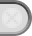

# Unity Editor Icons (6000.1.7f1)
A browsable list of 685 internal icons from the Unity Editor.

| Preview | Dimensions | Name (for `IconContent`) |
|:---:|:---:|---|
|  | `2x2` | `AnimationRowEven` |
|  | `4x4` | `AnimationRowEven@2x` |
|  | `2x2` | `AnimationRowEvenSelected` |
|  | `4x4` | `AnimationRowEvenSelected@2x` |
|  | `2x2` | `AnimationRowEvenSemiSelected` |
|  | `4x4` | `AnimationRowEvenSemiSelected@2x` |
|  | `2x2` | `AnimationRowOdd` |
|  | `4x4` | `AnimationRowOdd@2x` |
|  | `2x2` | `AnimationRowOddSelected` |
|  | `4x4` | `AnimationRowOddSelected@2x` |
|  | `2x2` | `AnimationRowOddSemiSelected` |
|  | `4x4` | `AnimationRowOddSemiSelected@2x` |
|  | `256x256` | `AreaLight Gizmo` |
|  | `16x16` | `ArrowNavigationLeft` |
|  | `16x16` | `ArrowNavigationRight` |
|  | `20x15` | `AssetLabelIcon` |
|  | `256x256` | `AudioSource Gizmo` |
|  | `160x32` | `bg_HeaderCollapsed@2x` |
|  | `160x32` | `bg_HeaderExpanded@2x` |
|  | `6x6` | `box` |
|  | `12x12` | `box@2x` |
|  | `16x16` | `BrushAttributes` |
|  | `16x16` | `BrushMask` |
|  | `17x19` | `btn` |
|  | `17x19` | `btn act` |
|  | `34x38` | `btn act@2x` |
|  | `17x19` | `btn focus` |
|  | `8x19` | `btn left` |
|  | `8x19` | `btn left act` |
|  | `16x38` | `btn left act@2x` |
|  | `8x19` | `btn left focus` |
|  | `8x19` | `btn left on` |
|  | `8x19` | `btn left on focus` |
|  | `16x38` | `btn left on@2x` |
|  | `8x19` | `btn left onact` |
|  | `16x38` | `btn left onact@2x` |
|  | `16x38` | `btn left@2x` |
|  | `6x19` | `btn mid` |
|  | `6x19` | `btn mid act` |
|  | `12x38` | `btn mid act@2x` |
|  | `6x19` | `btn mid focus` |
|  | `6x19` | `btn mid on` |
|  | `6x19` | `btn mid on focus` |
|  | `12x38` | `btn mid on@2x` |
|  | `6x19` | `btn mid onact` |
|  | `12x38` | `btn mid onact@2x` |
|  | `12x38` | `btn mid@2x` |
|  | `17x19` | `btn on` |
|  | `17x19` | `btn on focus` |
|  | `34x38` | `btn on@2x` |
|  | `17x19` | `btn onact` |
|  | `34x38` | `btn onact@2x` |
|  | `8x19` | `btn right` |
|  | `8x19` | `btn right act` |
|  | `16x38` | `btn right act@2x` |
|  | `8x19` | `btn right focus` |
|  | `8x19` | `btn right on` |
|  | `8x19` | `btn right on focus` |
|  | `16x38` | `btn right on@2x` |
|  | `8x19` | `btn right onact` |
|  | `16x38` | `btn right onact@2x` |
|  | `16x38` | `btn right@2x` |
|  | `34x38` | `btn@2x` |
|  | `24x19` | `buttonpulldown act` |
|  | `48x38` | `buttonpulldown act@2x` |
|  | `48x38` | `buttonpulldown@2x` |
|  | `256x256` | `Camera Gizmo` |
|  | `17x23` | `cmd` |
|  | `17x23` | `cmd act` |
|  | `34x46` | `cmd act@2x` |
|  | `17x23` | `cmd focus` |
|  | `8x23` | `cmd left` |
|  | `8x23` | `cmd left act` |
|  | `16x46` | `cmd left act@2x` |
|  | `8x23` | `cmd left focus` |
|  | `8x23` | `cmd left on` |
|  | `8x23` | `cmd left on focus` |
|  | `16x46` | `cmd left on@2x` |
|  | `8x23` | `cmd left onact` |
|  | `16x46` | `cmd left onact@2x` |
|  | `16x46` | `cmd left@2x` |
|  | `6x23` | `cmd mid` |
|  | `6x23` | `cmd mid act` |
|  | `12x46` | `cmd mid act@2x` |
|  | `6x23` | `cmd mid focus` |
|  | `6x23` | `cmd mid on` |
|  | `12x46` | `cmd mid on@2x` |
|  | `6x23` | `cmd mid onact` |
|  | `12x46` | `cmd mid onact@2x` |
|  | `12x46` | `cmd mid@2x` |
|  | `17x23` | `cmd on` |
|  | `17x23` | `cmd on focus` |
|  | `34x46` | `cmd on@2x` |
|  | `17x23` | `cmd onact` |
|  | `34x46` | `cmd onact@2x` |
|  | `8x23` | `cmd right` |
|  | `8x23` | `cmd right act` |
|  | `16x46` | `cmd right act@2x` |
|  | `8x23` | `cmd right focus` |
|  | `8x23` | `cmd right on` |
|  | `8x23` | `cmd right on focus` |
|  | `16x46` | `cmd right on@2x` |
|  | `8x23` | `cmd right onact` |
|  | `16x46` | `cmd right onact@2x` |
|  | `16x46` | `cmd right@2x` |
|  | `34x46` | `cmd@2x` |
|  | `4x4` | `cn entrybackodd` |
|  | `8x8` | `cn entrybackodd@2x` |
|  | `4x4` | `cnentrybackeven` |
|  | `8x8` | `cnentrybackeven@2x` |
|  | `28x18` | `ColorField focus` |
|  | `56x36` | `ColorField focus@2x` |
|  | `56x36` | `ColorField@2x` |
|  | `8x7` | `colorpickerbox` |
|  | `8x7` | `colorpickerbox` |
|  | `8x7` | `colorpickerboxfocused` |
|  | `8x7` | `colorpickerboxfocused` |
|  | `32x32` | `console.erroricon` |
|  | `16x16` | `console.erroricon.sml` |
|  | `32x32` | `console.infoicon` |
|  | `16x16` | `console.infoicon.sml` |
|  | `32x32` | `console.warnicon` |
|  | `16x16` | `console.warnicon.sml` |
|  | `128x128` | `CrossIcon` |
|  | `16x16` | `d__Help` |
|  | `16x16` | `d__Menu` |
|  | `16x16` | `d__Popup` |
|  | `16x16` | `d_account` |
|  | `256x256` | `d_AssemblyDefinitionAsset Icon` |
|  | `16x16` | `d_AssemblyLock` |
|  | `64x64` | `d_AssetStore Icon` |
|  | `64x64` | `d_AudioListener Icon` |
|  | `64x64` | `d_BoxCollider Icon` |
|  | `32x32` | `d_BuildSettings.Android` |
|  | `32x32` | `d_BuildSettings.DedicatedServer` |
|  | `32x32` | `d_BuildSettings.EmbeddedLinux` |
|  | `32x32` | `d_BuildSettings.GameCoreScarlett` |
|  | `32x32` | `d_BuildSettings.GameCoreXboxOne` |
|  | `33x33` | `d_BuildSettings.iPhone` |
|  | `32x32` | `d_BuildSettings.LinuxHeadlessSimulation` |
|  | `32x32` | `d_BuildSettings.Metro` |
|  | `32x32` | `d_BuildSettings.PS4` |
|  | `32x32` | `d_BuildSettings.PS5` |
|  | `33x32` | `d_BuildSettings.QNX` |
|  | `32x32` | `d_BuildSettings.Standalone` |
|  | `16x16` | `d_BuildSettings.Standalone.Small` |
|  | `32x32` | `d_BuildSettings.Switch` |
|  | `33x33` | `d_BuildSettings.tvOS` |
|  | `32x32` | `d_BuildSettings.visionOS` |
|  | `32x32` | `d_BuildSettings.WebGL` |
|  | `32x32` | `d_BuildSettings.XboxOne` |
|  | `16x16` | `d_CacheServerConnected` |
|  | `16x16` | `d_CacheServerDisabled` |
|  | `16x16` | `d_CacheServerDisconnected` |
|  | `64x64` | `d_Camera Icon` |
|  | `16x16` | `d_CameraPreview` |
|  | `16x16` | `d_clear` |
|  | `16x16` | `d_clear` |
|  | `16x16` | `d_CloudConnect` |
|  | `14x14` | `d_color_picker` |
|  | `14x14` | `d_color_picker` |
|  | `32x32` | `d_console.erroricon` |
|  | `32x32` | `d_console.erroricon` |
|  | `16x16` | `d_console.erroricon.inactive.sml` |
|  | `16x16` | `d_console.erroricon.sml` |
|  | `32x32` | `d_console.infoicon` |
|  | `32x32` | `d_console.infoicon` |
|  | `16x16` | `d_console.infoicon.inactive.sml` |
|  | `16x16` | `d_console.infoicon.sml` |
|  | `32x32` | `d_console.warnicon` |
|  | `16x16` | `d_console.warnicon.inactive.sml` |
|  | `16x16` | `d_console.warnicon.sml` |
|  | `16x16` | `d_CreateAddNew` |
|  | `256x256` | `d_cs Script Icon` |
|  | `19x13` | `d_CustomSorting` |
|  | `16x16` | `d_DataMode.Authoring` |
|  | `16x16` | `d_DataMode.Authoring.Sticky` |
|  | `16x16` | `d_DataMode.Mixed` |
|  | `16x16` | `d_DataMode.Mixed.Sticky` |
|  | `16x16` | `d_DataMode.Runtime` |
|  | `16x16` | `d_DataMode.Runtime.Sticky` |
|  | `16x16` | `d_debug` |
|  | `16x16` | `d_DebuggerAttached` |
|  | `16x16` | `d_DebuggerDisabled` |
|  | `16x16` | `d_DebuggerEnabled` |
|  | `64x64` | `d_DefaultAsset Icon` |
|  | `64x64` | `d_DirectionalLight Icon` |
|  | `12x12` | `d_dropdown` |
|  | `12x12` | `d_dropdown` |
|  | `15x12` | `d_dropdown_toggle` |
|  | `15x12` | `d_dropdown_toggle` |
|  | `16x16` | `d_editcollision_16` |
|  | `16x16` | `d_editconstraints_16` |
|  | `16x16` | `d_Exposure` |
|  | `16x16` | `d_Favorite` |
|  | `64x64` | `d_Favorite Icon` |
|  | `16x16` | `d_FilterByLabel` |
|  | `16x16` | `d_FilterByType` |
|  | `256x256` | `d_Folder Icon` |
|  | `256x256` | `d_FolderEmpty Icon` |
|  | `32x32` | `d_FolderEmpty On Icon` |
|  | `64x64` | `d_FolderFavorite Icon` |
|  | `256x256` | `d_FolderOpened Icon` |
|  | `16x16` | `d_FrameCapture` |
|  | `256x256` | `d_GameObject Icon` |
|  | `16x16` | `d_GameViewAudio` |
|  | `16x16` | `d_GameViewAudio On` |
|  | `16x16` | `d_GridAndSnap` |
|  | `16x16` | `d_GridLayoutGroup Icon` |
|  | `12x12` | `d_icon dropdown` |
|  | `13x13` | `d_IN_foldout` |
|  | `13x13` | `d_IN_foldout_act` |
|  | `13x13` | `d_IN_foldout_act_on` |
|  | `13x13` | `d_IN_foldout_on` |
|  | `16x16` | `d_Keyboard` |
|  | `16x16` | `d_KeyboardShortcutsDisabled` |
|  | `16x16` | `d_layout` |
|  | `16x16` | `d_LightingVisualization` |
|  | `16x16` | `d_LightingVisualizationColors` |
|  | `16x16` | `d_Linked` |
|  | `64x64` | `d_MeshFilter Icon` |
|  | `64x64` | `d_MeshRenderer Icon` |
|  | `16x16` | `d_more` |
|  | `16x16` | `d_MoreOptions` |
|  | `16x16` | `d_MouseLeft` |
|  | `16x16` | `d_MouseLeft-Drag` |
|  | `16x16` | `d_MouseMiddle` |
|  | `16x16` | `d_MouseMiddle-Drag` |
|  | `16x16` | `d_MouseRight` |
|  | `16x16` | `d_MouseRight-Drag` |
|  | `16x16` | `d_MoveTool` |
|  | `16x16` | `d_ol_minus` |
|  | `16x16` | `d_ol_minus` |
|  | `16x16` | `d_ol_minus_act` |
|  | `16x16` | `d_ol_minus_act` |
|  | `16x16` | `d_ol_plus` |
|  | `16x16` | `d_ol_plus` |
|  | `16x16` | `d_ol_plus_act` |
|  | `16x16` | `d_ol_plus_act` |
|  | `16x16` | `d_OrientationGizmo` |
|  | `16x16` | `d_PauseButton` |
|  | `16x16` | `d_PauseButton On` |
|  | `16x16` | `d_PBrowserPackagesNotVisible` |
|  | `16x16` | `d_PBrowserPackagesVisible` |
|  | `12x12` | `d_pick` |
|  | `12x12` | `d_pick` |
|  | `16x16` | `d_PlayButton` |
|  | `128x128` | `d_Prefab Icon` |
|  | `66x66` | `d_PrefabOverlayAdded Icon` |
|  | `66x66` | `d_PrefabOverlayRemoved Icon` |
|  | `16x16` | `d_Preset.Context` |
|  | `16x16` | `d_PreTexA` |
|  | `16x16` | `d_PreTexB` |
|  | `16x16` | `d_PreTexG` |
|  | `16x16` | `d_PreTexR` |
|  | `24x16` | `d_PreTexRGB` |
|  | `16x16` | `d_PreTextureMipMapHigh` |
|  | `16x16` | `d_PreTextureMipMapLow` |
|  | `12x12` | `d_ProfilerTimelineDigDownArrow` |
|  | `12x12` | `d_ProfilerTimelineRollUpArrow` |
|  | `16x16` | `d_Progress` |
|  | `16x16` | `d_Project` |
|  | `24x24` | `d_pulldown@2x` |
|  | `14x11` | `d_rol-body` |
|  | `14x6` | `d_rol-header` |
|  | `10x14` | `d_rol-tab` |
|  | `256x256` | `d_SceneAsset Icon` |
|  | `16x16` | `d_SceneLayersToggle` |
|  | `16x16` | `d_scenepicking_notpickable` |
|  | `16x16` | `d_scenepicking_notpickable_hover` |
|  | `16x16` | `d_scenepicking_notpickable-mixed` |
|  | `16x16` | `d_scenepicking_notpickable-mixed_hover` |
|  | `16x16` | `d_scenepicking_pickable` |
|  | `16x16` | `d_scenepicking_pickable_hover` |
|  | `16x16` | `d_scenepicking_pickable-mixed` |
|  | `16x16` | `d_scenepicking_pickable-mixed_hover` |
|  | `16x16` | `d_SceneViewSnap` |
|  | `16x16` | `d_scenevis_hidden` |
|  | `16x16` | `d_scenevis_hidden_hover` |
|  | `16x16` | `d_scenevis_hidden-mixed` |
|  | `16x16` | `d_scenevis_hidden-mixed_hover` |
|  | `16x16` | `d_scenevis_visible` |
|  | `16x16` | `d_scenevis_visible_hover` |
|  | `16x16` | `d_scenevis_visible-mixed` |
|  | `16x16` | `d_scenevis_visible-mixed_hover` |
|  | `64x64` | `d_ScriptableObject Icon` |
|  | `12x12` | `d_scrolldown` |
|  | `12x12` | `d_scrolldown` |
|  | `12x16` | `d_scrolldown_uielements` |
|  | `12x16` | `d_scrolldown_uielements` |
|  | `12x12` | `d_scrollleft` |
|  | `12x12` | `d_scrollleft` |
|  | `16x12` | `d_scrollleft_uielements` |
|  | `16x12` | `d_scrollleft_uielements` |
|  | `12x12` | `d_scrollright` |
|  | `12x12` | `d_scrollright` |
|  | `16x12` | `d_scrollright_uielements` |
|  | `16x12` | `d_scrollright_uielements` |
|  | `12x12` | `d_scrollup` |
|  | `12x12` | `d_scrollup` |
|  | `12x16` | `d_scrollup_uielements` |
|  | `12x16` | `d_scrollup_uielements` |
|  | `16x16` | `d_SculptMode_On` |
|  | `64x64` | `d_Search Icon` |
|  | `8x8` | `d_search_icon` |
|  | `8x8` | `d_search_icon` |
|  | `11x8` | `d_search_menu` |
|  | `11x8` | `d_search_menu` |
|  | `64x64` | `d_SearchJump Icon` |
|  | `16x16` | `d_SearchOverlay` |
|  | `16x16` | `d_SearchWindow` |
|  | `8x8` | `d_SeparatorDot` |
|  | `64x64` | `d_Settings Icon` |
|  | `16x16` | `d_Shaded` |
|  | `64x64` | `d_Shortcut Icon` |
|  | `16x16` | `d_StepButton` |
|  | `16x16` | `d_StopButton` |
|  | `256x256` | `d_TextAsset Icon` |
|  | `64x64` | `d_Texture Icon` |
|  | `14x14` | `d_toggle_bg` |
|  | `14x14` | `d_toggle_bg` |
|  | `14x14` | `d_toggle_bg_focus` |
|  | `14x14` | `d_toggle_bg_focus` |
|  | `14x14` | `d_toggle_bg_hover` |
|  | `14x14` | `d_toggle_bg_hover` |
|  | `14x14` | `d_toggle_mixed_bg` |
|  | `14x14` | `d_toggle_mixed_bg` |
|  | `14x14` | `d_toggle_mixed_bg_focus` |
|  | `14x14` | `d_toggle_mixed_bg_focus` |
|  | `14x14` | `d_toggle_mixed_bg_hover` |
|  | `14x14` | `d_toggle_mixed_bg_hover` |
|  | `14x14` | `d_toggle_on` |
|  | `14x14` | `d_toggle_on` |
|  | `14x14` | `d_toggle_on_focus` |
|  | `14x14` | `d_toggle_on_focus` |
|  | `14x14` | `d_toggle_on_hover` |
|  | `14x14` | `d_toggle_on_hover` |
|  | `16x16` | `d_Toolbar Minus` |
|  | `16x16` | `d_Toolbar Plus` |
|  | `16x16` | `d_Toolbar Plus More` |
|  | `16x16` | `d_ToolHandleCenter` |
|  | `16x16` | `d_ToolHandleGlobal` |
|  | `16x16` | `d_ToolHandleLocal` |
|  | `16x16` | `d_ToolHandlePivot` |
|  | `16x16` | `d_ToolSettings` |
|  | `2x2` | `d_tranp` |
|  | `64x64` | `d_Transform Icon` |
|  | `16x16` | `d_UndoHistory` |
|  | `16x16` | `d_UnityEditor.ConsoleWindow` |
|  | `16x16` | `d_UnityEditor.FindDependencies` |
|  | `16x16` | `d_UnityEditor.GameView` |
|  | `16x16` | `d_UnityEditor.Graphs.AnimatorControllerTool` |
|  | `16x16` | `d_UnityEditor.InspectorWindow` |
|  | `16x16` | `d_UnityEditor.SceneHierarchyWindow` |
|  | `16x16` | `d_UnityEditor.SceneView` |
|  | `73x22` | `d_UnityProduct` |
|  | `16x16` | `d_Unlinked` |
|  | `16x16` | `d_ViewOptions` |
|  | `16x16` | `d_WaitSpin00` |
|  | `16x16` | `d_WaitSpin01` |
|  | `16x16` | `d_WaitSpin02` |
|  | `16x16` | `d_WaitSpin03` |
|  | `16x16` | `d_WaitSpin04` |
|  | `16x16` | `d_WaitSpin05` |
|  | `16x16` | `d_WaitSpin06` |
|  | `16x16` | `d_WaitSpin07` |
|  | `16x16` | `d_WaitSpin08` |
|  | `16x16` | `d_WaitSpin09` |
|  | `16x16` | `d_WaitSpin10` |
|  | `16x16` | `d_WaitSpin11` |
|  | `28x25` | `darkviewbackground` |
|  | `56x50` | `darkviewbackground@2x` |
|  | `256x256` | `DirectionalLight Gizmo` |
|  | `256x256` | `DiscLight Gizmo` |
|  | `10x19` | `dockarea back` |
|  | `20x38` | `dockarea back@2x` |
|  | `10x8` | `dockarea overlay` |
|  | `20x16` | `dockarea overlay@2x` |
|  | `12x12` | `dropdown_PreviewPackages` |
|  | `27x16` | `dropwell nothumb` |
|  | `27x16` | `dropwell nothumb focus` |
|  | `54x32` | `dropwell nothumb@2x` |
|  | `27x16` | `dropwell predrop` |
|  | `54x32` | `dropwell predrop@2x` |
|  | `17x15` | `ExposablePopupBg` |
|  | `256x256` | `Folder On Icon` |
|  | `32x32` | `gameviewbackground` |
|  | `64x64` | `gameviewbackground@2x` |
|  | `8x8` | `grey_border` |
|  | `16x16` | `grey_border@2x` |
|  | `11x8` | `helpbox` |
|  | `11x8` | `helpbox` |
|  | `7x3` | `iconselector sep` |
|  | `14x6` | `iconselector sep@2x` |
|  | `4x18` | `IN BigTitle` |
|  | `4x18` | `IN BigTitle` |
|  | `4x18` | `IN BigTitle Post` |
|  | `4x18` | `IN BigTitle Post` |
|  | `13x13` | `IN foldout` |
|  | `13x13` | `IN foldout act on` |
|  | `26x26` | `IN foldout act on@2x` |
|  | `26x26` | `IN foldout act@2x` |
|  | `13x13` | `IN foldout focus` |
|  | `13x13` | `IN foldout focus on` |
|  | `26x26` | `IN foldout focus on@2x` |
|  | `26x26` | `IN foldout focus@2x` |
|  | `13x13` | `IN foldout on` |
|  | `26x26` | `IN foldout on@2x` |
|  | `26x26` | `IN foldout@2x` |
|  | `16x16` | `IN LockButton` |
|  | `32x32` | `IN LockButton act@2x` |
|  | `16x16` | `IN LockButton on` |
|  | `16x16` | `IN LockButton on act` |
|  | `32x32` | `IN LockButton on act@2x` |
|  | `32x32` | `IN LockButton on@2x` |
|  | `32x32` | `IN LockButton@2x` |
|  | `8x13` | `IN pulldown` |
|  | `16x26` | `IN pulldown@2x` |
|  | `15x19` | `IN Title Active` |
|  | `15x19` | `IN Title Focused` |
|  | `15x19` | `IN Title Normal` |
|  | `15x19` | `IN Title On Active` |
|  | `15x19` | `IN Title On Focused` |
|  | `15x19` | `IN Title On Normal` |
|  | `8x5` | `Inlined TextField Focus` |
|  | `16x10` | `Inlined TextField Focus@2x` |
|  | `256x256` | `LensFlare Gizmo` |
|  | `256x256` | `LightProbeGroup Gizmo` |
|  | `256x256` | `LightProbeProxyVolume Gizmo` |
|  | `256x256` | `Main Light Gizmo` |
|  | `17x16` | `mini btn` |
|  | `17x16` | `mini btn act` |
|  | `34x32` | `mini btn act@2x` |
|  | `17x16` | `mini btn focus` |
|  | `8x16` | `mini btn left` |
|  | `8x16` | `mini btn left act` |
|  | `16x32` | `mini btn left act@2x` |
|  | `8x16` | `mini btn left focus` |
|  | `8x16` | `mini btn left on` |
|  | `8x16` | `mini btn left on focus` |
|  | `16x32` | `mini btn left on@2x` |
|  | `8x16` | `mini btn left onact` |
|  | `16x32` | `mini btn left onact@2x` |
|  | `16x32` | `mini btn left@2x` |
|  | `6x16` | `mini btn mid` |
|  | `6x16` | `mini btn mid act` |
|  | `12x32` | `mini btn mid act@2x` |
|  | `6x16` | `mini btn mid focus` |
|  | `6x16` | `mini btn mid on` |
|  | `6x16` | `mini btn mid on focus` |
|  | `12x32` | `mini btn mid on@2x` |
|  | `6x16` | `mini btn mid onact` |
|  | `12x32` | `mini btn mid onact@2x` |
|  | `12x32` | `mini btn mid@2x` |
|  | `17x16` | `mini btn on` |
|  | `17x16` | `mini btn on focus` |
|  | `34x32` | `mini btn on@2x` |
|  | `17x16` | `mini btn onact` |
|  | `34x32` | `mini btn onact@2x` |
|  | `8x16` | `mini btn right` |
|  | `8x16` | `mini btn right act` |
|  | `16x32` | `mini btn right act@2x` |
|  | `8x16` | `mini btn right focus` |
|  | `8x16` | `mini btn right on` |
|  | `8x16` | `mini btn right on focus` |
|  | `16x32` | `mini btn right on@2x` |
|  | `8x16` | `mini btn right onact` |
|  | `16x32` | `mini btn right onact@2x` |
|  | `16x32` | `mini btn right@2x` |
|  | `34x32` | `mini btn@2x` |
|  | `24x16` | `mini popup act` |
|  | `48x32` | `mini popup act@2x` |
|  | `24x16` | `mini popup focus` |
|  | `46x32` | `mini popup focus@2x` |
|  | `48x32` | `mini popup@2x` |
|  | `24x16` | `mini pulldown act` |
|  | `48x32` | `mini pulldown act@2x` |
|  | `24x16` | `mini pulldown focus` |
|  | `48x32` | `mini pulldown focus@2x` |
|  | `48x32` | `mini pulldown@2x` |
|  | `6x32` | `miniScrollerVertical` |
|  | `12x19` | `ObjectPickerTab` |
|  | `24x38` | `ObjectPickerTab@2x` |
|  | `19x19` | `OL box` |
|  | `19x19` | `OL box on` |
|  | `38x38` | `OL box on@2x` |
|  | `38x38` | `OL box@2x` |
|  | `5x20` | `OL Highlight` |
|  | `5x20` | `OL Highlight` |
|  | `13x13` | `ol minus act` |
|  | `13x13` | `ol minus act` |
|  | `13x13` | `ol plus act` |
|  | `13x13` | `ol plus act` |
|  | `64x64` | `package_installed` |
|  | `32x32` | `package_update` |
|  | `16x16` | `pane options` |
|  | `32x32` | `pane options@2x` |
|  | `256x256` | `ParticleSystem Gizmo` |
|  | `256x256` | `ParticleSystemForceField Gizmo` |
|  | `2x17` | `PB-BottomBarBg` |
|  | `2x18` | `PB-HeaderBgMiddle` |
|  | `2x18` | `PB-HeaderBgTop` |
|  | `2x18` | `PB-TopBarBg` |
|  | `256x256` | `PointLight Gizmo` |
|  | `71x68` | `PopupWindowOff` |
|  | `21x16` | `PR DropHere` |
|  | `42x32` | `PR DropHere@2x` |
|  | `6x17` | `Pre button` |
|  | `6x17` | `Pre button act` |
|  | `12x34` | `Pre button act@2x` |
|  | `6x17` | `Pre button on` |
|  | `12x34` | `Pre button on@2x` |
|  | `12x34` | `Pre button@2x` |
|  | `16x17` | `Pre popup act` |
|  | `16x17` | `Pre popup on` |
|  | `4x17` | `Pre toolbar` |
|  | `4x17` | `Pre toolbar a` |
|  | `8x34` | `Pre toolbar a@2x` |
|  | `2x2` | `Pre toolbar act overlay` |
|  | `4x4` | `Pre toolbar act overlay@2x` |
|  | `8x34` | `Pre toolbar@2x` |
|  | `16x16` | `PreviewPackageInUse` |
|  | `22x12` | `ProfilerBadge` |
|  | `44x24` | `ProfilerBadge@2x` |
|  | `4x18` | `ProfilerLeftPane` |
|  | `8x36` | `ProfilerLeftPane@2x` |
|  | `3x4` | `ProfilerNoDataAvailableOverlayDark` |
|  | `3x4` | `ProfilerNoDataAvailableOverlayDarkOn` |
|  | `3x18` | `ProfilerRightPaneBackground` |
|  | `6x36` | `ProfilerRightPaneBackground@2x` |
|  | `3x18` | `ProfilerRightPaneBackgroundOn` |
|  | `6x36` | `ProfilerRightPaneBackgroundOn@2x` |
|  | `5x5` | `progress back` |
|  | `5x5` | `progress back` |
|  | `5x5` | `progress front` |
|  | `4x18` | `ProilerLeftPaneOn` |
|  | `8x36` | `ProilerLeftPaneOn@2x` |
|  | `22x17` | `ProjectBrowserGridLabel` |
|  | `22x17` | `ProjectBrowserGridLabelUnfocused` |
|  | `6x6` | `ProjectBrowserIconAreaBg` |
|  | `12x12` | `ProjectBrowserTextureIconDropShadow` |
|  | `12x12` | `ProjectBrowserTextureIconDropShadow` |
|  | `256x256` | `Projector Gizmo` |
|  | `24x19` | `pulldown act` |
|  | `48x38` | `pulldown act@2x` |
|  | `24x19` | `pulldown focus` |
|  | `48x38` | `pulldown focus@2x` |
|  | `48x38` | `pulldown@2x` |
|  | `256x256` | `ReflectionProbe Gizmo` |
|  | `16x16` | `RepaintDot` |
|  | `12x20` | `ro_selected_d` |
|  | `12x20` | `ro_unselected_d` |
|  | `37x15` | `scroll horiz` |
|  | `25x15` | `scroll horiz left act` |
|  | `50x30` | `scroll horiz left act@2x` |
|  | `50x30` | `scroll horiz left@2x` |
|  | `25x15` | `scroll horiz right act` |
|  | `50x30` | `scroll horiz right act@2x` |
|  | `50x30` | `scroll horiz right@2x` |
|  | `24x15` | `scroll horiz thumb` |
|  | `48x30` | `scroll horiz thumb@2x` |
|  | `74x30` | `scroll horiz@2x` |
|  | `15x37` | `scroll vert` |
|  | `15x25` | `scroll vert down act` |
|  | `30x50` | `scroll vert down act@2x` |
|  | `30x50` | `scroll vert down@2x` |
|  | `15x24` | `scroll vert thumb` |
|  | `30x48` | `scroll vert thumb@2x` |
|  | `15x25` | `scroll vert up act` |
|  | `30x50` | `scroll vert up act@2x` |
|  | `30x50` | `scroll vert up@2x` |
|  | `30x74` | `scroll vert@2x` |
|  | `6x31` | `scrubber background` |
|  | `10x21` | `scrubber button` |
|  | `10x21` | `scrubber button act` |
|  | `18x18` | `search focused` |
|  | `36x36` | `search focused@2x` |
|  | `36x36` | `search@2x` |
|  | `32x36` | `searchCancelButton@2x` |
|  | `16x18` | `searchCancelButtonActive` |
|  | `32x36` | `searchCancelButtonActive@2x` |
|  | `16x18` | `searchCancelButtonOff` |
|  | `32x36` | `searchCancelButtonOff@2x` |
|  | `8x8` | `SearchModeFilter` |
|  | `2x2` | `selected` |
|  | `4x4` | `selected@2x` |
|  | `13x13` | `ShurikenDropdownFocused` |
|  | `20x13` | `ShurikenObjectField` |
|  | `20x13` | `ShurikenObjectFieldFocused` |
|  | `20x13` | `ShurikenObjectFieldPreDrop` |
|  | `13x13` | `ShurikenPopupFocused` |
|  | `6x13` | `ShurikenTextField` |
|  | `6x13` | `ShurikenTextFieldFocused` |
|  | `12x12` | `ShurikenToggleFocused` |
|  | `12x12` | `ShurikenToggleFocusedOn` |
|  | `12x12` | `ShurikenToggleHover` |
|  | `12x12` | `ShurikenToggleHoverOn` |
|  | `12x12` | `ShurikenToggleMixed` |
|  | `12x12` | `ShurikenToggleNormal` |
|  | `12x12` | `ShurikenToggleNormalMixed` |
|  | `12x12` | `ShurikenToggleNormalOn` |
|  | `17x5` | `slider horiz` |
|  | `34x10` | `slider horiz@2x` |
|  | `12x12` | `slider thumb` |
|  | `12x12` | `slider thumb act` |
|  | `24x24` | `slider thumb act@2x` |
|  | `12x12` | `slider thumb focus` |
|  | `24x24` | `slider thumb focus@2x` |
|  | `24x24` | `slider thumb@2x` |
|  | `5x17` | `slider vert` |
|  | `10x34` | `slider vert@2x` |
|  | `256x256` | `SpotLight Gizmo` |
|  | `12x17` | `tabbar on` |
|  | `11x17` | `tabbar on f` |
|  | `22x34` | `tabbar on f@2x` |
|  | `24x34` | `tabbar on@2x` |
|  | `4x18` | `TE Toolbar` |
|  | `14x18` | `TE toolbar button` |
|  | `14x18` | `TE toolbar button act` |
|  | `28x36` | `TE toolbar button act@2x` |
|  | `28x36` | `TE toolbar button@2x` |
|  | `13x18` | `TE toolbar dropdown act` |
|  | `26x36` | `TE toolbar dropdown act@2x` |
|  | `26x36` | `TE toolbar dropdown@2x` |
|  | `8x36` | `TE Toolbar@2x` |
|  | `8x7` | `TextField` |
|  | `8x7` | `TextField focused` |
|  | `16x14` | `TextField focused@2x` |
|  | `16x14` | `TextField@2x` |
|  | `12x16` | `TextfieldDropdownAct` |
|  | `12x16` | `TextFieldDropDownFocused` |
|  | `5x16` | `TextFieldDropDownText` |
|  | `32x30` | `toggle act@2x` |
|  | `32x30` | `toggle focus@2x` |
|  | `16x15` | `toggle mixed act` |
|  | `32x30` | `toggle mixed act@2x` |
|  | `32x30` | `toggle mixed focus@2x` |
|  | `32x30` | `toggle mixed@2x` |
|  | `16x15` | `toggle on act` |
|  | `32x30` | `toggle on act@2x` |
|  | `32x30` | `toggle on focus@2x` |
|  | `32x30` | `toggle on@2x` |
|  | `32x30` | `toggle@2x` |
|  | `2x18` | `Toolbar` |
|  | `4x4` | `toolbar back` |
|  | `8x8` | `toolbar back@2x` |
|  | `14x18` | `toolbar button` |
|  | `14x18` | `toolbar button act` |
|  | `14x18` | `toolbar button act on` |
|  | `28x36` | `toolbar button act on@2x` |
|  | `28x36` | `toolbar button act@2x` |
|  | `14x18` | `toolbar button on` |
|  | `28x36` | `toolbar button on@2x` |
|  | `28x36` | `toolbar button@2x` |
|  | `13x18` | `toolbar popup act` |
|  | `13x18` | `toolbar popup act` |
|  | `28x36` | `toolbar popup@2x` |
|  | `13x18` | `toolbar pulldown` |
|  | `13x18` | `toolbar pulldown act` |
|  | `13x18` | `toolbar pulldown act` |
|  | `26x36` | `toolbar pulldown@2x` |
|  | `4x36` | `Toolbar@2x` |
|  | `16x14` | `toolbarsearch focused` |
|  | `32x28` | `toolbarsearch focused@2x` |
|  | `32x28` | `toolbarsearch@2x` |
|  | `28x28` | `toolbarsearchCancelButton@2x` |
|  | `14x14` | `toolbarsearchCancelButtonActive` |
|  | `28x28` | `toolbarsearchCancelButtonActive@2x` |
|  | `14x14` | `toolbarsearchCancelButtonOff` |
|  | `28x28` | `toolbarsearchCancelButtonOff@2x` |
|  | `17x14` | `toolbarsearchpopup focused` |
|  | `34x28` | `toolbarsearchpopup focused@2x` |
|  | `34x28` | `toolbarsearchpopup@2x` |
|  | `2x2` | `transparent` |
|  | `2x2` | `transparent` |
|  | `4x4` | `transparent@2x` |
|  | `4x4` | `transparent@2x` |
|  | `2x2` | `unselected` |
|  | `4x4` | `unselected@2x` |
|  | `256x256` | `VisualEffect Gizmo` |
|  | `4x4` | `white` |
|  | `4x4` | `window back` |
|  | `8x8` | `window back@2x` |
|  | `4x6` | `WindowBottomResize` |
|  | `256x256` | `WindZone Gizmo` |
